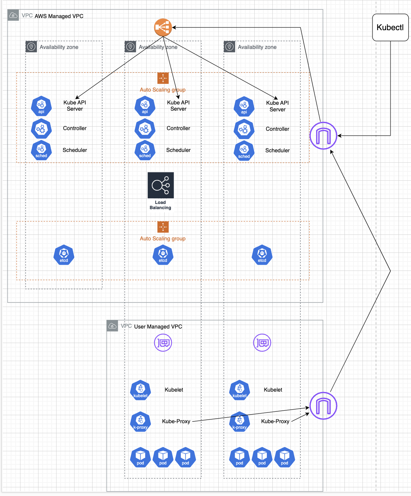

# EKS Introduction

## EKS란

EKS란 Elastic Kubernetes Service의 의미이다. EKS는 AWS에서 제공하는 관리형 쿠버네티스 서비스이다. 당연히 EKS내에서도 Kubernetes 모든 기존 플로그인 도구를 사용할 수 있다. AWS EKS는 Control Plane에 해당하는 부분을 Manage해주고 워커노드수도 늘려서 사용할 수 있게 해주는 Managed service이다.

EKS는 Control Plane과 Data Plane(그냥 Worker Node Plane으로 봐도된다) 구성되며, Control Plane 내 자원은 CSP(Cloud Service Provider) Managed 영역에 해당하므로, 사용자가 직접적인 관리가 불가능하다.



### EKS Control Plane

Control Plane의 API Server, Kube Scheduler, Controller 및 ETCD는 기본적으로 Auto Scaling Group으로 묶이게 된다. Kubectl을 통해 사용자가 Kube API Server에 접근하기 위해서는 맨 앞에 NLB(Network Load Balancer)를 통해 부하 분산이 이루어 진다.

Control Plane은 AWS Managed VPC에서 동작이 되며, Data Plane은 User VPC에서 동작된다. EKS의 Control Plane과 Data Plane간 격리된 VPC환경은 `EKS Owned ENI`를 통해 통신할 수 있는 구조를 가진다.

### EKS Data Plane

Data Plane은 실제 Pod들이 배포되는 곳이며, Worker Node로 생각하면 된다. 구성은 아래와 같다.

1. Customer VPC
2. Node (하단은 노드 유형들임)
   - Managed Node Groups
   - Self Managed Nodes
   - AWS Fargate
   - Karpenter
   - AWS Auto Mod
   - AWS Hybrid Nodes

### Cloud Controller Manager

- [공식문서](https://kubernetes.io/ko/docs/concepts/architecture/cloud-controller/)

CCM(Cloud Controller Manager)는 Kubernetes Control Plane 컴포넌트이다. CSP별 제어 로직을 분리해 동작하도록 설계가 되어있으며, 핵심 컨트롤러 컴포넌트에서 분리하고, CSP가 버전에 독립적으로 업데이트 및 배포할 수 있게 한다.CCM은 여러 인스턴스가 Pod 형태로 Control Plane에서 실행된다. 주요 컨트롤러들은 아래와 같다.

1. Node Controller

Cloud VM 생성시 Node객체에 클라우드 ID, 리젼, 리소스 정보를 자동으로 업데이트 한다. 노드 상태를 모니터링하면서, 삭제된 VM에 대응해 Kubernetes Node객체를 삭제한다.

2. Route Controller

클러스터내 각 노드간 통신을 위한 네트워크 라우팅 설정한다. Pod 네트워크 IP Block 할당을 하기도 한다.

3. Service Controller

Service (Service Type Loadbalancer)가 생성, 갱신, 삭제될때 클라우드의 로드밸런서, IP, 헬스체크등을 설정한다. 클라우드 인프라와 서비스 리소스를 동기화한다.

CCM은 RBAC가 요구된다.

1. Node: 전체 권한 필요
2. Service: list, watch, patch, update
3. Event: create, patch, update
4. Service Account: create

공식문서의 Cluster Role 예시는 하단과 같다.

```yaml
apiVersion: rbac.authorization.k8s.io/v1
kind: ClusterRole
metadata:
  name: cloud-controller-manager
rules:
  - apiGroups:
      - ""
    resources:
      - events
    verbs:
      - create
      - patch
      - update
  - apiGroups:
      - ""
    resources:
      - nodes
    verbs:
      - "*"
  - apiGroups:
      - ""
    resources:
      - nodes/status
    verbs:
      - patch
  - apiGroups:
      - ""
    resources:
      - services
    verbs:
      - list
      - watch
  - apiGroups:
      - ""
    resources:
      - services/status
    verbs:
      - patch
      - update
  - apiGroups:
      - ""
    resources:
      - serviceaccounts
    verbs:
      - create
  - apiGroups:
      - ""
    resources:
      - persistentvolumes
    verbs:
      - get
      - list
      - update
      - watch
```
