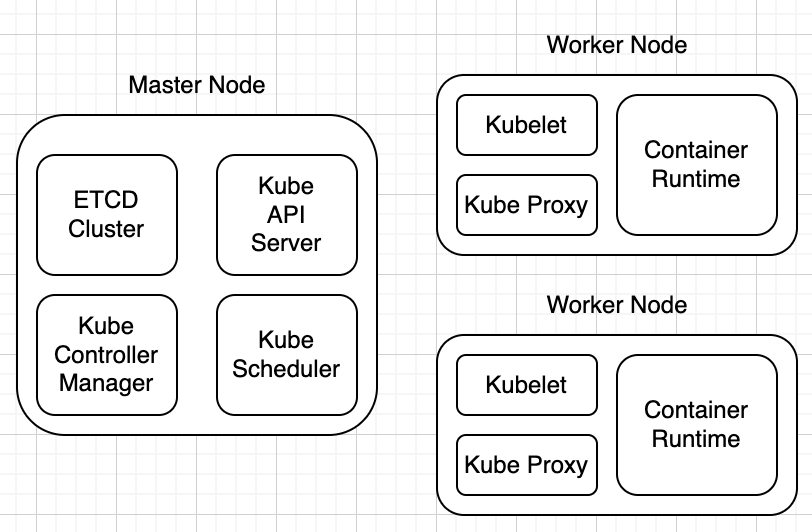

# Kubernetes Cluster Components

## Kubernetes란?

Kubernetes란 컨테이너 오케스트레이션 도구이다.

오케스트레이션이란 자동화된 태스크 혹은 프로세스를 조정하여 실행하는것을 의미한다.

## Kubernetes Cluster는 Node들로 구성되어있다.

Kubernetes Cluster는 Node들로 구성되어있으며, 2가지 Node가 존재한다.

1. Worker Node
2. Master Node

Cluster 내에 Master/Worker Node는 여러개로 구성될 수 있으며, Master Node는 Control Plane이라는 요소를 통해 Worker Node를 관리한다.

## Master Node 구성요소

1. etcd

- etcd란 컨테이너가 어떤 노드에 있고, 해당 컨테이너 생성 시간, 삭제시간 등의 정보가 저장된다.
- etcd는 고가용성 Key-Value Store이다.

2. Kube-Scheduler

- Kube-Scheduler는 컨테이너 리소스 요구사항, 워커노드 용량, 클러스터 정책 등의 규칙에 맞춰 컨테이너를 어떤 노드에 배치할지 결정하고 스케줄링 하는 역할을 한다.

3. Controller Manager

   1. Node Controller
      새로운 노드가 클러스터에 들어왔을때 온보딩 시키고, 사용불가 혹은 다운 되었을때 상황을 Control 한다.

   2. Replication Controller
      컨테이너가 원하는 그룹에서 지정된 수만큼 복제되어 실행되도록 보장한다.

4. Kube-Api-Server

- Kubernetes 주요 관리 구성 요소이다.
- 클러스터 내 모든 작업을 오케스트레이션 한다.
- 사용자가 클러스터를 제어하는데 사용되며, Worker Node에 작업이 필요한 경우 통신을 담당한다.
- 위에서 본 Master Node 컴포넌트간의 상호작용이 이루어진다.

## Worker Node 구성요소 살펴보기

1. Container Runtime

- Worker Node 뿐만 아니라 Master Node도 가지고 있다.
- Docker 뿐만 아니라 Container D, Podman 등 CRI를 준수하는 컨테이너 런타임은 모두 가능하다(Docker는 CRI를 준수하고 있지는 않음)

2. Kubelet

- 각 노드에서 실행되는 에이전트이다.
- Master Node로부터 요청에 맞춰 컨테이너를 만들거나 없앤다.
- Master Node는 Kubelet들로 부터 주기적인 Status Report를 받는다. 이를 통헤 컨테이너가 정의된 상태대로 동작하고 있는지 점검한다.

3. Kube-Proxy

- 클러스터 내 서비스들끼리 통신할 수 있게끔 한다.
