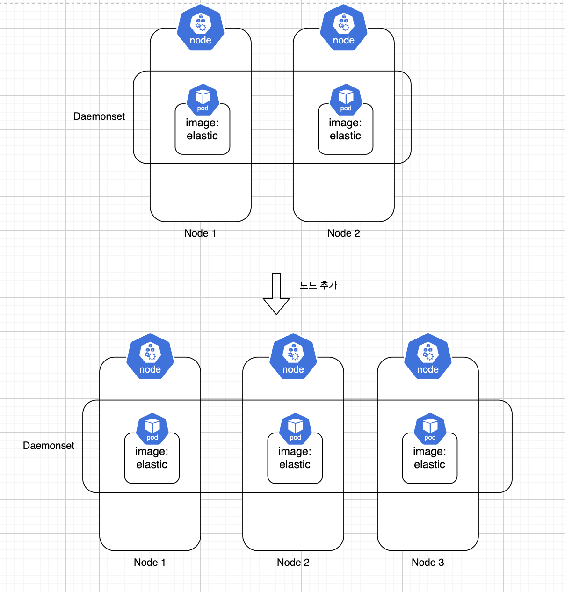

# Daemonset

Daemonset은 모든 노드에 동일한 Pod가 하나씩 실행되도록 한다. Daemonset이 생성되면 기본적으로 Daemonset에 정의된 Pod를 모든 노드에 하나씩 생성하게 되며, Daemonset이 제거되면 해당 Pod들도 함께 제거된다.



## Daemonset을 사용하는 이유

Deamonset은 각각의 노드에 Pod를 하나씩만 생성한다. 하나의 Pod를 Replicaset과의 비슷한 면이 있지만 각 노드당 Pod를 하나만 생성한다는 차이점이 존재한다. 그렇다면 Daemonset의 목적인 주로 무엇일까?

- 모든 노드에서 클러스터 스토리지 데몬 실행
  - Rook
  - OpenEBS
  - Longhorn
- 모든 노드에서 로그 수집 데몬 실행
  - Fluentd
  - Logstash
  - Opentelementary Collective
- 모든 노드에서 노드 모니터링 데몬 실행
  - Prometheus Node Exporter
  - Telegraf
  - Datadog Agent

데몬셋의 주요 목적과 해당 기능을 하는 프로젝트들을 살펴보았다.

### 데몬셋 정의하기

데몬셋을 정의해보자. **데몬셋은 Replicaset과 동일한 형태이지만 replicas를 명시하지 않는다는 차이점이 있다. 이유는 데몬셋은 각 노드에 하나씩 pod를 만들기 때문이다.**

```yaml
apiVersion: apps/v1
kind: DaemonSet
metadata:
  name: fluentd-logging
  labels:
    tier: system
    do: logging
spec:
  selector:
    matchLabels:
      tier: system
      do: logging
  template:
    metadata:
      labels:
        tier: system
        do: logging
    spec:
      containers:
        - name: fluentd-pod
          image: quay.io/fluentd_elasticsearch/fluentd:v2.5.2
          resources:
            limits:
              memory: 500Mi
```

```
╰─ kubectl apply -f ./manifest/daemonset.yaml
daemonset.apps/fluentd-logging created

╰─ kubectl get pods -o wide
NAME          READY   STATUS    RESTARTS   AGE   IP          NODE       NOMINATED NODE   READINESS GATES
nginx-97xrf   1/1     Running   0          11s   10.42.2.5   worker-2   <none>           <none>
nginx-pwtn9   1/1     Running   0          11s   10.42.1.7   worker-1   <none>           <none>
nginx-qbskk   1/1     Running   0          11s   10.42.0.6   master     <none>           <none>
```

결과에서 알 수 있듯이 모든 노드에서 Pod가 하나씩 실행되는것을 확인할 수 있다.

### Daemonset이 Pod생성하는것을 제한해보기

앞에서 본 `Node Selector` 혹은 `Node Affinity`를 사용하면 Daemonset이라도 특정 Node들에만 Pod를 생성할 수 있다. 우선 방금 만든 Daemonset을 지워보자.

```
╰─ kubectl delete daemonset nginx
daemonset.apps "nginx" deleted
```

그리고 master-node에는 `color=green`을, worker-2에는 `color=blue`를 적어준 뒤, daemonset의 node affinity에 `color`라는 label 키를 가진 노드에 배치하도록 해보자.

```
╰─ kubectl label nodes master color=green
node/master labeled

╰─ kubectl label nodes worker-2 color=blue
node/worker-2 labeled
```

이제 위에 조건에 맞게끔 daemonset을 수정해본다. key를 가지고 있는 노드를 의미했기 때문에 key에 대한 Exist(operator)를 확인하게끔 정의한다.

```yaml
apiVersion: apps/v1
kind: DaemonSet
metadata:
  name: nginx-node-affinity
  labels:
    tier: system
    do: logging
spec:
  selector:
    matchLabels:
      tier: system
      do: logging
  template:
    metadata:
      labels:
        tier: system
        do: logging
    spec:
      affinity:
        nodeAffinity:
          requiredDuringSchedulingIgnoredDuringExecution:
            nodeSelectorTerms:
              - matchExpressions:
                  - key: color
                    operator: Exists
      containers:
        - name: assume-this-is-some-global-application
          image: nginx
          resources:
            limits:
              memory: 500Mi
```

```
╰─ kubectl apply -f ./manifest/daemonset-node-affinity.yaml
daemonset.apps/nginx-node-affinity created

╰─ kubectl get pods -o wide
NAME                        READY   STATUS    RESTARTS   AGE   IP          NODE       NOMINATED NODE   READINESS GATES
nginx-node-affinity-24rls   1/1     Running   0          10s   10.42.2.6   worker-2   <none>           <none>
nginx-node-affinity-7hfl9   1/1     Running   0          10s   10.42.0.7   master     <none>           <none>
```

결과에서 알 수 있듯이 `color`가 key인 label을 가지지 않는 worker-1에는 Daemonset이지만 Pod가 생성되지 않은것을 볼 수 있다.
