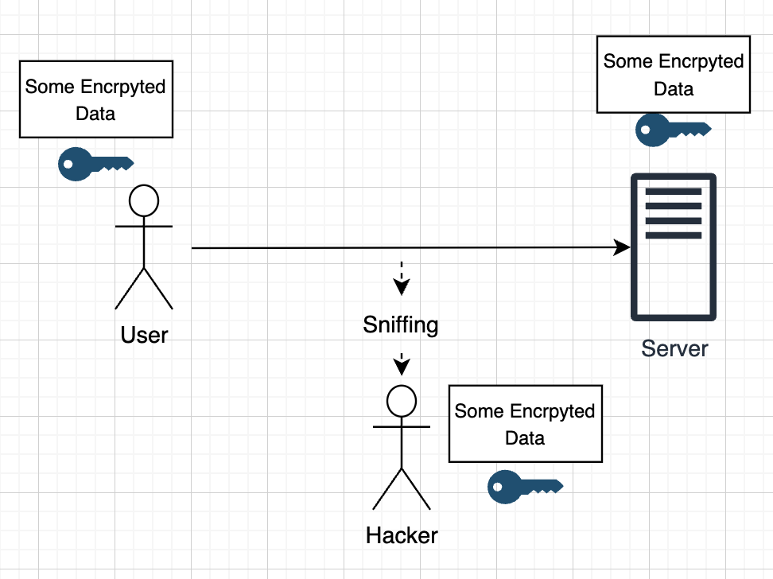
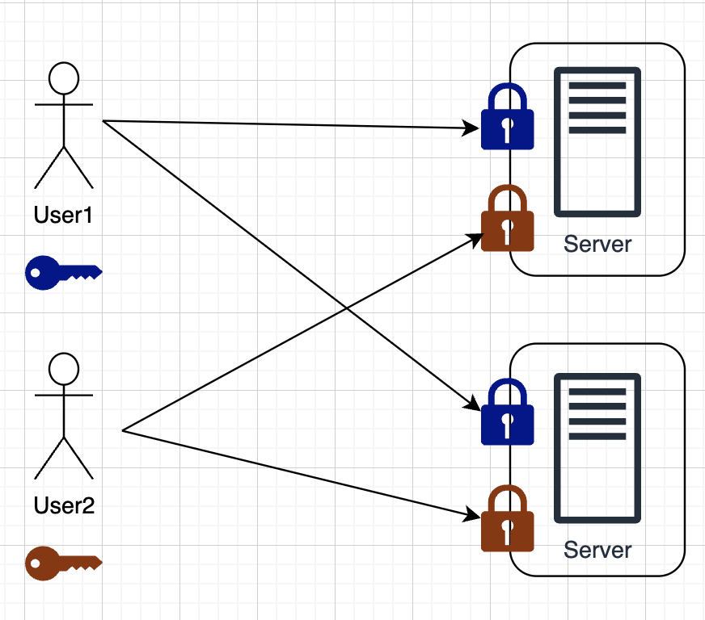
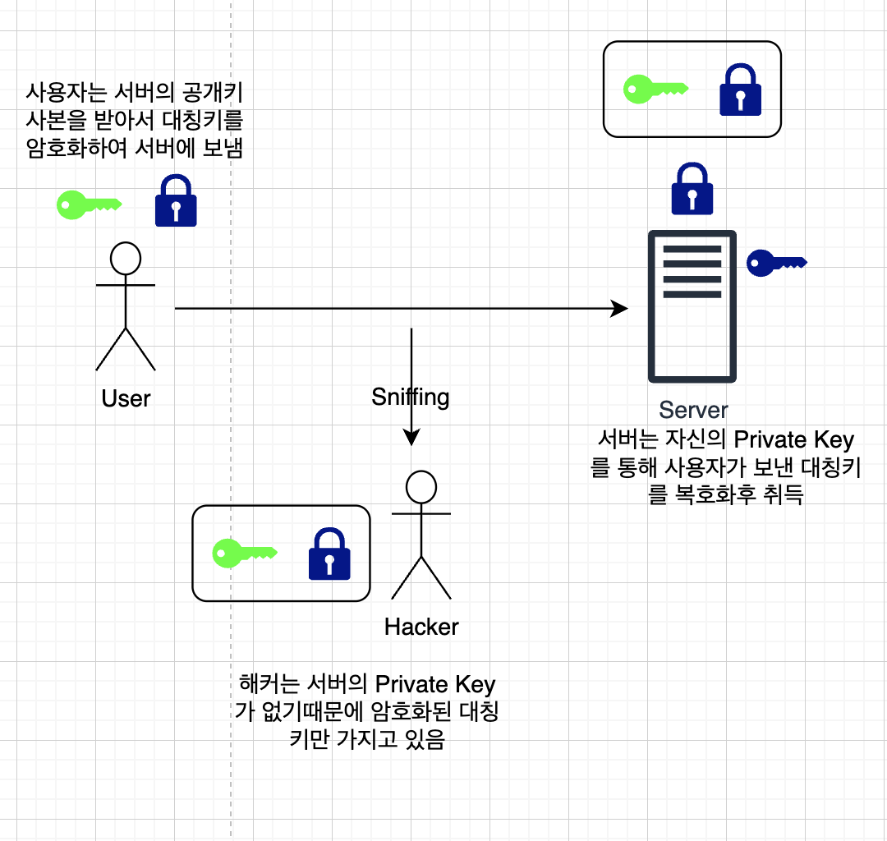
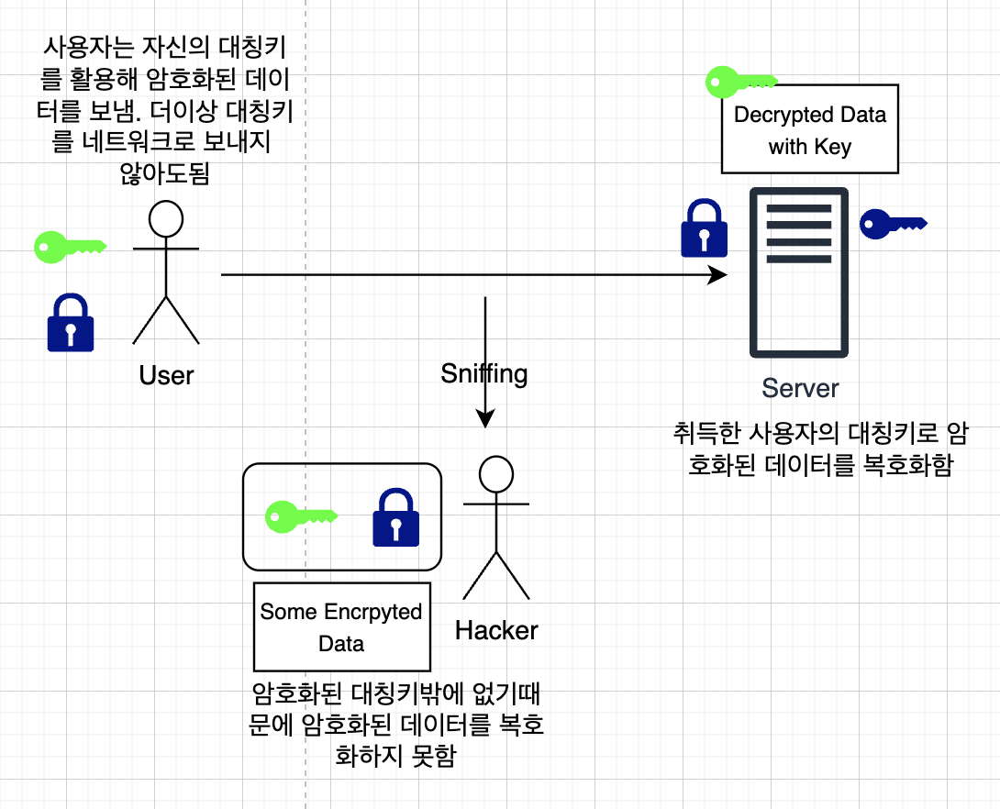

# Symmetric and Asymmetric Key

Kubernetes에서의 TLS를 알아보기전에 대칭키와 비대칭키의 개념을 잡고 간다.

## Symmetric Key



대칭키 방식을 먼저 살펴보자. 사용자가 데이터를 서버로 보내고 있고, 어떤 해커가 해당 네트워크를 스니핑 하고 있다고 가정한다. 사용자는 데이터를 안전히 보관하기 위해서 Key를 통해서 데이터를 암호화하고 이를 서버로 보냈다고 가정한다. 당연히 해커도 네트워크를 스니핑 하고 있으므로 암호화된 데이터를 동일하게 탈취하게 된다.

서버는 암호화된 데이터는 있지만 이 데이터를 보기 위해서는 Key를 통한 Decrpytion이 필요하다. 그렇기 때문에 사용자는 Key를 데이터와 동일하게 네트워크를 통해 서버로 전송한다. 이러면 서버는 암호화된 데이터를 Decrypt하여 볼 수 있지만, 해커도 동일하게 스니핑을 통해 키를 탈취하므로 해커도 해당 암호화된 데이터를 Decrypt하여 볼 수 있다. 결론적으로 대칭키의 경우에는 암호화된 데이터, Key 모두 탈취당할 위험성이 높은 방법이다.

## Asymmetric Key

비대칭 키는 대칭키의 노출 위험성을 방지하기 위한 방식이다. 비대칭키 방식에는 두가지가 존재한다.

1. Public Lock(Public Key): 이는 모두에게 공개된다.
2. Private Key: 이는 자신만 가지고 있어야 한다.

### SSH에서 사용되는 비대칭키 살펴보기

우리가 SSH를 `.key` 파일을 통해 인증하여 접속할때도 이 비대칭키 방식이 사용되는것이다. 한번 `ssh-keygen`명령어를 통해서 Public Key와 Private Key를 만들어본다

```
╰─ ssh-keygen
Generating public/private ed25519 key pair.
Enter file in which to save the key (/Users/hoplin/.ssh/id_ed25519):
Enter passphrase (empty for no passphrase):
Enter same passphrase again:
Your identification has been saved in /Users/hoplin/.ssh/id_ed25519
Your public key has been saved in /Users/hoplin/.ssh/id_ed25519.pub
The key fingerprint is:
```

위 로그에서도 볼 수 있듯이 Public Key(`.pub` 확장자)와 Private Key 두개가 생성된것을 볼 수 있다.



만약 SSH에서 이 Private Key를 통해 접근하고 싶은 경우에는, Public Key를 서버의 SSH Authroized Key에 User와 함께 추가해주면 Key형식의 접근이 되는것이다. 또한 이 Public Key는 하나의 서버 뿐만 아니라 여러개 서버의 Autoried Key로 추가해두면 하나의 Private Key를 통해 여러 서버의 SSH로 연결도 가능하다.

### HTTPS에서의 비대칭키 살펴보기

HTTPS에서의 비대칭키 원리는 SSH에서의 비대칭키와 살짝 다르다. HTTPS에서는 비대칭키와 대칭키 두가지 방식이 같이 사용된다. 앞서 보았듯이 사용자는 자신의 키를 사용하여 데이터를 암호화하고 암호화된 데이터와 암호화시 사용된 키를 서버로 보낸다고 하였다. 이 방식을 사용하는것은 동일하지만 비대칭키를 사용하여 더욱 안적한 방식으로 키를 서버로 보낸다.

1. 먼저 서버는 자신의 비대칭 키를 만든다. 당연히 Public Key와 Private Key 두가지를 생성한다.
2. 사용자는 서버로부터 Public Key 사본을 받는다. 당연히 이 과정에서 해커도 스니핑을 하고 있기 때문에 Public Key 사본을 같이 받게 된다.



3. 사용자는 서버로부터 받은 Public 키를 통해 대칭키를 암호화하여 서버한테 보낸다. 이 과정이 중요하다. 해커도 Public Key를 통해 암호화된 사용자의 대칭키를 받게 된다. 하지만 서버의 Private Key를 가지고 있지 않기때문에 해커는 해당 암호화된 대칭키의 값을 불러올 수 없게된다.



4. 사용자는 서버에게 대칭키를 보낸 이후부터 자신의 대칭키로 암호화한 데이터를 네트워크를 통해 서버로 전송하게 된다. 해커도 스니핑을 통해 암호화된 데이터를 받겠지만, 복호화된 사용자 대칭키가 없기 때문에 해당 데이터를 볼 수 없게 된다.
