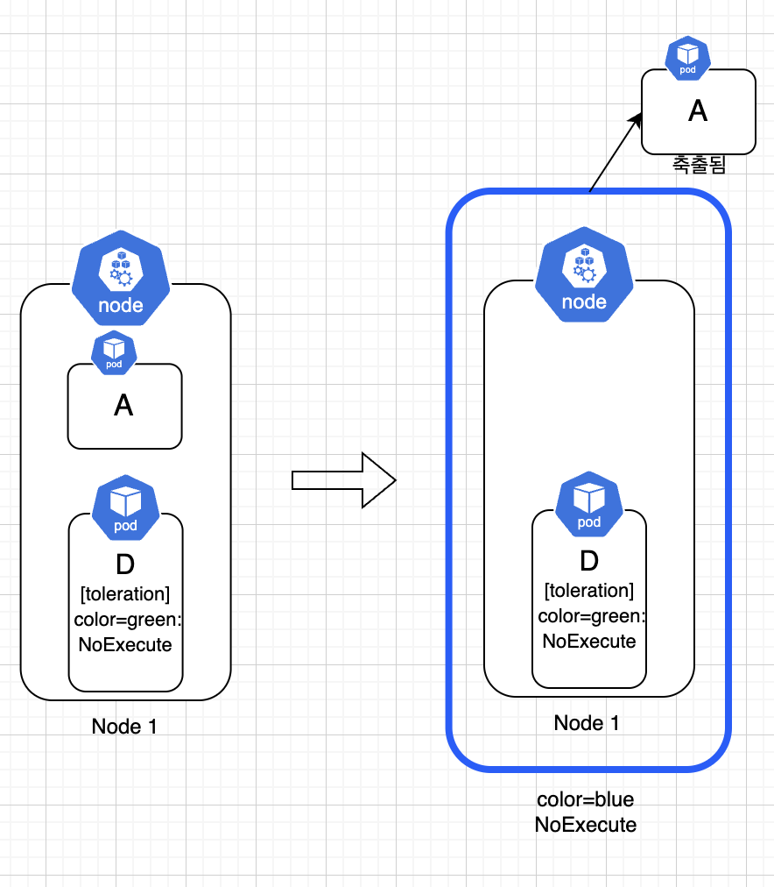

# Taints and Toleration

- [공식문서](https://kubernetes.io/ko/docs/concepts/scheduling-eviction/taint-and-toleration/)

> 실습환경: Master 1 + Worker 2

Taints and Toleration은 특정 Pod가 특정 Node에 배치되는것을 제한할 수 있게 해준다.

`Taint`의 사전적 의미는 얼룩의 의미이고 이 개념은 `Node`에 적용되는 개념이다. 반대로 `Toleration`의 사전적 의미는 관용, 묵인의 의미를 가지고 있으며, 이 개념은 `Pod`에 적용되는 개념이다.

쉽게 보면 Node에 얼룩이 있다. Pod들은 깔끔한것을 좋아하기 때문에 기본적으로 얼룩이 있는 Node를 가지 않으려고 한다. 하지만 `Toleration`을 통해 특정 얼룩은 괜찮다고 자신만의 허용을 하는것이다. 즉, `Taint`와 `Toleration`은 Pod가 스케줄링 되는 Node에 대한 제한을 설정하기 위한것이다.

## Taints랑 Toleration은 어떤 경우에 필요할까?

사실 처음에 보면 이게 왜 필요한지 감이 오지 않지만 이러한 경우에 필요하다고 한다.

1. 특정한 하드웨어가 설치된 노드.

예를 들어 GPU가 설치된 Node와 설치되지 않은 Node가 있다고 가정한다. 모델 학습을 하는 경우에는 무조건 GPU가 필요한다, GPU가 필요없는 Pod가 들어와서 CPU, 메모리 리소스를 먹어 정작 필요한 Pod가 스케줄 되지 못하는 경우가 발생할 수 있다. 이런 경우에는 분명한 자원의 낭비가 된다. GPU를 사용한다는 의미가 명시된 Pod만 GPU Node에 스케줄링 할 수 있다.

2. 팀별 노드 격리

만약 팀별로 노드를 분리하거나 혹은 계열사별로 노드를 분리하는 경우가 발생한다고 가정하자. 그런 경우에는 각 팀/계열사별에 대한 Toleration을 Pod에 적용해서 스케줄링 되는 Node를 제한할 수 도 있다.

## Taints와 Toleration은 어떻게 동작할까?

이 둘은 어떻게 동작할까를 먼저 살펴보자. 기본적으로 Pod는 기존에 봤듯이 Node에 스케줄링 되어서 들어간다. A,B,C,D,E라는 Pod가 있을떄 아래와 같이 클러스터 내 노드들에 고루고루 배치가 될것이다.


하지만 만약에 `Node 1`에서 `color=blue:NoSchedule`(Key-Value)이라는 Taint를 걸었다고 가정하자. 다소 헷갈릴 수 있어 남겨두자면 아래 형식으로 Taint를 정의한다

```
(Key)=(Value):(Taint Effect)
```

A,B,C,D,E Pod는 기본적으로 `color`라는 key에 대한 toleration을 들고있지 않기때문에, Node 1을 제외한 다른 Node들에 배치되게 된다.


하지만 만약 여기서 Pod C가 color라는 key에 대한 toleration이 생겼다고 가정하자. 그런 경우에는 Pod C는 Node 1에 스케줄 될 수 있게된다.

**단 여기서 중요한것은 '스케줄 될 수 있게된다'라는 점이다. toleration을 가지고 있다고 해서 꼭 해당 taint를 가진 Node에만 배치된다고 보장할 수 없다**


## Taints Effect의 종류

위에서는 Taints를 `NoSchedule`이라는 effect를 보았다. 하지만 Taints의 Effect에는 `NoSchedule`를 포함해서 총 3개의 Effect가 존재한다.

- **NoSchedule**: 해당 Taint를 허용하지 않는 Pod가 아예 스케줄링 되지 않는다.
- **PreferNoSchedule**: 해당 Taint를 허용하지 않는 Pod를 최대한 스케줄링 하지 않으려고 하지만 보장되지 않는다.
- **NoExecute**: Node에 배치된 Pod들중 해당 Taints를 허용하지 않는 경우에 모두 Node에서 축출된다. 여기서 Pod들은 NoExecute Taint Effect가 적용되기 이전에 이미 Node에 스케줄된 Pod들이다.

### 특정 Node에 Taints적용하기

kubectl을 통해서 특정 Node에 Taint를 적용할 수 있다. `kubectl taint`를 사용하면 되며, 기본적으로 아래와 같이 특정 Node에 Taint를 설정한다

```
kubeclt taint node (node-name) (key)=(value):(Taint Effect)
```

kubectl로 특정 node에 taints를 적용해보자. 예를 들어 아래와 같이 3개의 Node가 있다고 가정하자.

```
╰─ kubectl get nodes
NAME       STATUS   ROLES                  AGE   VERSION
master     Ready    control-plane,master   38m   v1.30.11+k3s1
worker-1   Ready    <none>                 38m   v1.30.11+k3s1
worker-2   Ready    <none>                 37m   v1.30.11+k3s1
```

여기서 worker-1 노드에 `color=blue:NoSchedule`라는 Taint를 설정해보자.

```
╰─ kubectl taint node worker-1 color=blue:NoSchedule
node/worker-1 tainted
```

그리고 이번에는 마스터 노드에 어떠한 Pod도 스케줄 되지 않도록 제한을 해보자.

> K8S는 기본적으로 Master Node에 Pod가 스케줄 되지 않도록 되어있는 경우도 있지만, K3S는 해당 설정이 되어있지 않다.

```
╰─ kubectl taint node master node-role.kubernetes.io/master=:NoSchedule
node/master tainted
```

### 스케줄링 확인하기

그리고 이제 클러스터 내 노드들의 Taint를 출력해서 잘 적용되었는지 확인해보자. 확인할때 다양한 방법이 있지만 `kubectl describe`를 활용해서 확인해본다.

```
╰─ kubectl describe node master | grep Taints
Taints:             node-role.kubernetes.io/master:NoSchedule

╰─ kubectl describe node worker-1 | grep Taints
Taints:             color=blue:NoSchedule

╰─ kubectl describe node worker-2 | grep Taints
Taints:             <none>
```

이제 Replica가 6이고 nginx 이미지로 구성된 Deployment를 생성해서 적용해본다.

```
╰─ kubectl apply -f ./manifest/taint-test-deployment.yaml
deployment.apps/taint-test-deployment created
```

`Deployment`를 생성하고 나서 Pod들이 어디 배치되었는지 확인하기 앞서 먼저 예상을 해보자.

1. Master Node는 기본적으로 어떠한 Pod도 스케줄 되지 않도록 Taint를 설정하였다.
2. Worker-1 Node도 `color=blue:NoSchudle` 이라는 Taint를 설정하였다.

즉 예상으로 모든 Pod들은 Worker-2 Node에 스케줄 되었을 것이다. 자 이제 Pod들이 어디 배치되었는지 살펴보자

```
╰─ kubectl get pods -o wide
NAME                                    READY   STATUS    RESTARTS   AGE     IP           NODE       NOMINATED NODE   READINESS GATES
taint-test-deployment-66ffdfc89-6rh95   1/1     Running   0          3m41s   10.42.2.10   worker-2   <none>           <none>
taint-test-deployment-66ffdfc89-gxxpj   1/1     Running   0          3m41s   10.42.2.13   worker-2   <none>           <none>
taint-test-deployment-66ffdfc89-lpb2g   1/1     Running   0          3m41s   10.42.2.15   worker-2   <none>           <none>
taint-test-deployment-66ffdfc89-pnw5l   1/1     Running   0          3m41s   10.42.2.12   worker-2   <none>           <none>
taint-test-deployment-66ffdfc89-q5w9g   1/1     Running   0          3m41s   10.42.2.14   worker-2   <none>           <none>
taint-test-deployment-66ffdfc89-zspwk   1/1     Running   0          3m41s   10.42.2.11   worker-2   <none>           <none>
```

> 혹은 kubectl get pods -o wide --field-selector spec.nodeName=(node name) 으로 해도된다.

그리고 우리가 예상했던것과 동일하게 Worker-2에만 스케줄링 된것을 볼 수 있다.

우선 위 실습이 끝났으면 해당 deployment는 우선 삭제해준다.

```
╰─ kubectl delete deployment taint-test-deployment
deployment.apps "taint-test-deployment" deleted
```

### NoExecute Effect Taint 더 살펴보기

`NoExecute` effect taint는 기존에 봤던 `NoSchedule`, `PreferNoSchedule`과는 살짝 다르게 동작한다. `NoExecute`는 운영중이던 노드에 적용되었다고 가정하는것이 가장 좋은데, 예를들어 A,B,C,D,E Pod가 3개의 Node에 있다고 가정하자. 근데 여기서 Node1에 `color=green:NoExecute`라는 taint effect가 추가되었고 여기에 원래 있던 Pod D는 toleration이 있었고 Pod A는 toleration이 없다고 가정하자. 그러면 `NoExecute` Taint가 적용되는 순간 Pod A는 축출되고, Pod D는 toleration이 있기때문에 유지된다.



물론 해당 Pod가 단일 Pod라면 그냥 삭제되겠지만, Replicas나 Deployments라면 스케줄이 가능한 다른 Node에 스케줄되게 된다.

하지만 필요에 따라 `NoExecute` Effect가 적용되면 일정 시간 뒤에 축출되게 할 수 도 있다.
만약 `toleration`에 `tolerationSeconds`를 정의하면 `NoExecute` Effect가 적용되고 나서 해당 시간(초) 이후 Pod가 축출된다.

```yaml
tolerations:
  - key: "key1"
    operator: "Equal"
    value: "value1"
    effect: "NoExecute"
    tolerationSeconds: 3600
```

위와 같이 설정하면 `key1=value1:NoExecute` effect가 적용되고 6분 뒤에 해당 Pod가 축출된다.

### NoExecute 확인해보기

이제 `NoExecute` Effect를 확인해본다. 먼저 실습에 앞서 먼저 worker-1 노드의 taint를 삭제한다. taint 삭제하는 방법은 아래와 같다.

```
kubeclt taint node (node-name) (key)=(value):(Taint Effect)-
```

```
╰─ kubectl taint node worker-1 color=blue:NoSchedule-
node/worker-1 untainted
```

이제 Pod 2개를 생성한다. 여기서는 조금 명확한 관찰을 위해서 두개의 Pod를 모두 worker-2에 생성한다.

```yaml
apiVersion: v1
kind: Pod
metadata:
  name: pod-with-toleration
  labels:
    tier: backend
spec:
  nodeName: worker-2
  containers:
    - name: nginx-container
      image: nginx
  tolerations:
    - key: "color"
      operator: "Equal"
      value: "red"
      effect: "NoExecute"

---
apiVersion: v1
kind: Pod
metadata:
  name: pod-without-toleration
  labels:
    tier: backend
spec:
  nodeName: worker-2
  containers:
    - name: nginx-container
      image: nginx
```

```
╰─ kubectl get pods -o wide
NAME                     READY   STATUS    RESTARTS   AGE   IP           NODE       NOMINATED NODE   READINESS GATES
pod-with-toleration      1/1     Running   0          34s   10.42.2.27   worker-2   <none>           <none>
pod-without-toleration   1/1     Running   0          34s   10.42.2.26   worker-2   <none>           <none>
```

하나는 `color=red:NoExecute`에 대한 toleration이 적용되어있고 하나는 적용되어있지 않다.이제 이상태에서 worker-2에 `color=red:NoExecute` taint를 적용하고 Pod를 확인해본다.

```
╰─ kubectl taint node worker-2 color=red:NoExecute
node/worker-2 tainted

╰─ kubectl get pods -o wide
NAME                  READY   STATUS    RESTARTS   AGE    IP           NODE       NOMINATED NODE   READINESS GATES
pod-with-toleration   1/1     Running   0          2m5s   10.42.2.29   worker-2   <none>           <none>
```

결과에서 볼 수 있듯이 toleration이 설정되어있지 않았던 `pod-without-toleration`은 축출되고 toleration이 설정된 `pod-with-toleration`은 그대로 동작하는것을 볼 수 있다.

이제 이후 실습을 위해 다시 worker-2의 taint를 없애고 worker-1의 taint를 다시 생성해주자.

```
╰─ kubectl taint node worker-1 color=blue:NoSchedule
node/worker-1 tainted

╰─ kubectl taint node worker-2 color=red:NoExecute-
node/worker-2 untainted
```

## Toleration 설정하기

위에서 Node에 Taints를 적용해보았으니 이번에는 반대로 Pod에 Toleration을 적용해본다. Toleration을 적용하기 위해서는 Pod의 spec에 `tolerations` 필드를 정의해주면된다. `color=blue:NoSchedule`에 대한 toleration이 적용된 단일 Pod를 설정해본다.

```yaml
# single-toleration-pod.yaml

apiVersion: v1
kind: Pod
metadata:
  name: single-toleration-pod
  labels:
    tier: backend
spec:
  containers:
    - name: nginx-container
      image: nginx
  tolerations:
    - key: "color"
      operator: "Equal"
      value: "blue"
      effect: "NoSchedule"
```

`tolerations`는 Pod `spec` 하단에 정의되며, 아래와 같은 값들이 들어간다

- key: Taint의 Key이다
- operator
  - operator에는 `Equal`과 `Exists` 두개가 존재한다.
  - `Equal`인 경우에는 `key`와 `value`, `effect`를 모두 명시해주어야한다. `Equal`은 기본적으로 `key`, `value`, `effect`가 모두 일치해야한다.
  - `Exists`인 경우에는 `key`, `effect`만 명시하고 `value`는 명시하면 안된다. `Exist`는 `key`와 `effect`만 검사하게된다.
- value: Taint Value이다.
- effect: Taint Effect이다. effect에는 `NoSchedule`, `PreferNoSchedule`, `NoExecute`가 존재한다.

### Toleration은 배열 형태로 받을 수 있다.

위에서 보면 알 수 있듯이 tolerations는 기본적으로 배열형태로 받는다. 만약 아래와 같이 하나의 Node에 여러개의 taint가 있다고 가정하자

```
kubectl taint nodes node1 key1=value1:NoSchedule
kubectl taint nodes node1 key1=value1:NoExecute
kubectl taint nodes node1 key2=value2:NoSchedule
```

만약 이상태에서 Pod의 Toleration이 아래와 같이 설정된다면

```
tolerations:
- key: "key1"
  operator: "Equal"
  value: "value1"
  effect: "NoSchedule"
- key: "key1"
  operator: "Equal"
  value: "value1"
  effect: "NoExecute"
```

해당 Pod는 세번째 taint에 대한 toleration이 없기 때문에 node1에 스케줄링 되지 않는다. 즉 **toleration이 여러개인 경우에는 해당 toleration이 모두 만족하는 Node에 스케줄링 될 수 있게되는것이다**

### Deployment에 toleration 생성하기

Deployment의 template에 동일하게 Pod의 `spec`, `metadata`를 정의한다. 그렇기 때문에 deployment에 `tolerations` 정의도 `sepc.template.spec.tolerations`에 정의해주면 된다. 위에서 설정한 node1의 toleration인 `color=blue:NoSchedule`에 대한 toleration이 된 Pod를 가진 Deployment를 생성해본다.

```yaml
apiVersion: apps/v1
kind: Deployment
metadata:
  name: deployment-toleration-test
  labels:
    tier: backend
spec:
  replicas: 6
  selector:
    matchLabels:
      tier: backend
  template:
    metadata:
      labels:
        tier: backend
    spec:
      containers:
        - name: nginx-container
          image: nginx
      tolerations:
        - key: "color"
          operator: "Equal"
          value: "blue"
          effect: "NoSchedule"
```

이제 이 deployment를 적용해본다.

```
╰─ kubectl get pods -o wide
NAME                                          READY   STATUS    RESTARTS   AGE   IP           NODE       NOMINATED NODE   READINESS GATES
deployment-toleration-test-6645f4778f-9c492   1/1     Running   0          39s   10.42.1.6    worker-1   <none>           <none>
deployment-toleration-test-6645f4778f-grf4d   1/1     Running   0          39s   10.42.1.7    worker-1   <none>           <none>
deployment-toleration-test-6645f4778f-k2wx7   1/1     Running   0          39s   10.42.2.24   worker-2   <none>           <none>
deployment-toleration-test-6645f4778f-mqs24   1/1     Running   0          39s   10.42.2.23   worker-2   <none>           <none>
deployment-toleration-test-6645f4778f-mz2sb   1/1     Running   0          39s   10.42.2.25   worker-2   <none>           <none>
deployment-toleration-test-6645f4778f-skd8b   1/1     Running   0          39s   10.42.1.8    worker-1   <none>           <none>
```

여기서 알 수 있는 사실이 2가지 존재한다.

1. tolerations설정을 통해 taint가 설정된 Node에 스케줄할 수 있다.
2. tolerations는 꼭 해당 taint가 설정된 Node에만 배정되는것이 아니다.
