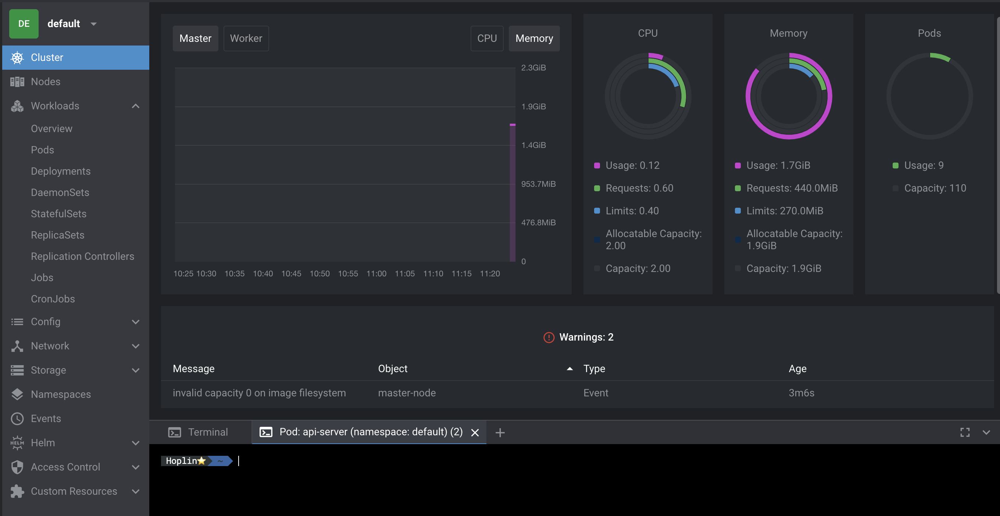

# Learning Docker and Kubernetes

---

- **Git clone을 하여 실습 예제 디렉토리를 사용하시는걸 권장합니다**
- Docker, Kubernetes 강의자료입니다. 피드백은 언제든지 환영하며, 잘못된 개념은 PR 혹은 Issue남겨주시면 감사하겠습니다.
- 개인적으로 Linux/Mac OS에서의 실습을 권장드립니다
- 필자는 ARM 아키텍쳐 CPU를 사용중입니다(Apple Silicon).
- Kubernetes는 Minikube를 사용합니다

---

## License

- BSD 3.0 License

---

## Install Docker

- Mac OS

  ```
  brew install docker --cask
  ```

- Ubuntu / RHEL / Cent OS

  ```
  wget -qO- https://get.docker.com | sh
  ```

- Windows

  1. [WSL2 설치하기](https://gaesae.com/161)
  2. [윈도우 도커 설치](https://goddaehee.tistory.com/251)

## Kubernetes

본 강의에서의 쿠버네티스 권장사항들은 아래와 같습니다

- 멀티노드 클러스터
- K8S 혹은 K3S (Minikube는 권장하지 않습니다)
- MacOS 혹은 Ubuntu Linux 환경

---

해당 강의의 기준 환경은 아래와 같습니다

- K3S Virtual Cluster
- NFS for PV,PVC : Raspberry Pi 3
  - 라즈베리파이를 통해 NFS만들기 : https://velog.io/@hoplin/라즈베리파이-4를-활용한-NFS서버-구축-및-Kubernetes-Pod-연결

---

### Recommend to use Lens, the Kubernetes IDE

- Lens : https://k8slens.dev
  

---

## Prepare your Kubernetes Environment

### K3S Virtual Cluster

- https://github.com/J-hoplin1/K3S-Virtual-Cluster

### Install Minikube & Multipass (Not Recommended)

- Minikube : https://minikube.sigs.k8s.io/docs/start/

- Multipass : https://multipass.run

---

## Lecture

- 📖 Appendix
  - [Using Shell Script](./Appendix-Shell-Script-Grammer-In-Bash/Readme.md)
- 💻 Docker
  - Week1 : [What is Docker?](./docker-1-What-is-docker%3F/)
  - Week2 : [Docker Engine Commands](./docker-2-Docker-Engine-Commands/)
  - Week3 : [Writing Dockerfile](./docker-3-Dockerfile/)
  - Week4 : [Docker Volume](./docker-4-Docker-Volume/)
  - Week5 : [Docker Network](./docker-5-Docker-Network/)
  - Week6 : [Docker Compose]()
- ☸️ Kubernetes
  - Lesson1 : [Start Kubernetes](./kubernetes-1-Starting-Kubernetes/)
  - Lesson1-1 : [Kubectl](./kubernetes-1-1-Kubectl/)
