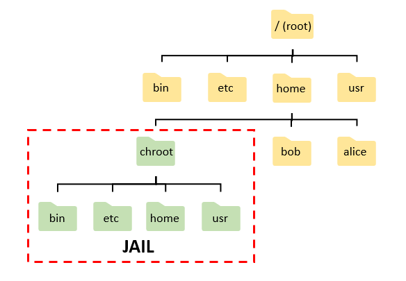

What is docker?
===
***
- Author : 홍익대학교 소프트웨어융합학과 윤준호(Hoplin)
- 사전과제
	- VM Ware, Virtual Box와 같은 가상 머신 사용해보기. 단 작업관리자를 키고 리소스의 변화와 함께 관찰
	- Docker 설치
- 다음과제
	- Dockerfile 실습과제를 위한 미니 프로젝트 혹은 토이 프로젝트 완성하기.(언어 무관, 웹, 앱 CLI 앱 모두 상관 없음) 자신의 Github에 업로드해서 제출
***
## Docker?

도커란 컨테이너 기술의 일종으로 **리눅스 기반의 컨테이너**에서 여러 기능을 추함으로써 애플리케이션 단위를 컨테이너로서 좀 더 쉽게 사용할 수 있도록 만들어놓은 오픈소스 프로젝트이다. `GO`언어로 작성되어있으며, `Container` 기술은 `가상 머신`과는 다르게 성능에 손실이 매우 적다. 그렇기에 차세대 기술인 클라우드, 인프라 솔루션에서 필수적인 기술이다.
<br>
도커와 관련된 프로젝트에는 아래와 같은것들이 있다.

- Docker Compose
- Docker Private Registry
- Docker Hub
- Docker Engine
- ...etc

이중 우리가 주목해서 눈여겨 보고 바로 사용할것이 바로 `도커 엔진`이다. 도커 엔진이란, 도커 컨테이너를 생성하고 관리하는 주체로서, 컨테이너를 제어하고, 다양한 기능을 제공하는 프로젝트이다. 결론적으로 도커 엔진을 제외한 프로젝트들은 도커 엔진을 효율적으로 사용하기 위한 방법들에 대한 프로젝트이다.

## Linux Container - Docker가 태어나기까지
리눅스는 오래전부터 `chroot`라는 명령을 제공해왔다. `chroot` 명령어란 change root의 줄임말로 Root Directory를 변경하는 명령어이다.(일반적으로 Root Directory는 `/`이다) chroot를 통해 루트 디렉토리를 설정하면 `chroot jail`이라는 환경이 생성된다. `chroot jail`안에서는 이의 외부 디렉토리에 대한 접근이 불가능하다. 이는 디렉토리 경로를 격리시키므로, 서버 정보 유출을 최소화 하기 위해 사용되었다.



다만 `chroot`는 단점이 있었다. 실행 파일, 공유 라이브러리를 직접 준비해야하며, 그에따른 설정은 매우 복잡했다. 또한 완벽한 가상 환경이 아니기 때문에 제약이 많다. 이후 리눅스는 LXC(LinuXContainer)라는 시스템 레벨 가상화를 지원한다.LXC는 커널 레벨에서 제공하는 가상 공간이다. 이 가상 공간에는 OS가 설치되지 않는다.

리눅스 커널에는 `cgroups`,`namespaces`라는것이 있다. `cgroups`는 CPU,메모리,디스크, 네트워크 자원을 할당해 완전한 가상 공간을 제공하고, `namespaces`는 프로세스 트리, 사용자 계정, 파일 시스템, IPC(프로세스간 통신)를 격리시켜 호스트와 별개의 공간을 만들게 된다. LXC는 이 두가지 기능이용하여 가상공간을 제공한다.


하지만 LXC는 격리된 공간만 제공했으며, 이외 운영에 필요한 요소들이 부족했다. Docker는 LXC 기반에 여러 필요한 기능들을 추가로 제공하는 방식으로 탄생을 했으며, `0.9` 버전부터는 [`libcontainer`](https://github.com/opencontainers/runc/tree/main/libcontainer)를 LXC대신 채택하여 사용한다(다만 실행 옵션에 따라 LXC를 선택할 수 도 있다.). `libcontainer`란 리눅스 커널이 제공하는 가상화를 직접 사용할 수 있도록 해주는 컨테이너 라이브러리이다. 


## Linux Container - chroot 실험하기

chroot를 간단하게 실습해보자. 실습 전에 chroot의 사용법을 알고간다. 

~~~
chroot (변경하고자 하는 Root 폴더 Directory) (명령어 shell. Default는 /bin/sh이다.)
~~~

리눅스 환경을 Docker를 통해서 띄워본다. 여기서는 Docker에 대해 이해가 없어도 된다. 단지 명령어를 복사해서 터미널에 붙여넣기를 한다.
~~~
docker pull ubuntu

docker run -it --name chroot-test ubuntu bash
~~~
위 명령어를 입력하면 우분투 쉘이 나올것이다. 운영체제를 확인해 보려면 `cat /etc/os-release`를 입력해보자
~~~
root@25106a1fd3ab:/# cat /etc/os-release
PRETTY_NAME="Ubuntu 22.04.1 LTS"
NAME="Ubuntu"
VERSION_ID="22.04"
VERSION="22.04.1 LTS (Jammy Jellyfish)"
VERSION_CODENAME=jammy
ID=ubuntu
ID_LIKE=debian
HOME_URL="https://www.ubuntu.com/"
SUPPORT_URL="https://help.ubuntu.com/"
BUG_REPORT_URL="https://bugs.launchpad.net/ubuntu/"
PRIVACY_POLICY_URL="https://www.ubuntu.com/legal/terms-and-policies/privacy-policy"
UBUNTU_CODENAME=jammy
~~~
chroot실습을 본격적으로 시작하자. 우선 혹시 모를 Permission오류를 대비하기 위해서 `/`,`/bin`,`/lib` 이 세 디렉토리에 대한 권한설정을 해준다. `chmod`라는 명령어를 이용할 것이다. chmod에 대한 설명은 이 [링크](https://recipes4dev.tistory.com/175)를 참고하자. 그리고 테스트용 디렉토리 `chroot-test`도 만들어준다
~~~
chmod 755 /
chmod 755 /bin
chmod 755 /lib

mkdir chroot-test
~~~
이제 `chroot`명령어를 사용해 본다. 디렉토리는 방금 만든 `chroot-test`로 기본 쉘은 `/bin/bash`로 한다.
~~~
chroot /chroot-test /bin/bash
~~~
하지만 실행하고 나면 아래와 같이 오류가 나는것을 볼 수 있다.
~~~
chroot: failed to run command '/bin/bash': No such file or directory
~~~
이 오류가 나는 이유는, 최상위 디렉토리를 `/chroot-test`로 변경하였으나, 그 디렉토리 내부에는 `/bin/bash`라는 디렉토리에 명령어 쉘이 존재하지 않기 때문이다. 
~~~
// ls -h 옵션은 파일 사이즈를 보기 편하게 변경해 주며 -l 은 파일 크기를 단위로 변경해준다. 기본 단위는 바이트이다

root@8489582f76dc:/# cd /bin
root@8489582f76dc:/bin# ls -lh | grep bash
-rwxr-xr-x 1 root root   1.4M Jan  6  2022 bash
-rwxr-xr-x 1 root root   6.7K Jan  6  2022 bashbug
lrwxrwxrwx 1 root root      4 Jan  6  2022 rbash -> bash
~~~
그렇다면 우선 bash를 복사해주자. 복사해준 후 `chroot`명령어를 다시 실행해보자. bash는 `/bin`이라는 디렉토리 하위에 존재한다. 
~~~
// -p 옵션은 최하단 디렉토리의 부모 디렉토리까지 재귀적으로 생성한다는 의미이다.
mkdir -p chroot-test/bin
cp /bin/bash /chroot-test/bin/bash
chroot /chroot-test /bin/bash
~~~
하지만 아까 일어났던 오류와 동일한 오류가 발생한다. 이 이유는 리눅스의 대부분의 명령어는 동작에 필요한 라이브러리를 가지고 있으며, 이 라이브러리에는 동적 라이브러리, 정적 라이브러리 두가지가 있다. `동적 라이브러리`(\*.so)는 완성된 프로그램을 실행할때 포함시키는 라이브러리이고, `정적 라이브러리`(\*.a)는 컴파일 과정에서 포함시키는 오브젝트 파일이다. 즉, 우리는 bash를 실행시키기 위해 bash의 동적 라이브러리를 가져와야할 필요가 있다. 리눅스에서 특정 실행파일의 라이브러리 의존성을 확인할때는 `ldd`라는 명령어를 사용해야한다. 
~~~
ldd (옵션) (실행파일명)
~~~
bash에 대해 `ldd`명령어를 사용하여 동적 라이브러리 리스트를 확인해 본다.
~~~
ldd /bin/bash

// 결과
	linux-vdso.so.1 (0x0000ffffb6bb7000)
	libtinfo.so.6 => /lib/aarch64-linux-gnu/libtinfo.so.6 (0x0000ffffb69b0000)
	libc.so.6 => /lib/aarch64-linux-gnu/libc.so.6 (0x0000ffffb6800000)
	/lib/ld-linux-aarch64.so.1 (0x0000ffffb6b7e000)
~~~
우리가 알 수 있는것은 동적라이브러리가 `/lib/aarch64-linux-gnu`,`lib`디렉토리에 존재한다는 것이다(인텔,AMD CPU를 쓴다면 위 결과는 달라질 수 도 있다. 필자는 ARM CPU로 진행).

여기서 `=>`는 심볼릭 링크(Soft Link)를 의미하는 것이며,`/lib/aarch64-linux-gnu/libtinfo.so.6`는  `libtinfo.so.6`의 바로가기라는 말과 동일하다.(리눅스 Symbolic, Hard link에 대한 설명은 이 [링크](https://ndb796.tistory.com/506)를 참고한다) 

`/chroot-test`디렉토리에 `/lib/aarch64-linux-gnu`,`lib`디렉토리를 만들고 아래서 부터 세개 동적라이브러리를 복사해준다.(자신의 실습환경에 따라 디렉토리명, 라이브러리 명이 다를 수 있기에 주의한다.)
~~~
mkdir -p chroot-test/lib/aarch64-linux-gnu
cp /lib/aarch64-linux-gnu/libtinfo.so.6 /chroot-test/lib/aarch64-linux-gnu/libtinfo.so.6
cp /lib/aarch64-linux-gnu/libc.so.6 /chroot-test/lib/aarch64-linux-gnu/libc.so.6
cp /lib/ld-linux-aarch64.so.1 /chroot-test/lib/ld-linux-aarch64.so.1
~~~
이제 터미널에서 다시 `chroot`명령어를 사용해본다
~~~
chroot /chroot-test /bin/bash

// 결과
root@25106a1fd3ab:/# chroot /chroot-test /bin/bash
bash-5.1# pwd
/

...etc

exit
~~~
bash기반의 tty가 실행되는것을 볼 수 있다. 그리고 `pwd`를 입력하면, 우리는 이 디렉토리가 `/chroot-test`라는것을 알지만, 결과에서는 `/`를 출력하는것을 볼 수 있다. 다만 이 상태에서 리눅스 기본 명령어들을 실행하려 하면, `command not found`가 나오는것을 볼 수 있다. 위에서 bash가 바로 실행 안됐듯이, 각각의 명령어들도 동적 라이브러리가 있으며, 그 라이브러리가 `/chroot-test`에 존재하지 않기 때문이다.


> `tty`란 teletypewriter의 약자로서 리눅스 디바이스 드라이버중 콘솔이나 터미널을 의미한다. 터미널에 `tty`명령어를 치면 현재 세션을 확인할 수 있으며, `/dev` 디렉토리에서 tty 세션들을 볼 수 있다.(`ls /dev | grep tty`)

이와 같이 `chroot`는 복잡하고, 설정하는데 꽤 까다롭다는 단점을 가졌다.

## Virtual Machine VS Docker Container

흔히 "가상화 기술"이라고 하면 가장 먼저 떠오르는것은 Virtual Box, VMWare과 같은 가상머신이다. 그렇다면 가상 머신과 Container기술을 어떤 차이점이 있으며 왜 점점 Container기술을 채택해갈까? 

### Virtual Machine
가상 머신은 성능이 좋지 않다.CPU에 가상화를 위한 다양한 기능들이 추가되었으나, Host Machine에 비해서는 속도가 느리다. 기본적으로 **가상머신은 완전한 형태의 Guest OS 이미지가 요구**되며(.iso파일) 이에 따라 **용량이 크고, 배포 및 관리 기능에 있어 치명적**이라는 단점이 존재한다.(아래 사진은 전가상화 방식. 최근에는 Xen과 같은 기술을 이용해 반가상화 방식으로 사용한다.)


- Hypervisor : 가상 머신 OS이미지는 모두 Kernel이 존재한다. 커널마다 명령어를 해석하는 방식, 리소스를 관리하는 방식은 모두 다르다. Hypervisor는 호스트 OS에서 여러 OS를 사용하기 위한 플랫폼이다.

### Docker Container
가상머신과의 큰 차이점은 바로 **Guest OS를 설치하지 않는다**라는 점이다. 운영을 위해 필요한 프로그램, 라이브러리만 격리해 사용할 수 있고, OS Resource,System Call은 Host OS와 공유한다. 그렇기에 이미지 파일 용량이 경량화 되는것이 당연하다


Docker는 **하드웨어를 가상화 하는 계층이 없다**. 그렇기에 메모리 접근, 파일시스템, 네트워크 모두 가상머신에 비해 빠르다. Docker는 **Dockerfile을 작성하여 이미지 생성/ 배포에 특화**되어있으며, 버전관리도 가능하다. 그리고 **Docker는 [Docker Hub](https://hub.docker.com)라는것을 제공하여 다른 사람이 만든 이미지를 사용할 수 도 있다**.

## Docker Image와 Container

Docker에는 `이미지`와 `컨테이너`라는 개념이 있다. 

### Docker Image
들어가기 앞서 `Base Image`라는 것이 있다. 이는 리눅스 배포판의 `User Land`만 설치된 파일을 의미한다.(참고(입문과정에서 알필요는 없음) : [Creating Base Image Scratch](https://tbhaxor.com/create-docker-base-image/)) 베이스 이미지에는 순수 리눅스 배포판 뿐만 아니라, Nginx, MySQL과 같은 미들웨어나 애플리케이션이 설치된 베이스 이미지도 존재한다.

결론적으로 `Docker 이미지`라고 하면, **베이스 이미지에 필요한 프로그램, 라이브러리, 소스코드가 설치된 하나의 파일** 이라고 할 수 있다.

>`User Land`에 대해 간단히 알아보자. 3학년 1학기 운영체제에서 배웠듯이 프로세스는 커널모드와 유저모드 두가지 모드에서 실행된다. 유저모드는 사용자가 접근할 수 있는 영역으로, 프로그램 자원 내부에 침입하지 못하도록 하는 모드이다. 반대로 커널 모드는 모든 자원에 대한 접근이 가능하며, 운영체제의 모든 작업을 할 수 있는 영역이다(커널에 의한 제어). 이와 비슷한 정의대로, `User Land`는 부팅에 필요한 실행파일(ex : /sbin/init)과 라이브러리, 패키징 시스템(apt,yarn,microdnf...etc)을 포함시킨다.

베이스이미지는 `Dockerfile`을 정의하여 만들 수 있다. 매번 이미지를 만들떄 이미지가 중복으로 생성되어 용량에 부담이 갈 수 도 있다 생각할 수 있지만, Docker는 베이스 이미지에서 바뀐 부분에 대해서만 이미지로 생성하고, 실행할때는 베이스이미지와 바뀐 부분을 합쳐서 실행한다. Docker Image는 16진수로 된 ID로 구분되며, 각각의 이미지는 독립적이다. 


### Docker Container
Docker Container란 이미지를 실행한 상태이다. 하나의 이미지로 여러개의 컨테이너를 만들 수 있으며, 운영체제에 비유하자면, 이미지는 `실행파일`, 컨테이너는 `프로세스`이다.

결론적으로 Docker는 애플리케이션 단위의 실행환경을 만들기에 최적화 되어있다. 그렇기에 클라우드 환경에서는 하나의 이미지로 여러개의 서버를 한번에 올리는것도 가능하며, 서버라는 호스트 머신에 직접적인 소프트웨어, 엔진을 설치하지 않아도 되고, 이에 따른 버전 의존성 문제도 해결된다.

## 간단한 Docker 실습

docker관련 명령어는 다음시간에 배울것이다. 다만 이번 시간에는 간단하게 ubuntu, 14.04버전을 컨테이너로 실행시켜 보고 마무리한다.

1. 이미지를 [docker hub](https://hub.docker.com)에서 가져오기(ubuntu, 14.04는 이 [링크](https://hub.docker.com/_/ubuntu)를 참고하자)

	```bash
	docker pull ubuntu:14.04
	```

2. 이미지를 잘 가져왔는지 확인한다

	```bash
	docker images | grep ubuntu

	// 결과
	ubuntu               14.04     55b7b4f7c5d6   2 months ago   187MB
	```
3. 우분투 이미지를 컨테이너로 실행한다

	```bash
	docker run -it --name my-ubuntu-env ubuntu:14.04 /bin/bash
	```
4. 기본 명령어 실행해보기
	```bash
	apt-get update
	apt-get upgrade -y

	... etc

	exit
	```
5. 컨테이너 멈추기(위에서 exit를 하면 멈춰지긴한다) 및 컨테이너 지우기, 이미지 지우기
	```bash
	docker stop my-ubuntu-env
	docker rm my-ubuntu-env
	docker rmi ubuntu:14.04
	```