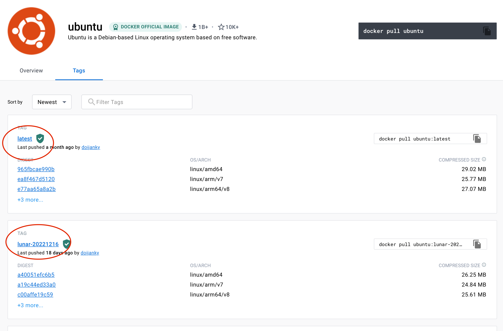
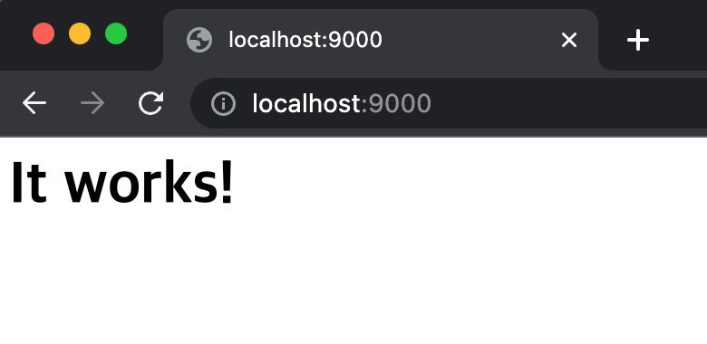
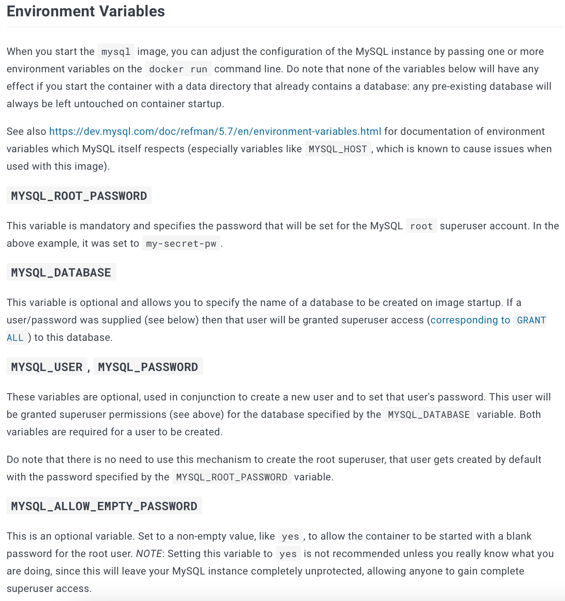
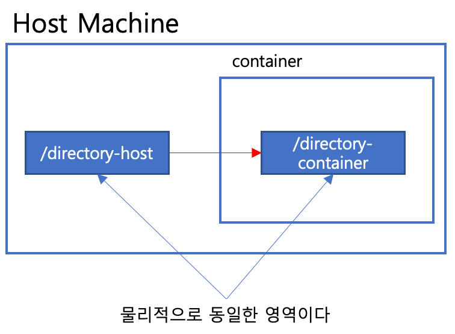
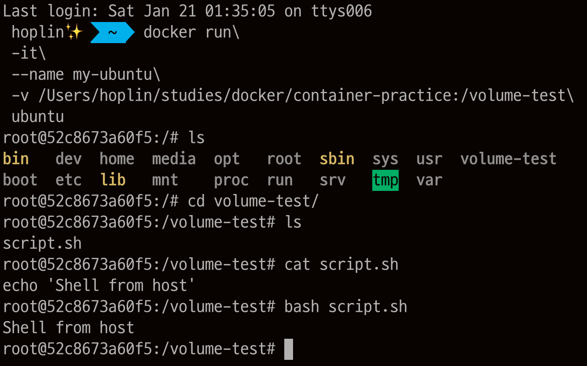
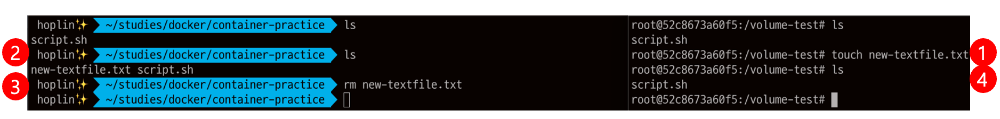
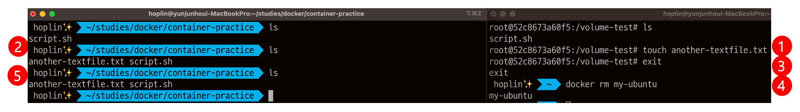
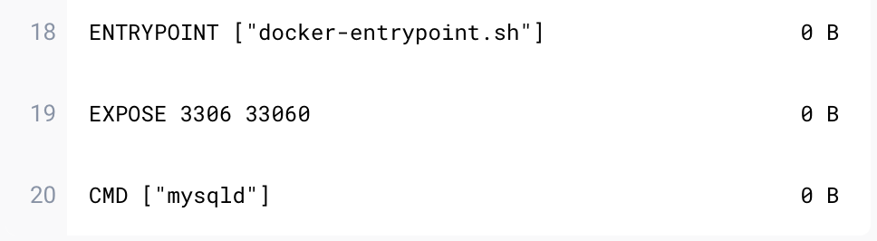
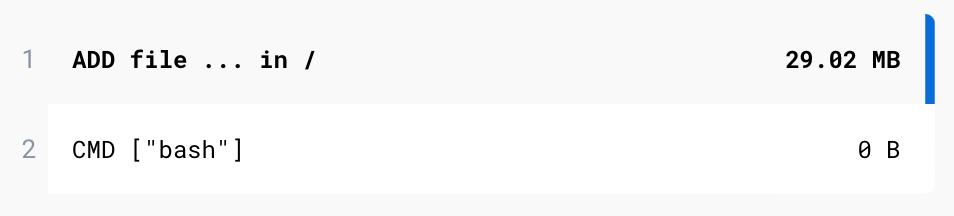

Docker Engine & Docker Commands
===
***
- Author : 홍익대학교 소프트웨어융합학과 윤준호(Hoplin)
- 사전과제
    - Dockerfile 실습과제를 위한 미니 프로젝트 혹은 토이 프로젝트 완성하기.(언어 무관, 웹, 앱 CLI 앱 모두 상관 없음) 자신의 Github에 업로드해서 제출
    - 복습
***
## Docker 명령어 알아보기

도커의 여러가지 명령어들을 알아보자. 모든 명령어의 옵션들을 당장 다룰수는 없으며, 도커 스웜, 도커 네트워크, 도커 볼륨등 추가 개념에 따라서 응용되는 옵션들은 스스로 공부하면서 터득하길 바란다. 지금은 대표적으로 쓰이는 명령어들을 살펴볼 것이다.

`docker hub`에서 여러 도커파일들을 pull해서 사용해 볼 수 있다.(https://hub.docker.com) 한번 어떤 Base Image들이 있는지 살펴보고 오자.

### `docker -v` 도커 버전 확인하기
~~~
docker -v 

// 결과 : Docker version 20.10.21, build baeda1f
~~~
### `docker pull` 도커 이미지 pull
기본적으로 docker는 `docker hub`라는 곳에서 이미지를 가져온다. 필요에 따라 Docker Private Registry에서 이미지를 가져올 수 도 있다. 형태는 아래와 같다. **이미지를 지정할때는 `(이미지 이름):(태그명)`과 같이 작성**해 주어야한다. 만약 **태그를 적어주지 않는다면 디폴트 태그인 `latest`로 지정**되어 이미지를 받아온다. 태그는 쉽게 말해 버전이름과 동일하며, `docker hub`에서 이미지의 `tags`탭에서 확인할 수 있다. 앞으로 모든 글에서 `(이미지 이름):(태그명)`을 단순히 `(이미지 이름)`으로 부를것이다.


~~~
docker pull <이미지 이름>
~~~
밑에 실습에 앞서 사용해볼 도커 이미지 세개를 pull한다
```
// https://hub.docker.com/_/mysql
docker pull mysql 

// https://hub.docker.com/_/ubuntu
docker pull ubuntu

// https://hub.docker.com/_/httpd
docker pull httpd
```
### `docker images` 도커 이미지 목록 확인하기
~~~
docker images

//예시
$ docker images 
REPOSITORY           TAG       IMAGE ID       CREATED        SIZE
httpd                latest    dc0ffcb6f5c2   2 days ago     139MB
mysql                latest    be430b9d80e5   2 days ago     527MB

~~~
### `docker ps` 컨테이너 목록 출력
~~~
docker ps (옵션)
~~~
컨테이너 목록들을 출력한다. 옵션이 없는경우 명령어는 실행중인 컨테이너만 출력하고 `-a`옵션과 함께 사용하면, 작동이 멈춘 컨테이너 목록까지 보여준다. 

### `docker stop` 컨테이너 작동 멈추기
~~~
docker stop (컨테이너 ID 혹은 컨테이너 이름)
~~~
### `docker start` 컨테이너 시작하기
~~~
docker start (컨테이너 ID 혹은 컨테이너 이름)
~~~
기본적으로 동작을 멈춘 컨테이너를 다시 시작할때 사용한다.
### `docker restart` 컨테이너 재시작
~~~
docker restart (컨테이너 ID 혹은 컨테이너 이름)
~~~
### `docker rm` 작동이 멈춘 컨테이너 삭제
~~~
docker rm (컨테이너 이름 혹은 컨테이너 ID)
~~~
작동이 멈춘 컨테이너를 삭제한다.
`docker rm` 실습은 밑에 `docker run`실습을 하면서 진행한다.
### `docker rmi` 도커 이미지 삭제하기
~~~
docker rmi (이미지 이름 혹은 이미지 ID)
~~~
`docker pull`을 사용해 pull한 이미지를 삭제할 수 있다. 다만, 삭제하기 위해서는 해당 이미지를 사용하고 있는 컨테이너가 있어서는 안된다.
### `docker run` 도커 컨테이너 실행하기
***
`-e`,`-v`,`-p` 옵션은 Dockerfile의 명령어와 상호작용하는 옵션들이다. 지금 애매하게 느껴지더라도 우선 느낌정도만 살펴보고 Dockerfile을 다루며 자세하게 다룬다.
***
docker run 옵션은 여러가지가 있다. 우선 `docker run`의 형태는 아래와 같다
~~~
docker run <옵션> <이미지 이름> <실행할 파일 혹은 실행 명령어(이후부터는 실행 명령어라 부른다). 주어지지 않으면 이미지에 정의된 기본 명령어 혹은 파일이 실행된다.>
~~~
**주의할 점은, `옵션-이미지이름-실행 명령어`의 순서는 꼭 지켜주어야 한다는 것이며, 실행 명령어의 경우 생략시, 이미지의 기본 실행 명령어로 실행이 된다는 것이다(주로 Dockerfile의 CMD, ENTRYPOINT에 정의되어있다.).** `docker hub`에서 특정 이미지의 Dockerfile을 확인하기 위해서는, 특정 이미지 페이지에서, `tags`탭, 태그 이름을 클릭하면 해당 이미지의 Dockerfile을 볼 수 있다.(예시로 [MySQL의 Dockerfile](https://hub.docker.com/layers/library/mysql/latest/images/sha256-5084e15154ea2784784ddc05b92cc9f5074c1b2d4dcc815acdd8ad6b98afaeb9?context=explore)을 살펴보자)
#### 실행모드 지정
우선 실행 모드 옵션에는  `-i`,`-t`,`-d`옵션이 대표적이며, `-it`, `-itd`,`-d` 이 세가지 옵션을 위주로 사용한다. 각각이 나타내는것은 아래와 같으며, 크게 Attach Mode, Detach Mode로 나뉜다.

- Attach Mode : 컨테이너 콘술 출력값을 확인하고 싶은경우 사용한다.
    - `-i` : interactive를 의미한다. 상호 작용 가능하다라는 의미이다
    - `-t` : Pseudo TTY를 의미한다. Week1에서 보았던 tty 개념을 되살리자
    - `-it` : 컨테이너 실행시, 실행 명령어에 대한 상호작용 가능한 쉘(혹은 tty)로 실행이 된다.(예를 들어 실행명령어가 bash면 bash shell로 mysql이면 mysql shell로 연결된다) 주로 `-i`와 `-t`는 따로쓰지 않고 함께 사용한다.
- Detach Mode : 콘솔창을 확인할 필요가 없으며, 백그라운드에서 작동만 하면 되는경우
    - `-d` : detach모드이다. detach모드는 백그라운드에서 실행하는 모드를 의미한다.
    - `-itd` : detach 모드에서 상호작용 가능한 쉘이 수행된다. 즉 상호작용이 가능한 쉘이 실행되지만, 백그라운드에서 실행되어 보이지 않는다. 주로 컨테이너 실험(도커 네트워크, 볼륨, Dockerfile 작동 디버깅)을 하거나, 테스트를 할때 유용하게 쓰인다.

`docker run`을 할때 만약 실행하려는 이미지가 호스트 머신에 없다면 아래 예시와 같이, 자동으로 이미지를 `docker hub`에서 검색해 pull한 다음 `docker run`을 실행한다.

~~~
docker run --name docker-run-test -e POSTGRES_PASSWORD='password1234!' postgres

//결과
Unable to find image 'postgres:latest' locally
latest: Pulling from library/postgres
934ce60d1040: Already exists
0e0e7ecfda3f: Pull complete
681739d8d2f1: Pull complete
...
~~~

#### 이름 지정
컨테이너 실행시 `--name`옵션을 사용하여 이름을 지정해 줄 수 있다. 만약 이름을 지정하지 않는다면, 아래 예시와 같이 Docker Engine에 의해 랜덤 이름으로 생성된다.
~~~
$ docker run -itd ubuntu bash
0809cc2d1b7c62e05f62026f000d225af859bd0b45eb61c6ca05320125a9c0c1
$ docker ps
CONTAINER ID   IMAGE     COMMAND   CREATED         STATUS         PORTS     NAMES
0809cc2d1b7c   ubuntu    "bash"    2 seconds ago   Up 2 seconds             cool_lovelace
~~~
#### 외부와의 연결을 위한 포트 지정
`-p`옵션을 지정하면 컨테이너의 특정 포트를 호스트 머신(도커를 실행하는 PC 혹은 서버)의 포트와 연결시켜줄 수 있다. 단, **바인딩할 호스트 머신의 포트는 점유되지 않은 포트**여야 한다. `-p`옵션 사용법은 아래와 같다
~~~
-p (호스트 머신 포트):(컨테이너 포트)
~~~
`-p`옵션은 여러개를 지정할 수 있다는점 알아두자. 위에서 받았던 `httpd` 이미지를 통해 컨테이너를 실행해보자. `httpd`는 Apache Web Server2의 도커이미지이다. 위에서 사용했던 내용들을 모두 사용해 볼 것이다. 아래 조건을 만족하게끔 컨테이너를 실행한다

- 웹서버이므로 콘솔을 볼 필요가 없이 실행이 목적이다. 그렇기에 `detach 모드로 실행`한다.
- 컨테이너 이름은 `my-apache`로 지정한다.
- Apache는 기본적으로 `80번 포트를 http로, 443번 포트를 https로 사용한다`. 두 포트 각각 호스트 머신의 `9000,9100으로 바인딩` 해본다.
- 실행 명령어는 기본 명령어는 지정하지 않는다.(이미지의 기본 실행명령어 사용)

~~~
docker run\
 -d\
 --name my-apache\
 -p 9000:80\
 -p 9100:443\
 httpd
~~~

웹 브라우저를 켜고 `localhost:9000`에 접속해본다.(https는 인증서 설정이 되어있지 않기에 9100포트는 접속이 불가능할 것이다.)아래와 같이 메세지가 나오면 된다



컨테이너를 `재시작하는 명령어를 작성해본다`. `docker stop`,`docker start`,`docker restart` 세가지 모두 사용해 보자. 그리고 재시작 후에도 웹 브라우저에서 정상적으로 메세지가 출력되는지도 확인한다.
~~~
docker stop my-apache && docker start my-apache

혹은

docker restart my-apache
~~~
이제 `컨테이너 작동을 멈추고`,`멈춘 my-apache 컨테이너가 docker ps를 통해 컨테이너 리스트에 나오도록 옵션을 사용해 본다`. 그 후 `my-apache 컨테이너와 my-apache의 이미지인 httpd 이미지도 함께 삭제`해본다.
~~~
docker stop my-apache

// docker ps는 기본적으로 작동중인 컨테이너만 출력하므로 -a 옵션을 줘서 멈춘 컨테이너도 출력한다
docker ps -a

// 결과
CONTAINER ID   IMAGE     COMMAND              CREATED             STATUS                         PORTS     NAMES
63f5a1da41fa   httpd     "httpd-foreground"   18 minutes ago      Exited (0) 2 seconds ago                 my-apache
...


docker rm my-apache
docker rmi httpd
~~~
#### 환경변수 지정
`-e`옵션을 통해 컨테이너 환경변수를 지정해 줄 수 있다 예를들어 MySQL 이미지의 경우에는 필수 환경변수, 선택적 환경변수를 지정할 수 있다. 지정하는 방식은 아래와 같이 Key-Value형식으로 지정한다. 문자열 값은 작은 따옴표(`''`)로 묶는다.
~~~
-e (환경변수이름)=(값)
~~~



MySQL컨테이너를 생성 및 활용해보자. 이번에는 아래에 작성한 시나리오, 조건에 맞게끔 명령어들을 작성해보자.
1. `mysql` 컨테이너를 생성한다. 아래 조건을 만족하라
    - `detach 모드`로 실행한다.
    - 컨테이너 이름은 `my-rdb`로 지정한다
    - MySQL은 3306번이 기본 포트이다. `로컬 포트의 9200번 포트와 연결`해본다.
    - MYSQL_ROOT_PASSWORD 환경변수는 'password1234!'로 값을 지정하고 MYSQL_DATABASE 환경변수는 'example'로 값을 지정한다.
    - 실행 명령어는 이미지 기본 실행 명령어를 사용한다
2. MySQL이 제대로 작동하는지 확인하기 위해 [`mysql-connect-test.py`](mysql-connect-test.py)를 실행해본다. 실행을 하기 위해서는 아래 패키지들을 사전 설치한다.
    ~~~
    pip3 install pymysql cryptography

    python3 mysql-connect-test.py

    // 결과
    [{'1+1': 2}]
    ~~~
3. 연결이 잘 된것을 확인하였다면, `my-rdb`컨테이너를 정지, 삭제 후 mysql 이미지를 삭제한다

Solution은 아래와 같다.

```
// 1
docker run\
-d\
--name my-rdb\
-p 9200:3306\
-e MYSQL_ROOT_PASSWORD='password1234!'\
-e MYSQL_DATABASE='example'\
mysql

// 2
pip3 install pymysql cryptography
python3 mysql-connect-test.py

//3
docker stop my-rdb
docker rm my-rdb
docker rmi mysql
```
#### 볼륨 지정하기
`-v` 옵션을 통해 컨테이너의 특정 디렉토리에 대해 볼륨(물리적 디스크 공간)을 지정할 수 있다. 도커는 기본적으로 휘발성을 가지고 있다. 그렇기에 컨테이너를 삭제하면, 안에있던 내용들도 같이 없어진다. 만약 볼륨을 지정한다면, 파일들을 물리적으로 보관할 수 있다.

도커는 두가지 형태로 볼륨을 가질 수 있다. 하나는 `호스트 머신 볼륨`이고 다른 하나는 `도커 볼륨`이다. 여기서는 `호스트 머신 볼륨`을 간단히 사용만 해본다. `-v`옵션은 아래와 같이 사용할 수 있다.
~~~
-v (호스트 디렉토리 혹은 도커 볼륨 이름):(컨테이너 디렉토리 이름)
~~~
`호스트 머신 볼륨`을 사용하게 된다면 **우측에 지정한 컨테이너의 디렉토리만, 좌측에 지정한 호스트 머신의 디렉토리 영역으로 대체**되는것이다(흔히 **마운트**라고한다.). 



예를 들어 필자의 경우 `/Users/hoplin/studies/docker/container-practice`라는 디렉토리를 컨테이너 볼륨으로 지정하고 싶다고 가정하자. 그리고 이 디렉토리에 **"Shell from host"** 라는 문구를 출력하는 쉘스크립트를 하나 저장해두자

~~~
pwd

//결과
/Users/hoplin/studies/docker/container-practice

echo "echo 'Shell from host'"> script.sh
~~~
앞서 받은 `ubuntu`이미지로 컨테이너를 생성한다. `ubuntu` 컨테이너의 `/volume-test`라는 디렉토리를 호스트 머신 볼륨과 연동할것이라 가정한다. `ubuntu` BaseImage에는 `/volume-test`라는 디렉토리가 없지만, Docker가 자체적으로 디렉토리를 생성하여 컨테이너를 실행한다. 여기서는 콘솔창을 이용해 `/volume-test`디렉토리를 살펴볼 것이기 때문에, `Attach Mode`로 실행한다.

~~~
docker run\
 -it\
 --name my-ubuntu\
 -v /Users/hoplin/studies/docker/container-practice:/volume-test\
 ubuntu
~~~

컨테이너를 실행하고 `ls`명령어를 쳤을때 `/volume-test` 디렉토리를 생성해준적이 없지만, `volume-test`라는 디렉토리가 생성 되었고, `/Users/hoplin/studies/docker/container-practice`디렉토리에 생성한 `script.sh`도 존재하는것을 볼 수 있다. 여기서 도커 볼륨의 성질을 더 확인해 보기 위해 아래 과정을 따라가보자. 자세한 성질은 `Docker Volume`강의에서 다뤄볼 것이다.

1. 컨테이너에서 텍스트 파일 하나를 만든다
2. 호스트 디렉토리에서 해당 디렉토리에 새로 생성된 텍스트 파일이 있는지 확인한다
3. 호스트 디렉토리에서 텍스트 파일을 지웠을 경우 컨테이너에서 텍스트 파일은 어떻게 되는지 관찰해 본다

 

이번에는 컨테이너가 없어지면 파일들이 어떻게 되는지 살펴본다. 위와 동일하게 아래 과정을 따른다

1. 컨테이너에서 새로운 텍스트 파일을 만든다
2. 컨테이너를 종료 후 컨테이너를 삭제한다
3. 호스트 볼륨 내에 파일 리스트를 관찰한다.


컨테이너는 없어졌지만, 컨테이너에서 생성한 `another-textfile.txt` 파일은 남아있는것을 볼 수 있다.

### `docker inspect`명령으로 도커 리소스 정보 확인하기
`docker inspect` 명령어를 사용하면 `도커 리소스` 정보를 확인할 수 있다. 사용 방법은 아래와 같다.
~~~
docker inspect (옵션) (리소스 타입) (리소스 이름)
~~~

`docker inspect`사용시 `--type`옵션을 사용하여 리소스 타입을 명시해주는것이 권장된다.(동일한 이름이 있는경우, 의도치 않은 결과 반환을 방지하기 위한 목적 등등...) `--type`의 형식과 사용방법은 아래와 같다
~~~
--type container|image|node|network|secret|service|volume|task|plugin
~~~ 
예를 들어 `mysql`이미지의 정보를 보기 위해서는 아래와 같이 작성하면 된다. `--type` 옵션이 `image`임을 명시하는것을 볼 수 있다.

~~~
docker inspect --type image mysql

...
"RootFS": {
            "Type": "layers",
            "Layers": [
                "sha256:9ba3f4dcb20cfdb61de5f20842eb213c6d45e32f3e7b67ea35d3a85d850a9bc8",
                "sha256:3bdf7aa8845ac700a282b5606f2b40e2b4ab014f3169459153a01f0812d3f4e2",
                "sha256:11a89786d3e0c0f7c95f2017ad6b78a6804a4d67a2738eed48956c5d8fca47a5",
                "sha256:8a6e83029651bb299d0e83a18d78ad78c75c63c5b3479a267f33dfc322cf76dd",
                "sha256:543438aeb09713c02c88834dc57a8273dd39637f86c2d1c5fbe9fe01077b940b",
                "sha256:67cfcfd7e544ad41a35a3b9bb305ab6f6d6bcab43b834fc4dee01e425a5ead1f",
                "sha256:2309d0f3860b0865bcffa7fb718bcedf79783e6ae5de2f4439325af0b0a59269",
                "sha256:b4905ba93fc20749f871a8b4e7228a17b7887ded1e8335bb2288ffaaf8b7003d",
                "sha256:25098214722a3a1a72beba937d19e34f9117fb6c3af373962b8ee19215f0b515",
                "sha256:2ad57a9001a3ae89dd8e8537abb36d58c4eab28cc722dacf0cfca035eec1d5e5",
                "sha256:38756df7e60696b7838333f7e3adcc6832324a98f6cabead8fe60906c619d278"
...
~~~

### `docker attach`명령으로 컨테이너 접속하기

`docker attach` 명령어는 이미 실행중인 컨테이너에 접속할 때 사용한다. 사용 방법은 아래와 같다
~~~
docker attach (컨테이너 이름 혹은 ID)
~~~

주의해야할것은, `docker attach`는 `docker run`명령어로 컨테이너 실행시 지정된 **컨테이너 실행 명령어 혹은 프로그램에 접속** 한다는 점이다. **`컨테이너는 기본 실행 명령어가 종료되는 경우 종료되는 성질을 가지고 있다.`** 그렇기 때문에 `docker attach` 명령어를 종료하면 컨테이너도 함께 종료된다.

> 이미지는 기본적으로 `Dockerfile`이라는것을 기반으로 생성이 된다. 컨테이너는 실행시(docker run) 사용자가 지정한 명령어나 프로그램이 없다면 Dockerfile의 `CMD` 혹은 `ENTRYPOINT`에 기재된 기본 명령어로 컨테이너를 실행하게 된다. **컨테이너는 사용자가 지정한 명령어나 프로그램 혹은 이미지 기본 명령어가 끝나면 자동으로 꺼진다는것을 알아두자.**

예를들어서 `mysql` 같은 경우에 `mysqld`라는 데몬 프로그램이 기본 실행 명령어이다.(이 [링크](https://hub.docker.com/layers/library/mysql/latest/images/sha256-56b3754c827c12d583689a3c619b49653d0b22cc19e341511544685ffcd6037d?context=explore)에서 확인해 봅시다) 그렇기 때문에, `docker attach`명령어로 `mysql`컨테이너를 접속하면 아무것도 안뜨는 화면이 나온다. 그렇다고 해서 `mysql` 컨테이너를 실행할때 `/bin/bash`를 지정하면 안된다. 그 이유는 `mysql` 이미지는 순수히 `mysql`을 실행하기 위해 설계가 되었고, 임의로 실행 명령을 바꾼다면 컨테이너가 설계 목적대로 작동하지 않을 가능성이 높기 때문이다.**(이미지는 결국 애플리케이션 단위 가상화가 주 목적이고, 이미지의 설계 목적을 무조건 고려해야한다. 이미지를 해당)**

반대로 `ubuntu`의 경우에는 기본 실행 명령어가 `bash`이므로 접속이 가능하다. detach모드로 컨테이너를 실행하고, docker attach로 생성한 컨테이너에 접속해 본다. 컨테이너에서 나오기 위해서는 `exit`명령어를 사용한다.

~~~
docker run\
 -itd\
 --name attach-test\
 ubuntu

docker attach attach-test

// 결과
root@a55c58e0f737:/#


exit
~~~
컨테이너 목록을 확인해보면 컨테이너가 꺼진것을 확인할 수 있을것이다. 이유는 `docker attach` 명령어는 ubuntu 컨테이너의 실행 프로그램인 `/bin/bash`에 접속하는것이고 exit 명령어에 의해 `/bin/bash`는 종료되었기 때문이다. **`다시한번 강조하지만 컨테이너는 기본 실행 명령어가 종료되는 경우 종료되는 성질을 가지고 있다.`** 이 컨테이너를 다시 시작하기 위해서는 `docker start`명령어를 사용하여 재시작해주면 된다.
### `docker exec`명령으로 외부에서 컨테이너에 명령어 실행하기

`docker exec`명령어는 **컨테이너 내부(컨테이너의 쉘)에서 사용할 수 있는 명령어들을 실행할 수 있는 명령어**이다. 사용법은 아래와 같다.

~~~
docker exec (옵션) (컨테이너 명) (명령어 args)
~~~
**옵션은 위에서 본 `docker run`의 `Attach Mode`인자들을 사용할 수 있다**. 예를 들어 위에서 생성한 ubuntu 컨테이너는 `/bin/bash`실행 프로그램으로 실행한다. 그렇기에 기본적인 Shell문법을 실행할 수 있다.
~~~
docker start attach-test

docker exec attach-test echo "hello world"

// 결과
hello world
~~~
`mysql` 컨테이너를 실행한다. 이번에는 mysql 쉘에 접속해 볼 것이다(`mysql -u root -p`). mysql 쉘은 상호작용이 가능한 쉘이기때문에 옵션인 `-it`를 사용하여 쉘에 접속한다. Enter password에 환경변수로 지정한 비밀번호를 입력한다(입력한것이 안보이는게 정상이다.). MySQL쉘에 접속한것을 볼 수 있다.
~~~
docker run\
 -d\
 --name my-rdb\
 -p 9200:3306\
 -e MYSQL_ROOT_PASSWORD='password1234!'\
 -e MYSQL_DATABASE='example'\
 mysql

docker exec -it my-rdb mysql -u root -p

// 결과
Enter password:
Welcome to the MySQL monitor.  Commands end with ; or \g.
Your MySQL connection id is 12
Server version: 8.0.32 MySQL Community Server - GPL

Copyright (c) 2000, 2023, Oracle and/or its affiliates.

Oracle is a registered trademark of Oracle Corporation and/or its
affiliates. Other names may be trademarks of their respective
owners.

Type 'help;' or '\h' for help. Type '\c' to clear the current input statement.

mysql> exit
Bye
~~~
`docker attach`와 비교할 수 있는 차이점은, exit을 통해 나와도 컨테이너는 꺼지지 않는다는것이다. `docker attach`는 컨테이너 실행 명령어에, `docker exec`는 주어진 명령어에 대한 것이기 때문에, `docker exec`에 의해 컨테이너가 꺼지지는 않는것이다.(Reminder : 컨테이너는 실행 명령어가 종료되면 작동을 멈춘다)

결국 모든 도커 이미지는 리눅스 기반이고, 그에 따라 `/bin/sh` 혹은 `/bin/bash`와 같은 쉘도 존재한다. `docker exec` 명령어는 이 쉘에서 주어진 명령어를 수행하는것과 동일하다. 이러한 성질이 있기때문에 `docker exec`을 사용해서 컨테이너의 상호작용 가능한 쉘에 접근이 가능하다. 
~~~
docker exec -it my-rdb bash

// mysql 컨테이너 쉘
bash-4.4# mysql -u root -p
Enter password:
// 컨테이너 내부의 MySQL 쉘
Welcome to the MySQL monitor.  Commands end with ; or \g.
Your MySQL connection id is 13
Server version: 8.0.32 MySQL Community Server - GPL

Copyright (c) 2000, 2023, Oracle and/or its affiliates.

Oracle is a registered trademark of Oracle Corporation and/or its
affiliates. Other names may be trademarks of their respective
owners.

Type 'help;' or '\h' for help. Type '\c' to clear the current input statement.

mysql>
~~~
위의 결과 처럼, mysql컨테이너 쉘 안에서 `mysql -u root -p`를 사용하면, 동일하게 mysql쉘에 접속할 수 있는것을 볼 수 있다.
