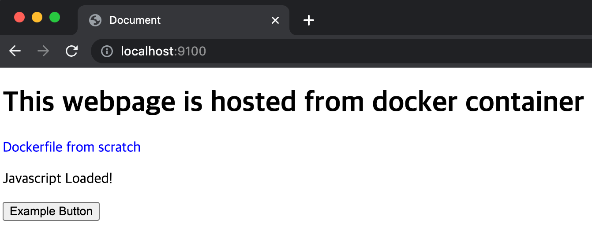
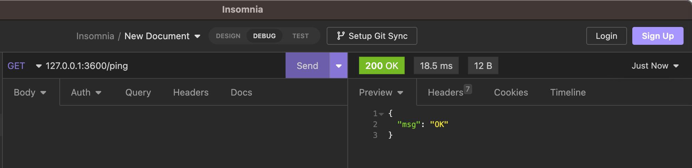
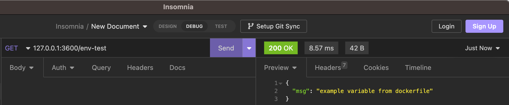

DockerFile
===
***
- Author : 홍익대학교 소프트웨어융합학과 윤준호(Hoplin)
- 사전과제
    - Dockerfile 실습과제를 위한 미니 프로젝트 혹은 토이 프로젝트 완성하기.(언어 무관, 웹, 앱 CLI 앱 모두 상관 없음) 자신의 Github에 업로드해서 제출
    - 복습
    - [Appendix Shell-Script](../Appendix-Shell-Script-Grammer-In-Bash/Readme.md) 공부하기
- 사전준비
    - Visual Studio Code Extension : [Docker](https://marketplace.visualstudio.com/items?itemName=ms-azuretools.vscode-docker)
    - RESTful API testing : [Insomnia](https://insomnia.rest)
***
**git clone을 아직 안한 사람은 git clone으로 레포지토리를 다운로드 하고 진행할것을 권장한다.**
***
## `docker commit` & `docker diff`

`docker commit` 명령어는 컨테이너 변경사항을 이미지 파일로 생성하는 역할을 한다. 예를 들어  `ubuntu`이미지에서 아래 과정을 수행한다고 가정하자


1. `example-directory`라는 디렉토리를 생성한다

2. `example-directory`에 `test.sh`라는 파일을 생성한다. 이 쉘 스크립트 파일은 'hello world'라는 문자열을 출력할 수 있어야한다. 

3. 기본적인 ubuntu 패키지 매니저 update,upgrade를 진행한다

```bash
# Host
docker run -it --name commit-test ubuntu bash

# Container
mkdir example-directory
touch example-directory/test.sh
echo "echo 'hello world'" >> example-directory/test.sh
apt-get update & apt-get upgrade
```
이 상태에서 새 터미널 창을 열고 `docker diff`를 입력하면 아래와 같이 수만은 로그들이 나오는것을 볼 수 있다. `docker diff`의 기본 사용법은 아래와 같다.
```bash
docker diff (컨테이너 이름 혹은 id)
```
```bash
docker diff commit-test

# Result
A /example-directory
A /example-directory/test.sh
C /etc
C /etc/pam.d
C /etc/pam.d/common-auth
C /etc/pam.d/common-password
C /etc/pam.d/common-session-noninteractive
C /etc/pam.d/common-session
C /etc/pam.d/common-account
C /etc/ld.so.cache
C /usr
C /usr/lib
C /usr/lib/aarch64-linux-gnu
C /usr/lib/aarch64-linux-gnu/krb5
C /usr/lib/aarch64-linux-gnu/krb5/plugins
C /usr/lib/aarch64-linux-gnu/krb5/plugins/preauth
C /usr/lib/aarch64-linux-gnu/krb5/plugins/preauth/spake.so
C /usr/lib/aarch64-linux-gnu/libpam_misc.so.0
C /usr/lib/aarch64-linux-gnu/libkrb5.so.3
...
```
`docker diff`의 결과를 보면 앞에 `A`,`C`와 같은 플래그가 있는것을 볼 수 있다. 이 과정에서는 안나왔지만, `D`라는 플래그도 존재한다. 이 **플래그들은 사용한 도커이미지를 기준으로 변경사항들을 의미**하며 각각의 플래그는 아래 의미를 가진다. 플래그들은 밑에서 실습하며 살펴볼것이다.

- `A` : 추가된파일
- `C` : 변경된파일
- `D` : 삭제된 파일

이제 `docker commit` 을 사용해서 위 과정을 진행한 컨테이너를 이미지화 해볼것이다. `docker commit`의 기본 사용법은 아래와 같다.
```bash
docker commit <옵션> <컨테이너 이름 혹은 id> <이미지이름>:<태그, 생략시 latest로 치환>
```
`commit` 옵션 중 사용해볼 것은 `-a`와 `-m` 옵션이다.
- `-a` : 커밋을 진행한 사람
- `-m` : 커밋메세지

`docker commit`을 사용하기 위해 우선 컨테이너에서 나와 종료시킨다. 그 후 `docker commit` 명령어를 사용해준다. 이미지 생성시 태그가 있는경우, 없는경우 모두 생성해본다. 그 후 방금 생성한 이미지를 `grep` 명령어를 사용해 출력해본다.
```bash
# Container
exit

# Host

# 태그없이
docker commit -a 'Hoplin' -m 'CommitExample' commit-test imagebycommit
# 태그를 지정하여 생성
docker commit -a 'Hoplin' -m 'CommitExample' commit-test imagebycommit:version1.1
# 이미지 목록 출력
docker images | grep imagebycommit

# 결과
imagebycommit             version1.1        7928a3cbe09e   2 minutes ago   111MB
imagebycommit             latest            cd7bd6ce8a65   3 minutes ago   111MB
```
아래 순서대로 명령어를 입력하며 실습해본다

1. 새로 생성한 이미지를 가지고 컨테이너를 만들어 본다.
    ```bash
    # Host
    docker run -it --name containerbycommit imagebycommit
    ```
2. `example-directory`디렉토리와 그 안에 `test.sh`가 존재하는지 확인한다.
    ```bash
    # Container
    ls example-directory
    cat example-directory/test.sh

    # 결과
    test.sh
    echo 'hello world'
    ```
3. `test.sh`의 내용을 변경한다. 단 `sed` 명령어를 이용하여 변경해본다.
    ```bash
    # Container
    sed -i "s/'hello world'/'changed text'/g" example-directory/test.sh
    cat example-directory/test.sh

    # 결과
    echo 'changed text'
    ```
4. 새로운 터미널을 열고 `docker diff`명령어를 사용하고 결과를 살펴본다. 
    ```bash
    # Host
    docker diff containerbycommit

    # 결과
    C /example-directory
    C /example-directory/test.sh
    ```
5. `rm` 명령어를 사용해서 `test.sh`를 삭제해본다.
    ```bash
    # Container
    rm example-directory/test.sh
    ```
6. `docker diff` 명령어를 사용하고 결과를 살펴본다.
    ```bash
    # Host
    docker diff containerbycommit

    # 결과
    C /example-directory
    D /example-directory/test.sh
    ```

`docker diff`의 결과를 보면 `4`에서는 `test.sh`를 수정한 이후이므로 `C` 플래그가 나타나는것을 볼 수 있다(디렉토리 또한 디렉토리의 내부 파일이 변경되었으므로, `C`플래그). 그리고 `6`에서는 `test.sh`를 삭제한 이후이므로 `D` 플래그가 나타나는것을 볼 수 있다.

## Before Dockerfile
한가지 예시를 들어보자. 만약 우분투에 `git`,`gcc`가 설치된 상태의 이미지가 필요하다고 가정을 하자. 현재로서 생각나는것은 위에서 본 `docker commit` 명령어를 이용해서 컨테이너 자체를 이미지로 변경하는 방법이 생각날 것이다. 하지만 이런 방법에서의 단점은 명확하다.

1. 패키지 설치를 일일히 설치해야하며, 이미지에 특정 코드를 불러와야하는 경우, 골치아프다.
2. 만약 이미지를 실수로 삭제한다면, 다시 컨테이너를 만들고, 다시 이미지로 만드는 과정을 거쳐야한다. 그리고 혹시라도 많은 명령어를 사용하여 이미지를 만들었다면, 그 명령어들을 모두 기억할 수 있는 확률도 매우 적을 것이다. 이 뿐만아니라, 과정도 꽤 복잡하다.

도커에서는 이미지를 생성하기 위한 패키지 설치 과정, 소스코드 복사, 실행해야하는 쉘 등을 `Dockerfile`을 만들어서 기록한 후 `docker build` 명령어로 이미지를 `Dockerfile`의 정의대로 생성한다. 이렇게 하면 `docker commit`으로 일일히 이미지를 만들어주는 수고가 줄어든다. 지금 당장은 별 차이가 없어보일 수 있지만, 대규모 서비스 환경을 정의하기 위해서는 필수이다. 한가지 더 알아두면 좋은것은, 자신이 만든 이미지는 `Docker hub`에 업로드할 수 도 있다.

### Dockerfile 맛보기

`Dockerfile`문법에 대해 알아보기 전에 전반적인 `Dockerfile` 흐름을 살펴보자. 간단하게 apache2를 설치하고, 웹페이지 하나를 호스팅 하는 실습을 진행해 볼 것이다.소스코드는 [dockerfile-scratch](./dockerfile-scratch/)에 코드가 있으니 참고바란다. 자신이 실습하고자 하는 디렉토리에 `Dockerfile` 이라는 파일을 생성한다(확장자 없음).
```Dockerfile
# Dockerfile

FROM ubuntu
LABEL maintainer="hoplin"
RUN apt-get update\
    && apt-get upgrade -y\
    && apt-get install vim git apache2 -y

COPY ./index.html /var/www/html/index.html
ADD ./foo.js /var/www/html/foo.js

WORKDIR /var/www/html
EXPOSE 80

CMD [ "-D","FOREGROUND" ]
ENTRYPOINT [ "apachectl" ]
```
그 후 실습에 사용할 html,js파일을 작성한다. 주의할점은 Dockerfile과 동일한 디렉토리에 만들어야한다.
```html
<!-- index.html -->
<!DOCTYPE html>
<html lang="en">

<head>
    <meta charset="UTF-8">
    <meta http-equiv="X-UA-Compatible" content="IE=edge">
    <meta name="viewport" content="width=device-width, initial-scale=1.0">
    <script src="./foo.js"></script>
    <title>Document</title>
</head>

<body>
    <h1>This webpage is hosted from docker container</h1>
    <p style="color: blue;">Dockerfile from scratch</p>
    <p id="jsloading">Wait for javascript loaded</p>
    <button onclick="exampleAlert()">Example Button</button>
</body>
</html>
```
```Javascript
// foo.js
const exampleAlert = () => {
    alert("example alert")
}

window.onload = () => {
    const element = document.getElementById('jsloading');
    element.innerText = "Javascript Loaded!"
}
```
터미널을 새로 열어, Dockerfile이 있는 디렉토리로 이동한다. 그 후 `docker build` 명령어로 이미지를 만들고 컨테이너를 실행한다. 단 아래 조건을 생각하며 명령어를 작성한다

- 컨테이너 포트 80번은 호스트 머신의 9100번 포트에 바인딩 되어야한다
- 컨테이너 실행 옵션은 Attach Mode, Detach Mode중 무엇이 더 알맞은 선택일까? 그리고 왜 그 선택을 하였는가?

```bash
cd (실습하고 있는 디렉토리)

docker build -t imagefromdockerfile .
docker run -d --name mycontainer -p 9100:80 imagefromdockerfile
```
위 명령어를 모두 입력하였다면 웹브라우저에서 `localhost:9100`에 들어가본다. 그러면 아래와 같이 html로 작성한 페이지가 나오는것을 볼 수 있다. 

> 한가지 참고하면 좋은것은, Apache 웹서버는 `/var/www/html`디렉토리를 root 디렉토리로 사용하며, 웹서버 도메인으로 별도의 경로 지정없이 접속하는경우,`index.html`이라는 파일을 기본으로 반환한다. 예를 들어 `localhost:9100`으로 접속시, 여기서도 별도의 경로(ex : `www.google.com/search~~~` 에서 `/search`와 같은것을 의미)를 지정하지 않았다. 그렇기에 Apache 웹서버는 `/var/www/html`에 있는 `index.html`을 기본으로 반환하는것이다. 그리고 앞에서도 봤듯이, `80`은 Apache웹서버가 http 요청을 받는 기본포트번호이다.



### `docker build` 명령어
`Dockerfile`을 이미지로 만들기 위해서는 `docker build`라는 명령어를 사용하게 된다. 사용 방식은 아래와 같다
```bash
docker build (옵션) (Dockerfile경로)
```
대표적인 옵션으로는 `-t`, `-f`가 있다
- `-t` : 이미지의 태그를 지정할때 사용한다. **필수 권장 옵션**이며 아래와 같이 사용자 명을 같이 기재할 수 있다. Docker hub에 이미지를 올리기 위해서는 사용자 명을 꼭 붙여야한다.
    ```bash
    docker build -t imagetag .
    docker build -t hoplin/imagetag .
    ```
- `-f` : 기본적으로 도커엔진은 지정한 `Dockerfile 경로`에서 `Dockerfile`이라는 파일을 찾아서 이미지를 빌드한다. 하지만, 필요에따라 다른 이름의 도커파일을 생성해야할 수 도 있다(예를들어 개발환경 도커를 위해 `Dockerfile.dev`와 같이 이름짓는 경우). 그런 경우 `-f` 옵션을 사용해서 도커파일의 이름을 지정해줄 수 있다.
    ```bash
    docker build -f Dockerfile.dev -t imagetag .
    ```
## Dockerfile 문법
***
아래 문법들을 볼때 사용할 예시 디렉토리는 [dockerfile-explain](./dockerfile-explain/)이니 참고하자.
***
### `.dockerignore`

**Dockerfile과 동일한 디렉토리에 있는 모든 파일들을 `컨텍스트`라고 한다**. 이미지를 생성할 때 모든 컨텍스트를 `Docker Daemon`에 전송하게 되는데, 이미지에 넣으면 안되는 파일들이 있을수도 있다(예를들어 API Key들이 들어있는 설정파일). 그런 경우 `.dockerignore`파일을 작성해 배제할 파일들을 기재하면된다. 주의할점은 **`.dockerignore`파일은 컨텍스트가 존재할 수 있는 최상단 디렉토리(Dockerfile과 동일한 디렉토리)에 존재해야한다**. 

`.dockerignore`의 파일 지정 문법은 Go언어의 `path`패키지의 `match`의 문법을 따르니 참고바란다([Document](https://pkg.go.dev/path/filepath@go1.20#example-Match))

```.dockerignore
# example dockerignore file

*.cpp
*.html
.env
DS_Store

```

### `FROM`
`FROM`은 이미지의 기반이될 이미지를 지정하는 명령어이다. 이미지 지정은 이미지 이름만 사용하거나 이미지 이름과 태그를 같이사용하여 지정할 수 있다. 지금쯤 당연해야하는것이지만, 태그 생략시 `latest`태그가 자동으로 붙는다. 주의할점은 **`FROM`은 `Dockerfile`의 가장 첫줄에 와야한다는점**이다. 만약 **지정한 이미지가 호스트에 없다면 `Docker Hub`에서 `pull`을 한 후 이미지를 생성한다**

```Dockerfile
# Without image tag
FROM centos

# With image tag
FROM centos:centos7.9.2009
```

### `LABEL`
`LABEL`은 이미지에 메타데이터를 지정할 수 있는 명령어이다.`키=값`형태로 값을 지정하며 이미지를 생성하는데 큰 영향을 주지 않는다.
```Dockerfile
LABEL maintainer="Hoplin"
LABEL email="jhoplin7259@gmail.com"
```

### `ENV`
`ENV`는 환경변수를 설정한다. `ENV`로 설정한 환경변수는 `RUN`,`CMD`,`ENTRYPOINT`에 적용된다. 
```Dockerfile
ENV (Variable name) (value)

#example
ENV EXAMPLE_ENV 'example-environment-variable'
```

### `RUN`
`RUN` 명령어는 `FROM`에서 지정한 이미지의 쉘에서 명령어 혹은 쉘스크립트를 실행한다.단, **명령어가 실행 되는 기본 디렉토리는 `FROM`에서 지정한 이미지의 `WORKDIR`로 지정된 디렉토리이며 만약 지정이 안되어있다면 기본적으로 `/`(최상단 Root디렉토리)라는점을 기억하자.만약 명령어를 실행하는 경로를 바꾸고 싶다면 아래에서 볼 `WORKDIR`명령어를 통해 바꿔줄 수 있다.** 위에서 봤듯이 `&&`연산자를 이용해 연쇄적인 명령어를 실행해도 되고, `배열`형태로 주어 실행해도 된다. 자신이 편한 방식으로 사용하면 된다
```Dockerfile
# 연쇄적인 방식
RUN (command1)\
&& (command2)\
&& (command3)

#배열 사용 방식
RUN [(command or executable file 1), (argument1),(argument2)]
RUN [(command or executable file 2), (argument1),(argument2)]
RUN [(command or executable file 3), (argument1),(argument2)]
```

`RUN`을 이용하여 생성한 결과는 새로운 이미지에 모두 적용이 된다. 주의할 점은 **이미지 build중인 시점에서는 입력을 줄 수 없기 때문에, `-y` 플래그를 주어 설치 확인 유무를 생략해 주어야한다**. 아래 예시에서도 `-y` 플래그를 주어 설치 확인 옵션을 자동으로 생략한다.

```Dockerfile
RUN apt-get update\
    && apt-get upgrade -y\
    && apt-get install vim git apache2 -y
```
만약 `-y`옵션을 주지 않으면 아래와 같이 오류가 날 수 있다.
```bash
...
#4 9.155 After this operation, 0 B of additional disk space will be used.
#4 9.155 Do you want to continue? [Y/n] Abort.
------
executor failed running [/bin/sh -c apt-get update    && apt-get upgrade    && apt-get install vim git apache2 -y]: exit code: 1
```
### `WORKDIR`
`WORKDIR`은 `RUN`,`CMD`,`ENTRYPOINT`등 명령어들에서 사용하는 기본 디렉토리를 설정한다. 
```Dockerfile
WORKDIR (경로)
```

### `ADD`
파일을 이미지에 추가한다. 사용방법은 아래와같다. 단 복사할 파일은 컨텍스트 혹은 컨텍스트 하위 디렉토리의 파일들만 가능하며, 디렉토리도 가능하다.
```Dockerfile
ADD (복사할 파일 경로 혹은 파일) (이미지에서 저장될 파일 경로(파일경로에 파일명을 함께 명시하여 저장될 이름을 변경해줄 수 있다.))
```
`ADD`의 특징들을 살펴보자

첫번째는 **복사할 파일로 파일의 URL을 첨부할 수 있다는 점**이다. 주의할점은 URL의 마지막이 `(파일명).(파일확장자)`형태여야한다.
```Dockerfile
ADD https://github.com/J-hoplin1/J-hoplin1/blob/master/README.md .
```
두번째는 **로컬에 있는 압축파일(`tar`,`tar.gz`,`tar.xz`...etc)들 같은 경우, `tar`파일을 풀어서 추가**된다. 

다만, **URL타입으로 지정하는 경우에는 풀어지지않고, 그대로 넣어지게 된다**.
```Dockerfile
ADD example_tar.tar .

ADD https://www.zlib.net/zlib-1.2.13.tar.gz .
```
웹에서 가져온 압축파일을 풀기 위해서는 `curl`명령어와 `tar`명령어를 함께 활용하여 압축을 해제할 수 있다. 

잠깐 `tar`,`curl`명령어의 옵션을 몇가지 살펴보자 
- `curl`
    - `-X` : HTTP method 설정한다
    - `-H` : Header를 설정한다
    - `-d` : 데이터를 전달한다.
    - `-f` : contentType은 `multipart/form-data`로 보낸다.
    - `-o` : 응답을 파일로 출력한다

- `tar`
    - `-c` : 파일을 tar로 묶는다
    - `-v` : 묶거나 파일을 풀때 과정을 화면으로 출력한다
    - `-f` : 파일이름을 지정한다
    - `-x` : tar압축을 푼다
    - `-z` : gzip으로 압축하거나 해제한다.
```Dockerfile
RUN curl https://www.zlib.net/zlib-1.2.13.tar.gz | tar -xz
```

### `COPY`
`COPY`또한 `ADD`처럼 파일을 이미지에 추가한다. 단 `ADD`와 달리, URL형식의 파일을 추가한다거나, 압축파일을 자동으로 풀어서 추가하는 일은 하지 못한다. 사용방법은 아래와 같다.
`COPY`를 사용해 디렉토리를 추가할때 추가할때 `.dockerignore`파일이 있는경우, 적용이 된다.
```Dockerfile
COPY (복사할 파일 경로 혹은 파일) (이미지에서 저장될 파일 경로(파일경로에 파일명을 함께 명시하여 저장될 이름을 변경해줄 수 있다.))
```

### `VOLUME`
`VOLUME`은 지정한 디렉토리 내용을 호스트의 물리적 디렉토리 혹은 도커 볼륨에 저장하도록 설정한다.하나의 디렉토리만 지정할 수 있으며, 여러개를 배열형태로 지정할 수 있다. 
```Dockerfile
VOLUME (directory)

or

VOLUME [(directory1),(directory2)...]
```
앞에서 보았던 `docker run` 옵션 중 `-v`옵션을 사용해서 설정할 수 있다. 주의할 점은 **호스트볼륨 혹은 도커볼륨에 의해 컨테이너의 디렉토리가 덮어씌우기 되는것**이다. 그렇기 때문에, **호스트와 연결한 컨테이너의 디렉토리에 파일이 있었다면, 모두 삭제되고, 호스트볼륨 혹은 도커볼륨의 파일들로 대체된다**. 

```Dockerfile
VOLUME '/dir'
VOLUME ['/dir1','/dir2','/dir3']
```

### `EXPOSE`
`EXPOSE`는 호스트와 연결할 포트번호를 설정한다. 하나의 포트번호만 설정해줄 수 도 있고, 여러개를 지정해주어도 된다.
```Dockerfile
EXPOSE (portnumber)

or

EXPOSE (portnumber1) (portnumber2) ...

# example
EXPOSE 5000 6000
```
앞에서 보았던 `docker run`옵션 중 `-p`옵션을 사용해서 설정할 수 있다.

### `CMD`
`CMD`는 컨테이너가 시작되었을때 스크립트 혹은 명령을 실행한다. `docker run`명령으로 컨테이너 실행시, 실행 명령어가 없는경우, `CMD`의 명령이 실행되게 되며, `docker run`에 실행 명령어가 있는 경우에는 무시된다. 또한 `docker start`명령으로 정지된 컨테이너 실행시 실행되는 명령어이기도 하다. `CMD`는 두가지 형식으로 활용할 수 있다.

- 일반 명령어 형식
    ```Dockerfile
    CMD (실행 명령어) (실행인자)


    # example
    CMD touch test.txt
    ```
- 배열형식
    ```Dockerfile
    CMD [(실행명령어),(실행인자1),(실행인자2)...]

    #example

    CMD ["apachectl","-D","FOREGROUND"]
    ```
### `ENTRYPOINT`
`ENTRYPOINT` 또한 컨테이너가 시작되었을때 스크립트 혹은 명령을 실행한다. `docker start`명령으로 정지된 컨테이너 실행시 실행되는 명령어라는점도 동일하다. 활용 형식도 `CMD`와 동일하다

- 일반 명령어 형식
    ```Dockerfile
    ENTRYPOINT (실행 명령어) (실행인자)


    # example
    ENTRYPOINT touch test.txt
    ```
- 배열형식
    ```Dockerfile
    ENTRYPOINT [(실행명령어),(실행인자1),(실행인자2)...]

    #example

    ENTRYPOINT ["apachectl","-D","FOREGROUND"]
    ```

다만 `CMD`와의 차이점이라면, **`ENTRYPOINT`는 `docker run`에 실행 명령어가 있어도 무시되지 않고, 먼저 실행된 후 `docker run`실행 명령어에 기재한 내용이 `ENTRYPOINT` 실행명령어의 실행인자로 들어가게 된다. (단, ENTRYPOINT를 배열 형식으로 지정했을때만 해당한다)**.

### `CMD`, `ENTRYPOINT`차이 확인하기
한번 두 명령어를 비교해보자. 이 예시에 쓰이는 도커파일은 [entry-cmd-compare](./entry-cmd-compare/) 디렉토리에 있다. 
```bash
# Build image

docker build -f Dockerfile-cmd -t cmdtest .
docker build -f Dockerfile-entry -t entrytest .

# cmdtest 이미지 실행
docker run cmdtest echo world

# 결과
world

# entrytest 이미지 실행
docker run entrytest world

#결과
Hello world
```
위 결과를 보면 알 수 있듯이,`CMD`는 실행 명령어에 의해 무시되지만, `ENTRYPOINT`는 우선 실행된 이후, 실행 명령어의 값이 `ENTRYPOINT`의 매개변수로 들어가는것을 볼 수 있다.

### `CMD`와 `ENTRYPOINT`를 같이 쓰는 경우
**두 명령어를 같이 사용하는 경우**도 있다. 이러한 경우, **`CMD`는 `ENTRYPOINT`에 매개변수를 전달하는 역할만 한다**. 이런 경우 CMD 독자적으로 명령어를 수행할 수 있는 능력을 잃는다.이 예시에 쓰이는 도커파일은 [entry-cmd-compare](./entry-cmd-compare/) 디렉토리에 있다.

`docker run`을 사용해서 컨테이너를 실행할때 실행인자를 주지 않으면, `CMD`의 값이 실행인자로 전달되어 실행되는것을 볼 수 있다. 
```bash
#Build image

docker build -f Dockerfile-cmd-entry -t cmdentrytest .

docker run cmdentrytest

#결과 
Hello World
```
만약에 `docker run`을 할때 실행 인자와 함께 전달한다면 어떻게 될까?
```bash
docker run cmdentrytest test

#결과
Hello test
```
이번에는 `CMD`의 값들이 무시되고, 실행 명령어 부분에 전달한 값이 `ENTRYPOINT`의 실행 인자로 넘겨진것을 볼 수 있다. 위에서 보았듯이 `CMD`는 `docker run`의 실행 명령어에 값이 있으면, 무시되는 성질이 있었다. `CMD`, `ENTRYPOINT`를 사용하는 경우도 동일하게, `docker run`명령어에 실행 명령어가 전달된 경우,`CMD`의 값들이 무시되고, `docker run`의 실행 명령어의 값들이 `ENTRYPOINT` 명령어의 실행 인자로 전달되는것이다.
## 실습
위 명령어들을 이용해서 예시 Dockerfile을 따라 작성해본다. 각각이 어떤 의미를 가지는지 생각하면서 따라 작성한다.주어진 API 코드와 Apache2 웹서버를 사용해서 실습을 진행해본다. 예시코드는 [Example-RESTful](./Example-RESTful/)디렉토리에 있다.

우선 `Dockerfile`을 먼저 살펴본다. 타이핑하면서 각각의 명령어가 의미하는것을 생각해본다
```Dockerfile
FROM node

LABEL maintainer="Hoplin"

RUN apt-get update\
    && apt-get upgrade -y\
    && mkdir api

ENV EXAMPLEVAR='example variable from dockerfile'

COPY ./example.txt .

WORKDIR /api

# 여기서부터 명령어가 실행되는 컨테이너 내부 디렉토리는 어디일까?

EXPOSE 3000
VOLUME [ "/api" ]

CMD [ "run" ]
ENTRYPOINT [ "npm" ]
```
Node.js를 모르는 사람을 위해 조금의 설명을 하자면 `process.env`를 사용해서 환경변수에 접근할 수 있다. `/env-test`엔드포인트는 도커파일에 지정한 환경변수 `EXAMPLEVAR`의 값을 반환하는 엔드포인트이다.
```js
...

app.get('/env-test', (req, res) => {
    return res.status(200).json(
        {
            msg: process.env.EXAMPLEVAR
        }
    )
})

...
```
그리고 Node.js를 사용하는 프로젝트는 주로 `npm init`이라는 명령어로 프로젝트 디렉토리를 초기화하는데, 그 과정에서 `package.json`파일이 생성된다. 그 안에 `scripts`라는 값 안에 `"key : value"` 식으로 간단하게 스크립트를 만들 수 있다. 이를 사용하기 위해서는 `npm run`이라는 명령어가 사용되고, `key`,`value`는 각각 아래와 같이 쓰인다. 이 실습에서는 `npm run start`를 사용해 볼 것이다.

```json
"scripts": {
    "test": "echo \"Error: no test specified\" && exit 1",
    "start": "npm i && node app.js"
  },

npm run (key) => (value에 적힌 명령어들 실행)

npm run start => "npm i && node app.js" 실행
```
이제 `Dockerfile`을 이미지로 만들고 실행해본다.

```bash
docker build -t rest-test .
docker run --name api-test -v $(pwd):/api -p 3600:3000 rest-test start

> example-restful@1.0.0 start
> npm i && node app.js


up to date, audited 83 packages in 512ms

8 packages are looking for funding
  run `npm fund` for details

found 0 vulnerabilities
npm notice 
npm notice New minor version of npm available! 9.2.0 -> 9.4.1
npm notice Changelog: <https://github.com/npm/cli/releases/tag/v9.4.1>
npm notice Run `npm install -g npm@9.4.1` to update!
npm notice 
listening on port 3000
::ffff:172.17.0.1 - - [05/Feb/2023:09:39:23 +0000] "GET /env-test HTTP/1.1" 200 42 "-" "insomnia/2022.7.5"
```
API 테스팅 툴인 `Insomnia`를 실행한다. 그리고 `127.0.0.1:3600`URL에 아래와 같이 요청을 보내본다.

- 127.0.0.1:3600/ping



- 127.0.0.1:3600/env-test

