Docker Volume
===
***
- Author : 홍익대학교 소프트웨어융합학과 윤준호(Hoplin)
***
## Docker Container은 기본적으로 휘발성을 가진다

Dockerfile을 아래와 같이 간단히 정의했다고 가정해 보자
```Dockerfile
FROM ubuntu:14.04

RUN mkdir example

WORKDIR /example

RUN echo "print('hello world')" >> ex.py

ENTRYPOINT [ "/bin/bash" ]
```
이미지를 빌드 하고 컨테이너 하나를 만들어 본다.
~~~
root@9aed78c57ae4:/example# echo "Example sentence" >> a.txt
root@9aed78c57ae4:/example# ls
a.txt  ex.py
~~~
파일이 잘 만들어 졌으며, 도커 이미지에서 생성한 파이썬 파일도 존재하는것을 볼 수 있다. 이제 컨테이너를 지우고, 동일한 이미지로 컨테이너를 생성한다. 그 후 디렉토리를 다시 한번 확인해본다.
~~~
root@861d9f139933:/example# ls
ex.py
~~~
다시 보니, 아까 만든 `a.txt`라는 파일은 없어지고, `ex.py`만 남아있는것을 볼 수 있다. 이는 컨테이너는 기본적으로 휘발성을 가지고 있기 때문이다. 도커 이미지를 통해 컨테이너를 생성하면 아래와 같은 형태를 띄게 된다.
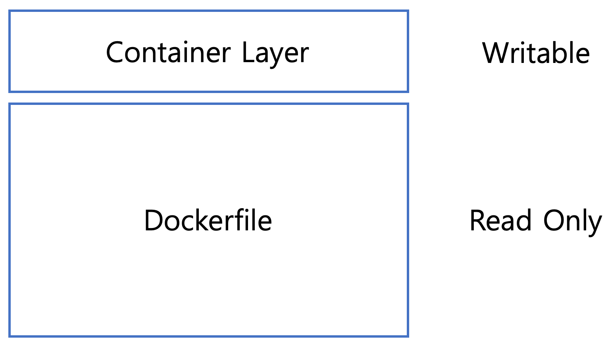
기본적으로 이미지를 통해 컨테이너를 만들면, 컨테이너는 읽기전용이 된다. 그리고 컨테이너 변경 사항만 별도로 저장하여, 컨테이너 정보를 보존한다. 이미지는 어떠한 경우로도 변경되지 않는다. 원래 이미지에서 변경된 파일시스템들은 모두 `Container Layer`에 저장되게 된다. 단, 이 Container Layer는 컨테이너가 삭제되면, 같이 삭제가 되는 점이 있다. 그렇기에 기본적으로 `Docker Container는 휘발성을 가진다`. 

`Docker Volume`을 사용하면, 데이터를 영구적으로 저장할 수 있다. 그리고 Docker에는 볼륨을 관리하는 방법중 대표적인 3가지를 알아보고자 한다.

## 1. Host Machine과 Container의 공유
아래 명령어를 입력해 mysql 컨테이너를 생성해 본다.
~~~
docker run -d -e MYSQL_ROOT_PASSWORD=hoplin1234! -e MYSQL_DATABASE=wordpress -v $(pwd):/var/lib/mysql mysql
~~~
일반적인 `docker run`과 달리진 점이라면, `-v`옵션이 생긴것이다. `-v`옵션의 인자는 기본적으로 아래와 같은 형태로 입력한다
~~~
(호스트 머신 디렉토리):(컨테이너 디렉토리)
~~~
ls를 입력해서 현재 디렉토리를 확인하면, mysql config와 관련된 파일들이 생긴것을 볼 수 있다. 

기본적으로 `-v`옵션을 통해 볼륨을 공유하기 위해서는 공유하고자 하는 디렉토리를 Dockerfile을 만들때 `VOLUME`이라는 명령어의 인자에 주어야 한다(VOLUME에 명시를 하지 않아도 컨테이너 디렉토리 지정시 공유가 되긴 한다.). 실제로 방금 실습했던 [mysql dockerfile의 코드](https://github.com/docker-library/mysql/blob/master/8.0/Dockerfile.debian)를 보면 `VOLUME`인자에 `var/lib/mysql`이 지정되어있는것을 볼 수 있다.
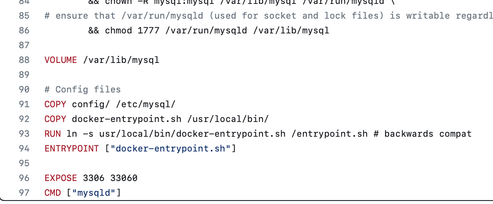
이번에는 mysql 컨테이너에 접속해서 `exampletext.txt`파일을 만들고, 호스트 머신에서도 해당 파일이 생겼는지 확인해본다.
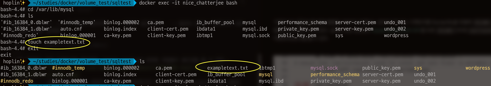
위 사진과 같이 동일한 파일이 바로 생기는것을 볼 수 있다.이말은 즉슨, 컨테이너의 `/var/lib/mysql`와 현재 디렉토리는 동일한 디렉토리를 사용한다는것을 알 수 있다. 컨테이너를 삭제한 후 현재 디렉토리를 다시 확인해 보자. 그러면, 컨테이너는 없어졌지만, mysql관련 config파일들은 남아있는것을 볼 수 있다.
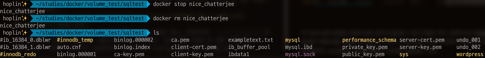

위에서 생성한 도커파일에 한줄을 더 추가한 후 다시 빌드한다.
```Dockerfile
FROM ubuntu:14.04

RUN mkdir example

WORKDIR /example

RUN echo "print('hello world')" >> ex.py

VOLUME [ "/example" ]

ENTRYPOINT [ "/bin/bash" ]
```
`/example`디렉토리를 호스트와 공유할 수 있도록 지정해준다. /example 디렉토리에 `ex.py`가 기본적으로 존재한다는 점을 상기하고, 컨테이너를 `-v`옵션에 현재디렉토리와 /example을 연결해주면서 생성해본다. 그 후 example디렉토리의 파일 리스트를 출력해본다
~~~
docker run -it -v $(pwd):/example exex
~~~
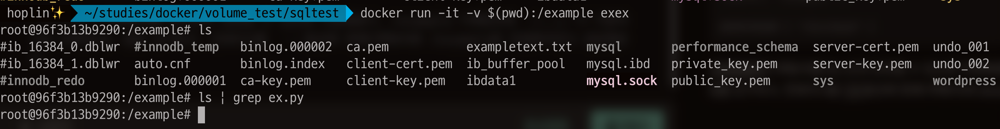
우리는 두가지 사실을 알 수 있다.

- 기존에 있던 파일이 그대로 컨테이너의 /example디렉토리에 적용되어있다
- 원래 있어야할 `ex.py`가 없어졌다.

이를 통해 알 수 있는것은, **기존에 존재하던 컨테이너 디렉토리에 호스트 볼륨을 공유하게되면, 컨테이너 디렉토리는 덮어씌우기가 된다는 점**이다. 기존에 mysql 컨테이너로 실습을 할때는 /var/lib/mysql에 원래 파일이 존재했던것이 아닌, mysql이 초기 설정되면서 파일이 작성되었기 때문에 파일이 호스트 디렉토리에 공유된것이다.

## 2. Volume Container
`-v`옵션을 사용하여, 컨테이너와 호스트 머신 디렉토리를 공유할 수 있는것을 알았다. 볼륨을 공유하는 두번째 방법은, `-v`옵션을 통해 생성한 컨테이너를 `--volumes-from`옵션을 통해 또 다른 컨테이너가 디렉토리를 공유하는것이다. 우선 현재 디렉토리의 파일을 모두 지우고, 위에서 작성한 도커파일을 통해 컨테이너를 하나 만든다. 

~~~
docker run -it --name first_level_container -v $(pwd):/example exex

docker run -it --name second_level_container --volumes-from first_level_contain
er exex
~~~
`second_level_container`을 생성할 때 --volumes-from옵션을 설정하여, `-v`옵션이 지정된, 컨테이너 볼륨 디렉토리를 공유하는 것이다.
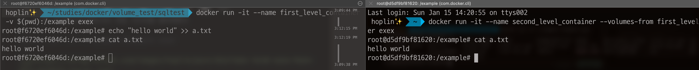
`first_level_container`에서 a.txt를 생성하고, `second_level_container`에서도 파일이 동일하게 생겨서, 값을 확인할 수 있는것을 볼 수 있다. 당연한 것이지만, 호스트 머신에서도 동일하게 파일이 생성되었다
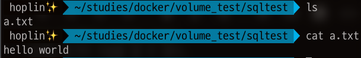
만약 `--volumes-from`을 통해서 공유받은 컨테이너가 서로 다른 Dockerfile을 가진다면 어떻게될까? 해답은 영향에 미치지 않는다이다. 위에서 만든 도커파일이 아닌, 일반 우분투 Dockerfilef로 `docker run ~~~ --volumes-from first_level_container~~`를 실행해보자.

~~~
docker run -it --volumes-from first_level_container ubuntu bash
~~~
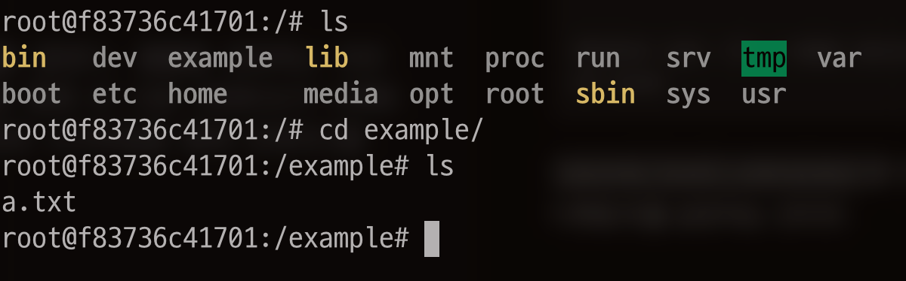
Dockerfile과 상관없이 동일하게 `first_level_container`의 디렉토리를 공유받는것을 볼 수 있으며, 파일을 생성해도 동일하게 공유된다. `--volumes-from`을 통해 볼륨을 공유하면 아래와 같은 구조를 가진다.
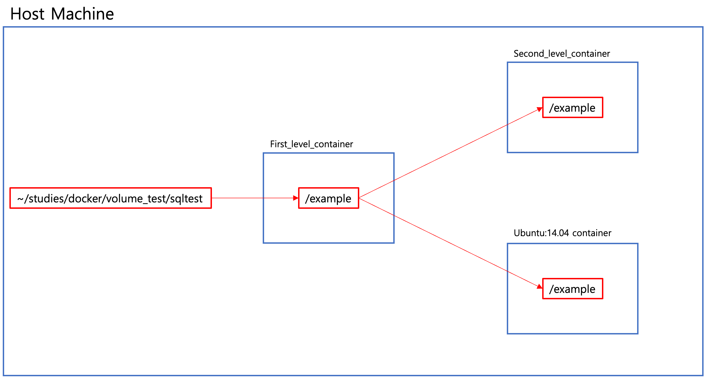

## 3. Docker Volume 사용하기
위에서 본 두가지 방법들은 결론적으로 호스트와의 공유를 통해서 볼륨을 공유하였다. 세번째 방법은, 도커 자체에서 제공하는 볼륨을 사용하는것이다. docker volume은 디렉토리 하나의 단위이며, 이는 Docker Engine이 파일시스템의 도커영역에서 관리하는 방식이다. 
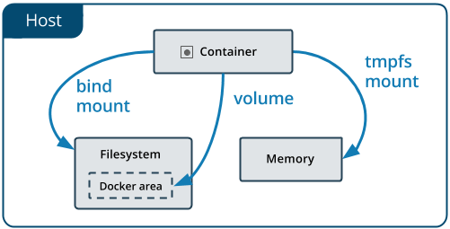
위 두 방식과 마찬가지로 호스트 머신에 저장되는 방식이다. 도커 볼륨을 생성하기 위해서는 `docker volume create`명령어를 통해 생성한다. 그 후 `docker volume ls`를 통해 볼륨 리스트들을 확인해본다.

~~~
docker volume create --name testvolume

docker volume ls
~~~
도커 볼륨을 사용한 컨테이너를 만들때는 위에서 보았던 방식과 동일하게 `-v` 옵션을 사용하며 인자는 아래와 같이 주면 된다
~~~
(볼륨 이름):(컨테이너 공유 디렉토리)
~~~
위에서 생성한 도커이미지와 방금 만든 `testvolume`을 이용하여 컨테이너를 생성해 본다.
~~~
docker run -it -v testvolume:/example exex
~~~
그 후 `test`라는 디렉토리 하나를 만든다.

만약 Docker Desktop이 있다면, volumes 탭에 들어가서 방금 만든 볼륨을 클릭 후, `In Use`탭에서 해당 볼륨을 사용중인 컨테이너를 `Data`탭에서 해당 볼륨 내에 있는 `test`디렉토리를 볼 수 있다. 당연하게도 해당 볼륨을 사용하는 컨테이너를 만들면, 컨테이너 마운트로 지정한 경로에 `test`라는 디렉토리가 똑같이 존재하게 된다.
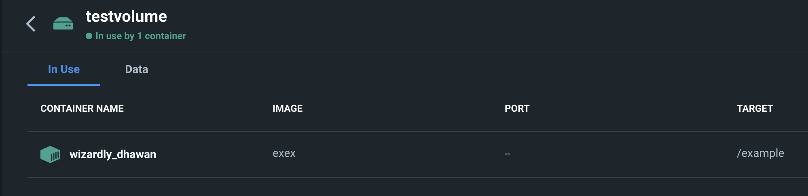 도커 볼륨은 아래와 같은 구조로 사용을 하게 되는것이다.
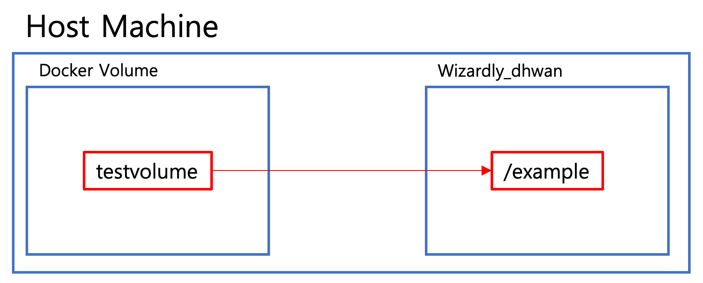
도커 볼륨의 기본적인 단위들을 확인할때는 `docker inspect` 명령어를 사용해 줄 수 있다.(단 --type을 volume으로 지정)
~~~
docker inspect --type volume testvolume


[
    {
        "CreatedAt": "2023-01-15T07:07:55Z",
        "Driver": "local",
        "Labels": {},
        "Mountpoint": "/var/lib/docker/volumes/testvolume/_data",
        "Name": "testvolume",
        "Options": {},
        "Scope": "local"
    }
]
~~~
간단히 필드를 짚고 넘어가자면, `Driver`는 볼륨이 쓰는 드라이버를 의미하며 local은 호스트 머신을 의미한다. driver type은 로컬 이외에도 cifs,ntfs, tmpfs등 다양한 형태가 있다. `--opt`옵션으로 필요에 따라 지정해줄 수 있다. Mountpoint는 볼륨이 실제 호스트의 어디에 저장되어있는지지만, 접근하지 못한다. Docker Volume을 사용한다라는 점 자체에서 사용자는 우선 Mountpoint의 정보를 알 필요가 없기 때문에 큰 영향은 없다. 컨테이너의 정보를 `docker inspect`를 통해 출력하여 mount정보를 보면, 지정한 볼륨으로 Mount가 되어있으며, Source에는 볼륨의 경로가, Destination에는 컨테이너 경로가 적혀져있는것을 볼 수 있다.
~~~
docker inspect (container id)
~~~

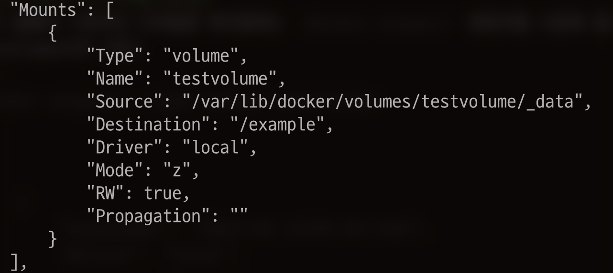

볼륨을 삭제하기 위해서는 `docker volume rm`을 사용하면 된다. 
~~~
docker volume rm (container id or name)
~~~
혹은 안쓰는 볼륨들을 한번에 지우기 위해서는 `docker volume prune`을 사용하는 방법도 있다.
~~~
docker volume prune
~~~

## 상황에 따라 어떤걸 써야할까?
도커 볼륨이랑 호스트 머신과의 공유는 어떨때 구분해서 써야할까? 해당 정리를 아래 간단하게 정리해 보았다.

### Host machine
- Docker Container과 config filed을 공유할때
- Dev Container를 구성하여 사용하는 경우, 호스트와 컨테이너 간의 소스코드 연동을 위해서 사용
- 디렉토리 구조가 일정 하게 잡혀있는것이 보장되어야하는 경우

### Docker Volume
- 디렉토리 구조가 일정하게 잡혀있지 않아도 되는경우
- 도커 컨테이너 자체적인 운용만으로도 괜찮으며, 원격 혹은 클라우드 호스트에 저장할때 적합하다