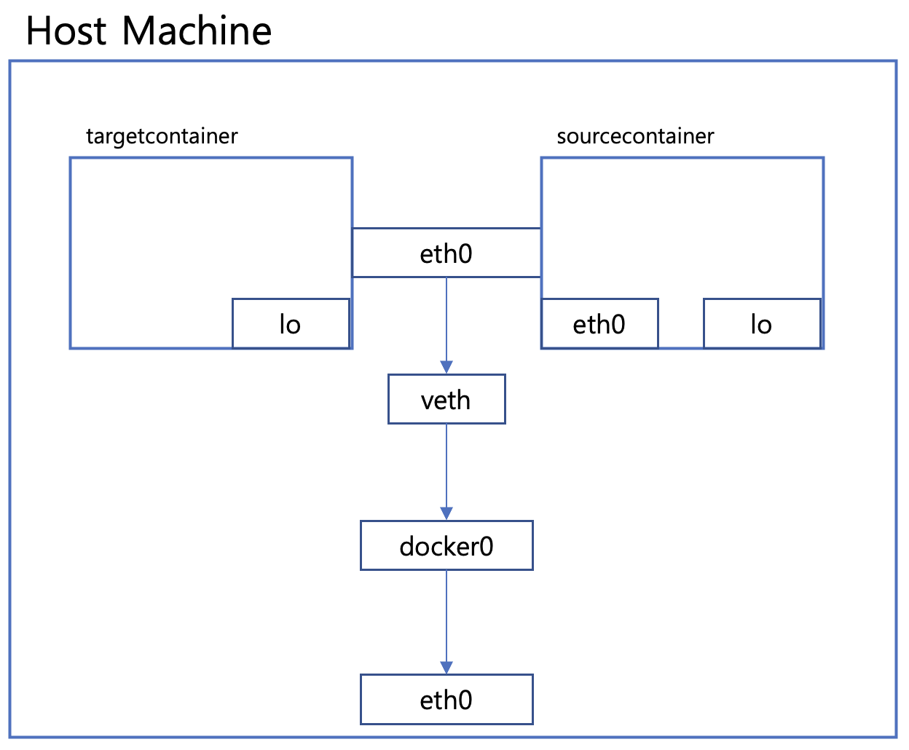
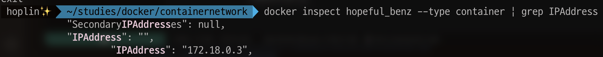

Docker Network
===
***
- Author : 홍익대학교 소프트웨어융합학과 윤준호(Hoplin)
***
## 실험환경 
- PC : Macbook Pro
- CPU/Memory : M1(ARM) /16GB
- Docker Version : 20.10.21
- 기타 : Intel PC를 쓰시는분은 Redis를 x86전용이미지로 pull해주세요
## Docker Network 구조
ubuntu:14.04 이미지로 컨테이너를 임의로 하나 만들고 `ifconfig`명령어를 입력해본다. 그러면 아래와 같이 결과가 나오는것을 볼 수 있다.
~~~
root@34b04067bf3a:/# ifconfig
eth0      Link encap:Ethernet  HWaddr 02:42:ac:11:00:02
          inet addr:172.17.0.2  Bcast:172.17.255.255  Mask:255.255.0.0
          UP BROADCAST RUNNING MULTICAST  MTU:1500  Metric:1
          RX packets:8 errors:0 dropped:0 overruns:0 frame:0
          TX packets:0 errors:0 dropped:0 overruns:0 carrier:0
          collisions:0 txqueuelen:0
          RX bytes:736 (736.0 B)  TX bytes:0 (0.0 B)

lo        Link encap:Local Loopback
          inet addr:127.0.0.1  Mask:255.0.0.0
          UP LOOPBACK RUNNING  MTU:65536  Metric:1
          RX packets:0 errors:0 dropped:0 overruns:0 frame:0
          TX packets:0 errors:0 dropped:0 overruns:0 carrier:0
          collisions:0 txqueuelen:1000
          RX bytes:0 (0.0 B)  TX bytes:0 (0.0 B)
~~~
eth0란 랜카드를 의미한다. 그리고 lo는 loopback IP를 의미하며 우리가 흔히 아는 127.0.0.1을 의미한다.

도커는 컨테이너 내부에 IP를 순차적으로 할당한다. 그리고 이 IP는 컨테이너 재부팅시 재할당 될 수 도 있다. 이 IP는 호스트 내부에서만 사용할 수 있는 IP이다. 이 IP가 외부와 연결될때는 호스트에 `veth`라는 네트워크 인터페이스가 생성된다. `veth`는 도커 엔진에서 생성하며, 우분투,Cent OS같은 순수 리눅스 계열에서는 볼 수 있다. 
~~~
veth1: flags=4163<UP,BROADCAST,RUNNING,MULTICAST> mtu 1500 
	inet 10.0.0.25 netmask 255.255.255.0 broadcast 0.0.0.0 
	inet6 xxxx::xxxx:xxxx:xxxx:xxxx prefixlen 64 scopeid 0x20 
    ether xx:xx:xx:xx:xx:xx txqueuelen 1000 (Ethernet) RX packets 424719 bytes 427581571 (407.7 MiB) 
    RX errors 0 dropped 1 overruns 0 frame 0 
    TX packets 388158 bytes 150649891 (143.6 MiB) 
    TX errors 0 dropped 0 overruns 0 carrier 0 collisions 0
~~~

도커에는 `veth`를 제외하고 `docker0`라는 브리지가 존재한다. 순수 리눅스 계열에서는 확인할 수 있지만, 윈도우 맥에서는 표시되지 않는다. 윈도우 혹은 맥을 사용중이라면, 밑에서볼 Host Network와 우분투 컨테이너를 통해 `veth`, `docker0`를 볼 수 있다.

`docker0`브리지란 각 `veth`인터페이스와 바인딩돼 호스트의 eth0와 연결하는 역할을 해준다. 기본적인 도커 네트워크의 구조를 보면 아래와 같은 형태이다.


## Docker Network 기능
컨테이너를 생성하면 기본적으로 `docker0 Bridge`를 사용하여 외부와 통신할 수 있게된다. 기본 브릿지 네트워크 이외에도 다른 네트워크 드라이버를 사용할 수 있다. 여기서는 도커에서 기본적으로 사용할 수 있는 `Brdige`, `Host`, `None` 이 세가지를 다루어 본다. 

우선 터미널에서 `docker network ls`를 입력해본다. 그러면 아래와 같이 세가지 네트워크가 나오는것을 볼 수 있다.

~~~
 $ docker network ls
NETWORK ID     NAME         DRIVER    SCOPE
8642753242db   bridge       bridge    local
85b7c2087a8b   host         host      local
9be4003e028d   none         null      local
~~~
이미 세가지 네트워크가 있는것을 확인할 수 있다. 그 중에서 `brdige`네트워크에 대해 `docker inspect`를 통해 정보를 가져와 보자

~~~
$ docker inspect --type network bridge

....
"IPAM": {
            "Driver": "default",
            "Options": null,
            "Config": [
                {
                    "Subnet": "172.17.0.0/16",
                    "Gateway": "172.17.0.1"
                }
            ]
...
~~~
많은 양의 데이터가 나올것이다 그중 Config의 subnet, gateway가 있는 부분을 살펴보자. 위에서 컨테이너에서 ifconfig 했던 부분의 결과를 한번 더 보고 오자. eth0에 172.17.0.2로 되어있는것을 볼 수 있다. 기본 브릿지 네트워크는 컨테이너 생성히 자동으로 연결되는 docker0 브릿지를 이용하게 되어있으며, 172.17.0.x 대역의 IP를 순차적으로 할당하게 되는것이다.

### Bridge Network
`docker0`도 기본적으로 Bridge 네트워크이다. 브리지 네트워크를 새로 생성하여 컨테이너를 연결하면, `docker0`가 아닌 사용자 정의 네트워크에서 연결해 줄 수 있다. 브릿지 네트워크를 만들어보자
~~~
docker network create --driver bridge bridgetest
~~~
그리고 ubuntu:14.04를 사용해서 컨테이너 하나를 생성해본다. 네트워크를 지정하기 위해서는 `docker run`명령어에 `--network` 옵션이 추가로 붙는다.(--network (네트워크이름)) 컨테이너 생성 후 `ifconfig`명령어를 입력해본다.	
~~~
$ docker run -it --network bridgetest ubuntu:14.04

# Container
root@87f2f9985767:/# ifconfig
eth0      Link encap:Ethernet  HWaddr 02:42:ac:12:00:02
          inet addr:172.18.0.2  Bcast:172.18.255.255  Mask:255.255.0.0
          UP BROADCAST RUNNING MULTICAST  MTU:1500  Metric:1
          RX packets:9 errors:0 dropped:0 overruns:0 frame:0
          TX packets:0 errors:0 dropped:0 overruns:0 carrier:0
          collisions:0 txqueuelen:0
          RX bytes:842 (842.0 B)  TX bytes:0 (0.0 B)

lo        Link encap:Local Loopback
          inet addr:127.0.0.1  Mask:255.0.0.0
          UP LOOPBACK RUNNING  MTU:65536  Metric:1
          RX packets:0 errors:0 dropped:0 overruns:0 frame:0
          TX packets:0 errors:0 dropped:0 overruns:0 carrier:0
          collisions:0 txqueuelen:1000
          RX bytes:0 (0.0 B)  TX bytes:0 (0.0 B)
~~~
`eth0`를 보면, 이번에는 172.17.0.x가 아닌 172.18.0.2형태인것을 볼 수 있다. 즉, `docker0`와 다른 네트워크임을 알 수 있다. 브릿지 네트워크가 생성되면, 도커는 IP대역을 차례대로 할당하게 된다. 

`bridgetest`네트워크의 정보를 출력해보면 해당 컨테이너가 네트워크에 포함된것을 볼 수 있다.
~~~
$ docker inspect --type network bridgetest

...
"Containers": {
            "e21f67a01df876a09d2556a8347b2a79027013125d3f56a6fd6c196a5bb2bbdb": {
                "Name": "kind_newton",
                "EndpointID": "91f4f99c6bec7d8da43d1fe2a57e3fa94da6f150fe749240d55e4f2073f39c0c",
                "MacAddress": "02:42:ac:12:00:02",
                "IPv4Address": "172.18.0.2/16",
                "IPv6Address": ""
            }
        },
...
~~~
브릿지 네트워크는 `docker network connect/disconnect` 명령어를 사용해서 네트워크를 붙였다가 다시 뗄수 있다.
~~~
docker network (connect | disconnect) (network name) (container id or name)
~~~

~~~
$ docker network disconnect bridgetest kind_newton

$ docker inspect --type network bridgetest
...
"Containers": {},
...

# 기본 브릿지 네트워크인 docker0에 연결해본다
$ docker network connect bridge kind_newton

$ docker inspect --type network bridge

...
"Containers": {
       "e21f67a01df876a09d2556a8347b2a79027013125d3f56a6fd6c196a5bb2bbdb": {
                "Name": "kind_newton",
                "EndpointID": "ec1a6231a9cfc5d9871a69be0eadc575b3ea98bfade2edc426f42b60528b3a5b",
                "MacAddress": "02:42:ac:11:00:03",
                "IPv4Address": "172.17.0.3/16",
                "IPv6Address": ""
            }
        },
...
~~~
브릿지 네트워크는 생성시 `--subnet`, `--ip-range`,`--gateway` 옵션을 통해 세부사항을 지정해 줄 수 있으며, `--subnet`과 `--ip-range`는 동일한 네트워크를 사용해야한다.

### Host Network
Host 네트워크는 말그대로 호스트 머신의 네트워크환경을 그대로 사용할 수 있는것이다. 호스트 네트워크를 사용하면, 애플리케이션에 대한 별도의 포트포워딩이 필요없게된다. 브릿지 네트워크와 동일하게 `--network`옵션을 주어 지정한다. Host네트워크는 별도의 생성없이 `--network host`를 통해 바로 사용할 수 있다
~~~
$ docker run -it --name hostnettest --network host ubuntu:14.04

root@docker-desktop:/# ifconfig
...
docker0   Link encap:Ethernet  HWaddr 02:42:6f:dd:e3:a8
          inet addr:172.17.0.1  Bcast:172.17.255.255  Mask:255.255.0.0
          inet6 addr: fe80::42:6fff:fedd:e3a8/64 Scope:Link
          UP BROADCAST RUNNING MULTICAST  MTU:1500  Metric:1
          RX packets:0 errors:0 dropped:0 overruns:0 frame:0
          TX packets:7 errors:0 dropped:0 overruns:0 carrier:0
          collisions:0 txqueuelen:0
          RX bytes:0 (0.0 B)  TX bytes:746 (746.0 B)
...
veth257dbf5 Link encap:Ethernet  HWaddr ea:f1:e9:9f:b9:a9
          inet6 addr: fe80::e8f1:e9ff:fe9f:b9a9/64 Scope:Link
          UP BROADCAST RUNNING MULTICAST  MTU:1500  Metric:1
          RX packets:0 errors:0 dropped:0 overruns:0 frame:0
          TX packets:17 errors:0 dropped:0 overruns:0 carrier:0
          collisions:0 txqueuelen:0
          RX bytes:0 (0.0 B)  TX bytes:1366 (1.3 KB)
~~~
순수 터미널에서는 볼 수 없었던 `docker0`, `veth`도 보이는것을 알 수 있다.(필자는 Mac OS사용)

### None Network(Private Mode)
None 네트워크는 아무런 네트워크를 사용하지 않는것을 의미한다. loopback IP만 할당받게되며, 외부와 연결이 불가능한 상태로 생성이 된다. `--network`옵션을 `docker run`에 추가해야하며, `--network none`으로 지정하면 된다.

~~~
$ docker run -it --name nonetest --network none ubuntu:14.04
root@2b4653a7be89:/# ifconfig
lo        Link encap:Local Loopback
          inet addr:127.0.0.1  Mask:255.0.0.0
          UP LOOPBACK RUNNING  MTU:65536  Metric:1
          RX packets:0 errors:0 dropped:0 overruns:0 frame:0
          TX packets:0 errors:0 dropped:0 overruns:0 carrier:0
          collisions:0 txqueuelen:1000
          RX bytes:0 (0.0 B)  TX bytes:0 (0.0 B)

~~~
주의할 점은, None network로 초기화된 컨테이너는 `docker network connect`를 통해 추후 네트워크 연결이 불가능하다.
~~~
$ docker network connect bridge nonetest
Error response from daemon: container cannot be connected to multiple networks with one of the networks in private (none) mode
~~~

### Container Network
Container Network란 다른 컨테이너의 네트워크 네임스페이스를 공유할 수 있도록 해주는 네트워크이다. `--network container:(Other container ID or Name)`형태로 지정할 수 있으며, 내부 IP, MAC주소등을 공유할 수 있다.

먼저 `sourcecontainer`라는 이름을 가진 컨테이너를 생성합니다. 기존에 만든 `bridgetest` 브릿지 네트워크를 사용합니다
~~~
$ docker run -itd --name sourcecontainer --network bridgetest ubuntu:14.04
$ docker exec sourcecontainer ifconfig
eth0      Link encap:Ethernet  HWaddr 02:42:ac:12:00:02
          inet addr:172.18.0.2  Bcast:172.18.255.255  Mask:255.255.0.0
          UP BROADCAST RUNNING MULTICAST  MTU:1500  Metric:1
          RX packets:9 errors:0 dropped:0 overruns:0 frame:0
          TX packets:0 errors:0 dropped:0 overruns:0 carrier:0
          collisions:0 txqueuelen:0
          RX bytes:806 (806.0 B)  TX bytes:0 (0.0 B)

lo        Link encap:Local Loopback
          inet addr:127.0.0.1  Mask:255.0.0.0
          UP LOOPBACK RUNNING  MTU:65536  Metric:1
          RX packets:0 errors:0 dropped:0 overruns:0 frame:0
          TX packets:0 errors:0 dropped:0 overruns:0 carrier:0
          collisions:0 txqueuelen:1000
          RX bytes:0 (0.0 B)  TX bytes:0 (0.0 B)
~~~
여기서 `sourcecontainer`의 내부 IP는 `172.18.0.2`라는 것에 집중합니다. `sourcecontainer`의 container IP를 사용하는 컨테이너를 생성해봅니다. `targetcontainer`라는 이름으로 만들어봅니다.
~~~
$ docker run -itd --name targetcontainer --network container:sourcecontainer ubuntu:14.04
$ docker exec targetcontainer ifconfig
eth0      Link encap:Ethernet  HWaddr 02:42:ac:12:00:02
          inet addr:172.18.0.2  Bcast:172.18.255.255  Mask:255.255.0.0
          UP BROADCAST RUNNING MULTICAST  MTU:1500  Metric:1
          RX packets:13 errors:0 dropped:0 overruns:0 frame:0
          TX packets:0 errors:0 dropped:0 overruns:0 carrier:0
          collisions:0 txqueuelen:0
          RX bytes:1086 (1.0 KB)  TX bytes:0 (0.0 B)

lo        Link encap:Local Loopback
          inet addr:127.0.0.1  Mask:255.0.0.0
          UP LOOPBACK RUNNING  MTU:65536  Metric:1
          RX packets:0 errors:0 dropped:0 overruns:0 frame:0
          TX packets:0 errors:0 dropped:0 overruns:0 carrier:0
          collisions:0 txqueuelen:1000
          RX bytes:0 (0.0 B)  TX bytes:0 (0.0 B)
~~~
동일한 Mac주소, 내부 IP를 가지는것을 확인할 수 있다. 결론적으로 네트워크 구조는 아래와 같다. targetcontainer과 sourcecontainer는 동일한 eth0를 공유하는 형태이다.



### Container Network 실험해보기

컨테이너 네트워크를 사용하여 실험을 해볼 수 있다. 결론적으로 동일한 내부 IP라는것은 어떻게 보면, 동일한 PC라는 가정을 들 수 있다. 실험 가정은 아래와같다. MySQL컨테이너를 생성하고, 3306포트에서 호스팅한다. Node.js 컨테이너는 MySQL컨테이너의 컨테이너 네트워크를 사용하면, 동일한 내부 IP가 된다. 이렇게 된다면, Node.js컨테이너에서 `localhost:3306`을 통해 SQL에 접근할 수 있게된다.


우선 MySQL컨테이너를 생성한다.
~~~
docker run -d --name sqlbridge -e MYSQL_ROOT_PASSWORD=hoplin1234! --network bridgetest mysql
~~~
그 다음 Node.js 컨테이너 준비를 해준다. 우선 MySQL에 접속할 수 있는 간단한 코드와 DockerFile을 준비한다.
~~~
$ npm init -y
$ npm i mysql2
$ touch index.js
~~~
```javascript
# index.js
const mysql = require('mysql2/promise')

const db = async() => {
    try{
        const connection = await mysql.createConnection({
            host : 'localhost',
            port : '3306',
            password : 'hoplin1234!',
            database : 'mysql',
            user : 'root'
        })
    
        const [result,_] = await connection.query('SELECT 1 + 1')
        console.log(result)
    }catch(err){
        console.error(err)
    }
}

db()
```
```Dockerfile
# Dockerfile
FROM node

COPY . .
RUN rm -rf node_modules\
&& npm i

ENTRYPOINT [ "/bin/bash" ]
```
Dockerfile을 빌드하여 이미지를 생성해준다. 그 후 앞에서 만든 MySQL컨테이너의 네트워크를 사용하는 컨테이너를 생성한다.
~~~
$ docker build -t nodebridge .
$ docker run -itd --name nodectn --network container:sqlbridge nodebridge
~~~
이제 Node.js 컨테이너에서 작성한 코드가 잘 작동하는지 확인해본다.
~~~
$ docker exec -it nodectn node index.js
[ { '1 + 1': 2 } ]
~~~
코드가 문제 없이 잘 작동하는것을 볼 수 있으며, SQL에 정상적으로 접속되는것을 확인하였다.

## Bridge Network, Net-alias
`docker run`을 통해 `브릿지 네트워크를 사용하는 컨테이너`생성시, `--net-alias` 옵션을 함께 사용하면, 특정 이름으로 여러개의 컨테이너에 접근할 수 있게된다. 

### link옵션 알아보기
docker run에는 [`--link`라는 옵션](https://docs.docker.com/network/links/)이 있다. 현재는 deprecated된 옵션이며, 컨테이너간 연결을 해줄때 사용하는 옵션이다.이 옵션을 사용하는 이유는, Priavate IP를 사용하는 컨테이너는 재시작시 IP가 변경될 수 있다. 그렇기에 link를 통해 IP가 변경되어도 연결을 유지할 수 있도록 한다. `--link`옵션을 한번 사용해 보자.
~~~
$ docker run -itd --name linktest1 ubuntu:14.04
$ docker run -it --name linktest2 --link linktest1 ubuntu:14.04
~~~
`linktest2`컨테이너는 `linktest1`을 링크하고있다. 이제 `linktest2`컨테이너에서 `linktest1`이라는 이름으로 ping을 보내볼 수 있다.
~~~
root@5779b86835eb:/# ping -c 1 linktest1

PING linktest1 (172.17.0.2) 56(84) bytes of data.
64 bytes from linktest1 (172.17.0.2): icmp_seq=1 ttl=64 time=0.227 ms

--- linktest1 ping statistics ---
1 packets transmitted, 1 received, 0% packet loss, time 0ms
rtt min/avg/max/mdev = 0.227/0.227/0.227/0.000 ms
~~~
이것이 가능한 이유는 link한 컨테이너는 `/etc/hosts`에 저장하게 되기 때문이다. 우분투,RHEL계열 리눅스는 네임서버 타입의 주소를 `/etc/hosts` 우선 참고하여 IP로 바꾼다. `linktest2`의 `/etc/hosts`를 출력해보자

~~~
root@5779b86835eb:/# cat /etc/hosts
127.0.0.1	localhost
::1	localhost ip6-localhost ip6-loopback
fe00::0	ip6-localnet
ff00::0	ip6-mcastprefix
ff02::1	ip6-allnodes
ff02::2	ip6-allrouters
172.17.0.2	linktest1 e8ede99d09d1
172.17.0.3	5779b86835eb
~~~
`linktest1`이 `172.17.0.2`에 바인딩 되어있는것을 볼 수 있다. 참고로 `--link`는 여러개를 지정할 수 있다.
### 다시 `--net-alias`로
도커는 사용자가 정의한 브릿지 네트워크에 사용되는 내장 DNS 서버를 가지고 있다. 그리고 이 DNS서버의 IP는 `127.0.0.11`이다. `--net-alias`를 통해서 alias를 등록하면, 해당 컨테이너 Private IP를 alias값을 통해 접근할 수 있다. 이 또한 Private IP는 재시작에 의해 변경될수 있다는 점에 의해서이다. 이를 통해서 위에서 보았던 `--link`옵션을 더 쉽고, 확장성 높게끔 구현할 수 있다.

### --net-alias 실험해보기
MySQL, Redis 두개의 컨테이너를 띄워본다.두 컨테이너 모두 위에서 생성한 `bridgetest` 브릿지 네트워크에 바인드하며, MySQL의 alias는 `sqll`로 Redis의 alias는 `rediss`로 설정한다.
~~~
# Redis
docker run --name bridgeredis -p 6379:6379 --network bridgetest --network-alias rediss -d arm64v8/redis

# MySQL
docker run -d -e MYSQL_ROOT_PASSWORD=hoplin1234! -e MYSQL_ROOT_HOST=% --network bridgetest --network-alias sqll -v $(pwd):/var/lib/mysql --publish 3306:3306 mysql
~~~
이번에도 Node.js를 이용해서 각각 MySQL, Redis에 연결을 해볼것이다. 단, 각각 연결시 host값을 `--net-alias`에 넣어준 값대로 입력해 주어야한다. 소스코드는 아래와 같다.
```javascript
// connectredis.js
const redis = require('redis');

const client = redis.createClient({
    socket : {
        host : 'rediss',
        port : 6379
    },
    legacyMode : true
});

client.on('connect',async () => {
    console.log("Redis connection success")
})

client.on('error', err => {
    console.log('Error ' + err);
});

client.connect().then();
redisClient = client.v4

// index.js
const mysql = require('mysql2/promise')

const db = async() => {
    try{
        const connection = await mysql.createConnection({
            host : 'sqll',
            port : '3306',
            password : 'hoplin1234!',
            database : 'mysql',
            user : 'root'
        })
    
        const [result,_] = await connection.query('SELECT 1 + 1')
        console.log(result)
    }catch(err){
        console.error(err)
    }
}

db()
```
Dockerfile은 위에서 작성한것과 동일한것을 사용한다.도커 이미지를 다시 빌드해준 뒤 컨테이너를 띄워준다. `bridgetest` 브릿지 네트워크를 사용하며, 사용하지는 않을것이지만 `--net-alias`는 `nodesql`로 설정한다
```
$ docker build -t nodebridge .
$ docker run -itd --name nodectn --network bridgetest --network-alias nodesql nodebridge
```
이제 위에서 생성한 두개의 파일을 각각 실행시켜본다.
~~~
 $ docker exec -it nodectn node connectredis.js
Redis connection success

$ docker exec -it nodectn node index.js
[ { '1 + 1': 2 } ]
~~~
잘 실행이 되는것을 볼 수 있다.

각각의 `--network-alias`의 IP를 확인해보자. 이를 확인해보기 위해서는 `dnsutils`의 `dig`명령어가 필요하다. 이는 DNS에 대응하는 IP를 반환한다. Node.js코드가 실행되는 컨테이너에 접속하여 `dnsutils`를 설치한다
~~~
$ apt-get update
$ apt-get upgrade
$ apt-get install dnsutils -y
~~~
`sqll` alias를 확인해 본다. dig명령어를 통해 sqll에 매핑된 IP는 `172.18.0.3`인것을 알 수 있고, 실제로 `docker inspect`를 통해서도 동일하다는것을 확인하였다. 그리고 DNS 서버가 `127.0.0.11`,즉 Docker의 내장 DNS라는것을 알 수 있다.


`rediss` alias또한 동일하다


방금 실험한것의 최종 구조도를 그려보면 아래와 같다. 
