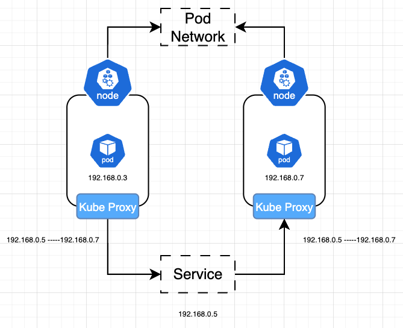

# Kube Proxy

쿠버네티스 클러스터 내에는 `Pod Network` 라는 것이 존재한다. `Pod Network` 는 클러스터 전반에 걸친 가상 네트워크로서, Pod간 통신을 하는 과정에서 사용된다. 하지만 `Pod Network`를 통해서만 Pod간 통신하는것은 한계가 많다.

## Docker DNS를 상기시켜본다.

Docker Network의 개념을 다시 상기시켜보자. 기본적으로 Container는 '휘발성'이라는 특성을 가지고 있으며, 이 컨테이너에 부여되는 ip는 일시적 ip로서, 컨테이너가 삭제된 후 다시 생성되면, ip는 바뀌게 된다.(정확히는 같다는 보장 x) 그로 인해 Docker에서도 Docker DNS라는것을 제공하여 내부 네트워크 내에서 DNS를 제공한다.

## 다시 Kube Proxy

Kubernetes에서도 Service라는 것을 제공하여 이러한 한계를 해결한다. 다만 Service는 `Pod Network`에 포함되지 않는다. Service는 단순 Kubernetes 메모리에만 존재하는 개념이다.

모든 클러스터 내에서 동일한 이름으로 특정 Pod에 접근할 수 있어야한다.그리고 이는 `Kube Proxy`를 통해 이루어진다.

**Kube Proxy**는 모든 노드에서 실행되는 프로세스이다. Kube Proxy의 역할은 다음과 같다.

- Service에 맞는 Pod의 IP를 연결해준다.
- 새로운 Service가 생성되면, 규칙을 만들어서 해당 서비스로 트래픽을 전달한다. 여기서 규칙의 대표적인 예로는 iptable을 들수 있다.

한가지 알아둬야할것은, Service가 생성될때 임의의 IP가 부여되는데, 이 IP는 기본적으로 `Cluster IP`로서 클러스터 내에서 접근 가능한 IP가 할당된다. 그리고 이 IP는 Service가 없어지기 전까지 고정된다.
