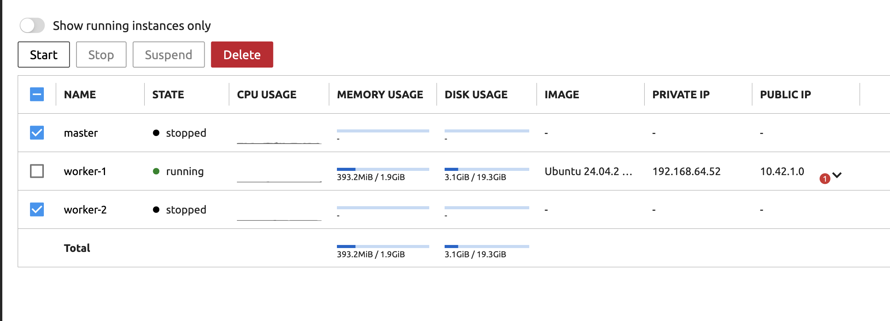
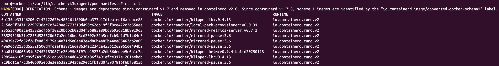
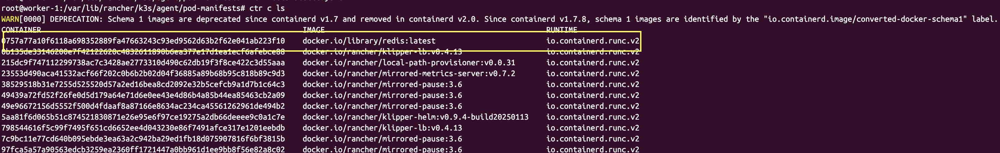
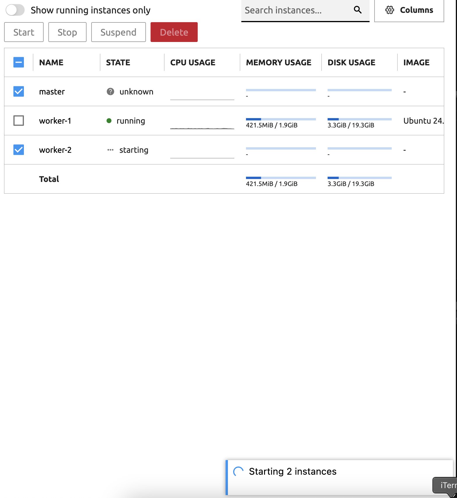
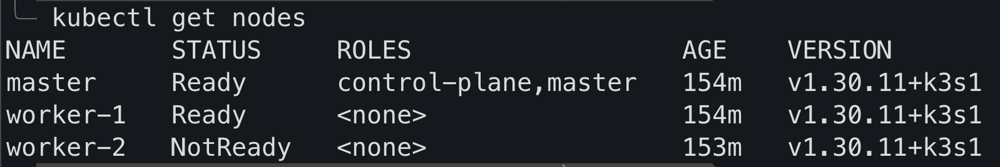

# Static Pod

만약 클러스터에서 모든 마스터 노드랑 워커노드가 다 없어지고 하나의 워커노드만 단일로 남았다고 가정하자. 그러면 어떻게 될까? 기본적으로 kubelet은 kube-scheduler, kube-api를 통해서 Pod를 생성하는 상호작용을 한다. 하지만 만약 그러한 소통이 불가능한 상황에서 kubelet은 무엇을 할 수 있을까?

본질적으로 보면 kubelet은 컨테이너, 즉 해당 노드에 존재하는 컨테이너 런타임을 활용하여 Pod를 생성할 수 있다. 다만 제약사항이 있다 우리가 지금까지 해왔듯이 `kubectl`을 사용하지 못한다는 것이다.

그렇다면 왜 `kubectl`을 사용하지 못할까? 그 이유는 **`kubectl`은 기본적으로 kube-api-server를 통해서 동작하기 때문이다.**

**그렇기 때문에 Static Pod가 동작하는지 보고싶다면 해당 노드의 컨테이너 런타임을 통해서 확인해야한다.**

### Static Pod 생성하기

Static Pod를 생성하기 위해서는 특정 디렉토리에 Static Pod가 정의된 파일을 저장해주면 해당 파일들을 읽어서 컨테이너를 실행해준다. Kubernetes Config file에서 이는 바꿀 수 있지만 각각의 런타임에서 Manifest 폴더는 아래와 같다.

- K8S: `/etc/kubernetes/manifests`
- K3S: `/var/lib/rancher/k3s/agent/pod-manifests`

kubelete은 주기적으로 해당 디렉토리를 읽은 후에 노드에 Pod를 생성한다. kubelet은 해당 파일을 통해서 Pod를 관리한다. 아래 사항들을 참고하자

- Static Pod의 Application Crush가 발생하면 Restart를 한다
- Static Pod의 정의가 변경되었을떄 그에 맞춰 적용한다.
- Static Pod 정의 파일이 삭제되면 Pod도 같이 삭제된다.

즉 kubelet을 통해 Pod가 관리되는것은 그대로인 것이다.

### Static Pod는 kubectl을 통한 직접적인 수정이 불가능하다

Static Pod가 생성되고 난 후 추후 다시 클러스터 Master Node, Worker node에 연결되고 난 후 `kubectl`을 통해 Pod를 가져오면 Static Pod도 그대로 나온다. 하지만 다른 점이라면 kubectl을 통해서 직접적인 수정은 불가능하고 **단순히 Readonly Mirror**라는 점을 명심하자

### Static Pod 실습하기 - Static Pod 생성하기

이제 Static Pod 실습을 진행해본다. 먼저 worker-1을 제외하고는 Virtual machine Instance들을 Stop상태로 변경한다.



k3s의 기본 컨테이너 런타임은 containerd이다. 그렇기 때문에, `ctr`을 사용해서 기본적으로 존재하는 컨테이너를 확인해준다.

```
ctr container ls
```



현재 나의 실습환경은 k3s이다. 그렇기 때문에 `/var/lib/rancher/k3s/agent/pod-manifests`디렉토리에 Pod 파일을 생성해본다.

```yaml
apiVersion: v1
kind: Pod
metadata:
  name: static-pod
  labels:
    tier: backend
spec:
  containers:
    - name: redis-container
      image: redis
      ports:
        - containerPort: 6379
```

```
root@worker-1:/var/lib/rancher/k3s/agent/pod-manifests# vim redis-static-pod.yaml
root@worker-1:/var/lib/rancher/k3s/agent/pod-manifests# ls
redis-static-pod.yaml
```

redis static pod의 정의 파일을 만들어 주고 난 후 다시 확인해본다

```
ctr container ls
```



사진에서 볼 수 있듯이 정의한 Redis Pod의 Redis container가 새로 생성된것을 확인할 수 있다.

### Static Pod 실습하기 - 다시 클러스터 원상복구

다시 master-node와 worker-2인스턴스를 실행해준다. 그러면 `kubectl`이 다시 활성화 되면서 클러스터를 복구하는것을 볼 수 있다.




이상태에서 `kubectl get pods`를 하면 `static-pod-worker-1`이 있는것을 볼 수 있다.

```
╰─ kubectl get pods
NAME                        READY   STATUS        RESTARTS   AGE
nginx-node-affinity-24rls   1/1     Terminating   0          83m
static-pod-worker-1         1/1     Running       0          6m59s
```

그러면 실제로 `kubectl`로 static-pod를 수정하지 못하는지 확인해보자. 우리가 앞에서 봤듯이 Static Image는 Readonly Mirror이기 때문에 수정이 불가능하다.

```
╰─ kubectl describe static-pod-worker-1
error: the server doesn't have a resource type "static-pod-worker-1"
```

한번 pod의 image도 업데이트 해본다. 메세지만 보면 문제 없이 바뀌는것 같다. 하지만 실제 pod describe를 확인하면 컨테이너 이미지 재적용 과정이 일어나지 않으며, 내부 로그에서는 redis log를 출력하는것을 확인할 수 있다.

```
╰─ kubectl describe pods static-pod-worker-1

...(생략)
Conditions:
  Type                        Status
  PodReadyToStartContainers   True
  Initialized                 True
  Ready                       True
  ContainersReady             True
  PodScheduled                True
Volumes:                      <none>
QoS Class:                    BestEffort
Node-Selectors:               <none>
Tolerations:                  :NoExecute op=Exists
Events:
  Type    Reason   Age   From     Message
  ----    ------   ----  ----     -------
  Normal  Pulling  19m   kubelet  Pulling image "redis"
  Normal  Pulled   19m   kubelet  Successfully pulled image "redis" in 1.94s (1.94s including waiting). Image size: 44786370 bytes.
  Normal  Created  19m   kubelet  Created container: redis-container
  Normal  Started  19m   kubelet  Started container redis-container
```
