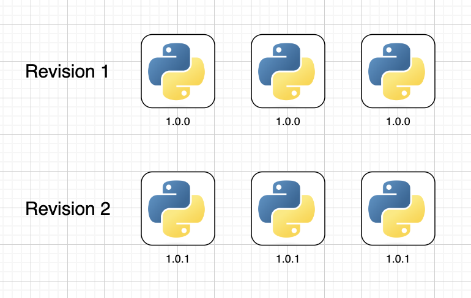
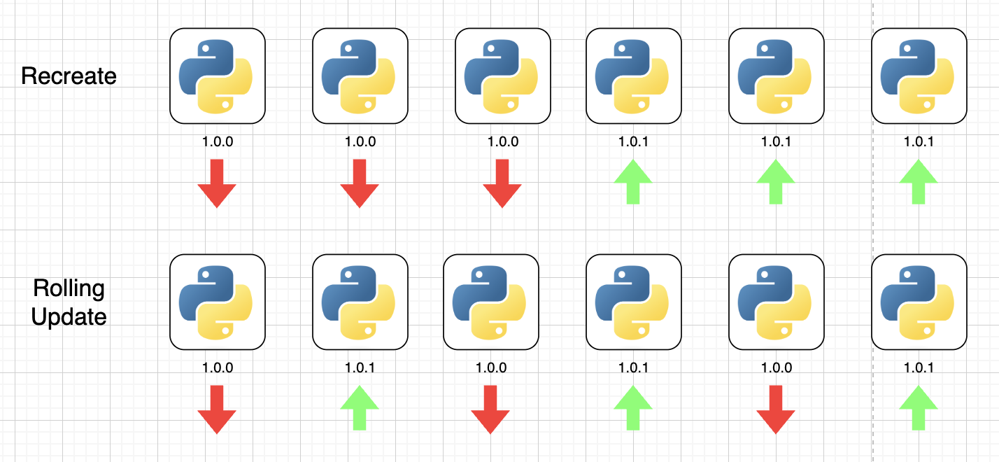

# Rolling Update and Rollout

## Rollout

만약 특정 애플리케이션에 대해 첫 배포를 하게 된다면, 해당 애플리케이션의 최초 Rollout을 생성한다. 그 이후 만약 애플리케이션이 업데이트되어 컨테이너가 업데이트 되었다면, 새로운 Rollout이 생성된다.



여기서 중요한 점은 "새로 생성된다"는 점인데, 기존 배포에 대한것을 추적하여 필요에 따라 이전 버전으로 롤백할 수 있게끔 도와준다.

## Deployment Strategy

[공식문서](https://kubernetes.io/docs/concepts/workloads/controllers/deployment/#strategy)

새로운 Deployment에 대한 배포 전략에는 총 2가지가 존재한다.

1. Recreate
2. Rolling Update

기본값은 `RollingUpdate`이며, 배포 전략은 `spec.strategy.type`에 정의해주어야 한다.



### Recreate

Recreate는 기존 Deployment를 한번에 삭제한 뒤 새로운 Deployment들을 한번에 다시 생성하는 방식을 의미한다.

이 방식의 문제점은 새로운 Deployment가 생성되기 전까지는 Application Down상태가 된다는 점이다.

```yaml
spec:
  replicas: 3
  selector:
    matchLabels:
      type: nginx
  strategy:
    type: Recreate
```

`recreate.yaml` 파일로 아래 순서에 맞춰 실습을 해본다.

1. 원래 Deployment를 생성한다.
2. nginx image version을 1.28로 변경해서 다시 적용한다.
3. Deployment describe를 해본다.

```
╰─ kubectl apply -f recreate.yaml
deployment.apps/recreate-deployment created

╰─ kubectl get deployments.apps
NAME                  READY   UP-TO-DATE   AVAILABLE   AGE
recreate-deployment   3/3     3            3           44s

// 1.27에서 1.28로 변경

╰─ kubectl apply -f recreate.yaml
deployment.apps/recreate-deployment configured

╰─ kubectl describe deployments.apps recreate-deployment
Name:               recreate-deployment
Namespace:          default
CreationTimestamp:  Mon, 05 May 2025 23:42:42 +0900
Labels:             app=myapp
                    type=nginx
Annotations:        deployment.kubernetes.io/revision: 2
Selector:           type=nginx
Replicas:           3 desired | 3 updated | 3 total | 3 available | 0 unavailable
StrategyType:       Recreate

...

  Type    Reason             Age   From                   Message
  ----    ------             ----  ----                   -------
  Normal  ScalingReplicaSet  111s  deployment-controller  Scaled up replica set recreate-deployment-7dd9f45897 to 3
  Normal  ScalingReplicaSet  35s   deployment-controller  Scaled down replica set recreate-deployment-7dd9f45897 to 0 from 3
  Normal  ScalingReplicaSet  34s   deployment-controller  Scaled up replica set recreate-deployment-6bc56cfd5b to 3

╰─ kubectl delete deployments.apps recreate-deployment
deployment.apps "recreate-deployment" deleted
```

### Rolling Update

Rolling Update는 기존 Deployment를 하나씩 교체하는 방식을 의미한다. 쿠버네티스에서는 **Rolling Update가 기본 배포 전략으로 설정되어있다.**

```yaml
spec:
  replicas: 3
  selector:
    matchLabels:
      type: nginx
  strategy:
    type: RollingUpdate
```

`rolling-update.yaml`을 활용해 아래 순서에 맞춰 실습해본다.

1. 원래 Deployment를 생성한다.
2. nginx image version을 1.28로 변경해서 다시 적용한다.
3. Deployment describe를 해본다.

```
╰─ kubectl apply -f rolling-update.yaml
deployment.apps/rolling-update-deployment created

╰─ kubectl get deployments.apps
NAME                        READY   UP-TO-DATE   AVAILABLE   AGE
rolling-update-deployment   3/3     3            3           4s


// 1.27에서 1.28로 변경

╰─ kubectl get deployments.apps
NAME                        READY   UP-TO-DATE   AVAILABLE   AGE
rolling-update-deployment   3/3     3            3           46s

╰─ kubectl describe deployments.apps rolling-update
Name:                   rolling-update-deployment
Namespace:              default
CreationTimestamp:      Mon, 05 May 2025 23:45:50 +0900
Labels:                 app=myapp
                        type=nginx
Annotations:            deployment.kubernetes.io/revision: 2
Selector:               type=nginx
Replicas:               3 desired | 3 updated | 3 total | 3 available | 0 unavailable
StrategyType:           RollingUpdate

...

  Type    Reason             Age   From                   Message
  ----    ------             ----  ----                   -------
  Normal  ScalingReplicaSet  73s   deployment-controller  Scaled up replica set rolling-update-deployment-7dd9f45897 to 3
  Normal  ScalingReplicaSet  42s   deployment-controller  Scaled up replica set rolling-update-deployment-6bc56cfd5b to 1
  Normal  ScalingReplicaSet  41s   deployment-controller  Scaled down replica set rolling-update-deployment-7dd9f45897 to 2 from 3
  Normal  ScalingReplicaSet  41s   deployment-controller  Scaled up replica set rolling-update-deployment-6bc56cfd5b to 2 from 1
  Normal  ScalingReplicaSet  39s   deployment-controller  Scaled down replica set rolling-update-deployment-7dd9f45897 to 1 from 2
  Normal  ScalingReplicaSet  39s   deployment-controller  Scaled up replica set rolling-update-deployment-6bc56cfd5b to 3 from 2
  Normal  ScalingReplicaSet  38s   deployment-controller  Scaled down replica set rolling-update-deployment-7dd9f45897 to 0 from 1

╰─ kubectl delete deployments.apps rolling-update-deployment
deployment.apps "rolling-update-deployment" deleted
```

위에서 Recreate, Rolling Update Describe log에서 알 수 있듯이 각 Strategy별로 다음 버전배포에 대한 방식이 다르다.

## Rollback

필요에 따라 Rollback을 해야할 수 도 있다. 그런 경우에는 `kubectl rollout undo`를 활용한다.

```
kubectl rollout undo deployment/(deployment-name)
```

아래 순서에 맞춰 실습해본다.

```
╰─ kubectl apply -f rolling-update.yaml
deployment.apps/rolling-update-deployment created

// 1.27 -> 1.28버전으로 변경

╰─ kubectl apply -f rolling-update.yaml
deployment.apps/rolling-update-deployment configured

╰─ kubectl rollout history deployment/rolling-update-deployment
deployment.apps/rolling-update-deployment
REVISION  CHANGE-CAUSE
1         <none>
2         <none>

╰─ kubectl describe deployments.apps rolling-update-deployment

Conditions:
  Type           Status  Reason
  ----           ------  ------
  Available      True    MinimumReplicasAvailable
  Progressing    True    NewReplicaSetAvailable
OldReplicaSets:  rolling-update-deployment-7dd9f45897 (0/0 replicas created)
NewReplicaSet:   rolling-update-deployment-6bc56cfd5b (3/3 replicas created)
Events:
  Type    Reason             Age   From                   Message
  ----    ------             ----  ----                   -------
  Normal  ScalingReplicaSet  57s   deployment-controller  Scaled up replica set rolling-update-deployment-7dd9f45897 to 3
  Normal  ScalingReplicaSet  52s   deployment-controller  Scaled up replica set rolling-update-deployment-6bc56cfd5b to 1
  Normal  ScalingReplicaSet  51s   deployment-controller  Scaled down replica set rolling-update-deployment-7dd9f45897 to 2 from 3
  Normal  ScalingReplicaSet  51s   deployment-controller  Scaled up replica set rolling-update-deployment-6bc56cfd5b to 2 from 1
  Normal  ScalingReplicaSet  50s   deployment-controller  Scaled down replica set rolling-update-deployment-7dd9f45897 to 1 from 2
  Normal  ScalingReplicaSet  50s   deployment-controller  Scaled up replica set rolling-update-deployment-6bc56cfd5b to 3 from 2
  Normal  ScalingReplicaSet  49s   deployment-controller  Scaled down replica set rolling-update-deployment-7dd9f45897 to 0 from 1

╰─ kubectl rollout undo deployment/rolling-update-deployment
deployment.apps/rolling-update-deployment rolled back

╰─ kubectl describe deployments.apps rolling-update-deployment

Events:
  Type    Reason             Age              From                   Message
  ----    ------             ----             ----                   -------
  Normal  ScalingReplicaSet  3m50s            deployment-controller  Scaled up replica set rolling-update-deployment-7dd9f45897 to 3
  Normal  ScalingReplicaSet  3m45s            deployment-controller  Scaled up replica set rolling-update-deployment-6bc56cfd5b to 1
  Normal  ScalingReplicaSet  3m44s            deployment-controller  Scaled down replica set rolling-update-deployment-7dd9f45897 to 2 from 3
  Normal  ScalingReplicaSet  3m44s            deployment-controller  Scaled up replica set rolling-update-deployment-6bc56cfd5b to 2 from 1
  Normal  ScalingReplicaSet  3m43s            deployment-controller  Scaled down replica set rolling-update-deployment-7dd9f45897 to 1 from 2
  Normal  ScalingReplicaSet  3m43s            deployment-controller  Scaled up replica set rolling-update-deployment-6bc56cfd5b to 3 from 2
  Normal  ScalingReplicaSet  3m42s            deployment-controller  Scaled down replica set rolling-update-deployment-7dd9f45897 to 0 from 1
  Normal  ScalingReplicaSet  10s              deployment-controller  Scaled up replica set rolling-update-deployment-7dd9f45897 to 1 from 0
  Normal  ScalingReplicaSet  8s               deployment-controller  Scaled down replica set rolling-update-deployment-6bc56cfd5b to 2 from 3
  Normal  ScalingReplicaSet  6s (x4 over 8s)  deployment-controller  (combined from similar events): Scaled down replica set rolling-update-deployment-6bc56cfd5b to 0 from 1
```

[`kubectl rollout undo` 공식문서](https://kubernetes.io/docs/reference/kubectl/generated/kubectl_rollout/kubectl_rollout_undo/)

`kubectl rollout history`를 하면 `revision`이 나오게 되는데 `kubectl rollout undo`에 `--to-revision`플래그를 정의하여 특정 revision 시점으로 돌릴 수 도 있다.
