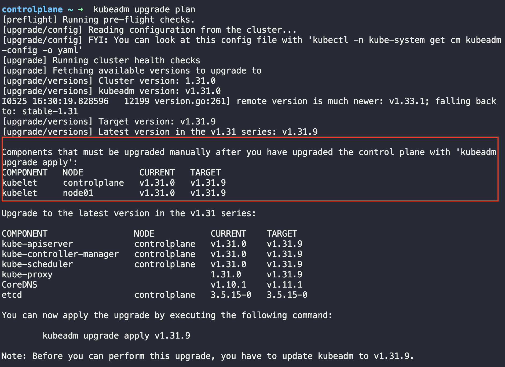
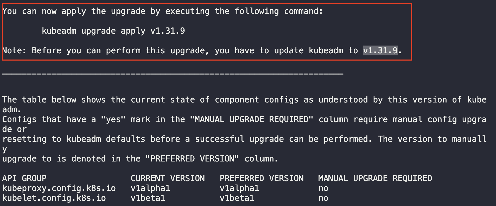
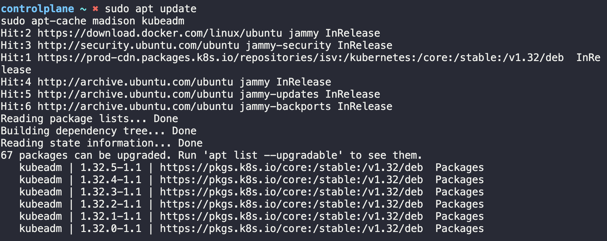

# Upgrading Cluster

Kubernetes 클러스터를 생성하고 난 후 업그레이드를 하는 경우가 발생할 수 있다. 대표적으로는 아래 두가지가 있을 수 있다.

1. 노드(=서버)의 운영체제 버전 업그레이드
2. 노드의 Kubernetes 버전 업그레이드

하지만 클러스터는 엄연히 운영환경이다. 즉 달리는 자동차이며, 이 과정에서 엔진 혹은 부품을 변경하는것과 동일하다. 어떻게 하면 안전하게 교체를 할 수 있을까?

## Kubernetes Control Plane Component 버전

Control Plane을 이루는 핵심 컴포넌트들은 아래와 같다.

1. kube-apiserver
2. controller-manager
3. kube-scheduler
4. kubelet
5. kube-proxy
6. kubelet

꼭 이 컴포넌트들이 모두 동일한 버전을 가질 필요는 없다. 서로 다른 버전을 가질 수 있지만, 최대로 차이나는 버전은 제한되어있다. `kube-apiserver`가 핵심 요소이기 때문에 `kube-apiserver`를 기준으로 각 컴포넌트의 최대 허용 버전을 살펴보자. **단 여기서 주의할 점은 `kubelet`을 제외하고 `kube-apiserver` 보다 낮은 버전은 가질 수 있지만, 더 높은 버전을 가질 수 는 없다는 점을 명심하자.**

1. kube-apiserver: Version `X`
2. controller-manager: Version `X-1`
3. kube-scheduler: Version `X-1`
4. kubelet: Version `X-2`
5. kube-proxy: Version `X-2`
6. kubelet: Verxion `X+1`, Version `X`, Version `X-1`

## Kubernetes Version

Control Plane을 이루고 있는 컴포넌트들의 업그레이드 최대 허용 범위를 살펴보았다. 하지만 반대로 언제 쿠버네티스를 업그레이드 해야할까? 쿠버네티스는 공식적으로 가장 최신의 3개의 Minor Version들에 대해서만 지원한다.
예를 들어 현재 최신버전이 `1.20` 버전이라고 한다면 쿠버네티스는 `1.20`,`1.19`,`1.18` 이렇게 3가지 버전만 공식적으로 지원하게 되는것이다. 즉 해당 범위 내에 포함되지 않으면 업그레이드 하는것이 권장되게 된다.

업그레이드를 할때는 각 Minor Version을 하나씩 업그레이드 하는것이 권장된다. 예를 들어 `1.20`으로 올리고 싶은데 현재 내 노드의 쿠버네티스 버전이 `1.17`이라면 `1.18`,`1.19`,`1.20`이렇게 순차적으로 업그레이드 하는것이다.

`kubeadm`에서는 업그레이드하는 명령어를 지원한다.

- kubeadm upgrade plan
- kubeadm upgrade apply

### Kubernetes Cluster 업그레이드 하기: Master Node

이제 업그레이드를 진행해보자. 여기서는 1.31.0에서 1.32.0으로 업그레이드 한다고 가정한다.

쿠버네티스에서는 공식적으로 클러스터 업그레이드시 어떤 순서로 업그레이드 해야하는지 메뉴얼을 제공하고 있다([링크](https://v1-32.docs.kubernetes.io/docs/tasks/administer-cluster/kubeadm/kubeadm-upgrade/))

먼저 `kubeadm upgrade plan`을 사용하면 아래 사진과 같이 각각의 컴포넌트 버전들과 같이 업그레이드와 관련된 많은 정보들을 준다.



또한 아래 사진에서 볼 수 있듯이, 업그레이드를 하기 전에는 `kubeadm`의 버전을 업그레이드 해야한다는점도 알려주는것을 볼 수 있다. `kubeadm`은 쿠버네티스 소프트웨어 버전과 동일한 버전을 따른다.



먼저 kubeadm을 업데이트 해준다. 하단 명령어를 실행했을때 자신이 업데이트하고 싶은 쿠버네티스 버전과 동일한 kubeadm 버전이 존재하는지 확인한다.

```
sudo apt update
sudo apt-cache madison kubeadm
```

> apt-cache madison은 Debian계열 시스템에서 패키지 버전과 경로를 확인해주는 명령어이다.



만약 존재하지 않는다면 쿠버네티스 패키지 레포지토리를 변경해주어야한다.(주로 마이너 버전을 업그레이드 할때 진행해 주어야한다. [링크](https://kubernetes.io/docs/tasks/administer-cluster/kubeadm/change-package-repository/))

```
nano /etc/apt/sources.list.d/kubernetes.list
```

를 통해 들어간뒤 맨 뒤에 자신이 업데이트 하고자 하는 버전으로 변경해준다.

```
# 기존에 이랬던거를

deb [signed-by=/etc/apt/keyrings/kubernetes-apt-keyring.gpg] https://pkgs.k8s.io/core:/stable:/v1.31/deb/ /

# 업그레이드 하고자 하는 마이너 버전으로 변경

deb [signed-by=/etc/apt/keyrings/kubernetes-apt-keyring.gpg] https://pkgs.k8s.io/core:/stable:/v1.32/deb/ /
```

그 이후 상단 명령어를 다시 실행해준다. 자신이 업데이트 하고자 하는 쿠버네티스 버전에 대한 kubeadm버전이 확인 되었다면

```
sudo apt-mark unhold kubeadm && \
sudo apt-get update && sudo apt-get install -y kubeadm='1.32.x-*' && \
sudo apt-mark hold kubeadm
```

명령어를 실행해준다. 현재 kubeadm 버전을 확인하고 업데이트를 진행해준다.

```
controlplane ~ ➜  kubeadm version
kubeadm version: &version.Info{Major:"1", Minor:"32", GitVersion:"v1.32.0", GitCommit:"70d3cc986aa8221cd1dfb1121852688902d3bf53", GitTreeState:"clean", BuildDate:"2024-12-11T18:04:20Z", GoVersion:"go1.23.3", Compiler:"gc", Platform:"linux/amd64"}

controlplane ~ ➜ kubeadm upgrade apply v1.32.0
```

만약 성공적으로 업데이트 되었다면 아래와 같이 success 로그가 나온다.

```
[upgrad/kubeconfig] The kubeconfig files for this node were successfully upgraded!
W0525 17:12:59.216429   23724 postupgrade.go:117] Using temporary directory /etc/kubernetes/tmp/kubeadm-kubelet-config1951732202 for kubelet config. To override it set the environment variable KUBEADM_UPGRADE_DRYRUN_DIR
[upgrade] Backing up kubelet config file to /etc/kubernetes/tmp/kubeadm-kubelet-config1951732202/config.yaml
[kubelet-start] Writing kubelet configuration to file "/var/lib/kubelet/config.yaml"
[upgrade/kubelet-config] The kubelet configuration for this node was successfully upgraded!
[upgrade/bootstrap-token] Configuring bootstrap token and cluster-info RBAC rules
[bootstrap-token] Configured RBAC rules to allow Node Bootstrap tokens to get nodes
[bootstrap-token] Configured RBAC rules to allow Node Bootstrap tokens to post CSRs in order for nodes to get long term certificate credentials
[bootstrap-token] Configured RBAC rules to allow the csrapprover controller automatically approve CSRs from a Node Bootstrap Token
[bootstrap-token] Configured RBAC rules to allow certificate rotation for all node client certificates in the cluster
[addons] Applied essential addon: CoreDNS
[addons] Applied essential addon: kube-proxy

[upgrade] SUCCESS! A control plane node of your cluster was upgraded to "v1.32.0".

[upgrade] Now please proceed with upgrading the rest of the nodes by following the right order.
```

하지만 `kubectl get nodes`를 하면 아직 업그레이드 이전 버전이 나오는것을 볼 수 있다.

```
controlplane ~ ➜  kubectl get nodes
NAME           STATUS   ROLES           AGE   VERSION
controlplane   Ready    control-plane   60m   v1.31.0
node01         Ready    <none>          60m   v1.31.0
```

이러한 현상이 발생하는 이유는 `kubectl get nodes`의 버전은 각 노드의 `kubelet`의 버전을 기준으로 보여주기 때문이다. 이제 kubelet을 업그레이드 해준다.

```
# Check kubelet Version
controlplane ~ ➜  apt-cache madison kubelet
   kubelet | 1.32.5-1.1 | https://pkgs.k8s.io/core:/stable:/v1.32/deb  Packages
   kubelet | 1.32.4-1.1 | https://pkgs.k8s.io/core:/stable:/v1.32/deb  Packages
   kubelet | 1.32.3-1.1 | https://pkgs.k8s.io/core:/stable:/v1.32/deb  Packages
   kubelet | 1.32.2-1.1 | https://pkgs.k8s.io/core:/stable:/v1.32/deb  Packages
   kubelet | 1.32.1-1.1 | https://pkgs.k8s.io/core:/stable:/v1.32/deb  Packages
   kubelet | 1.32.0-1.1 | https://pkgs.k8s.io/core:/stable:/v1.32/deb  Packages

# Upgrade kubelet
controlplane ~ ➜  apt upgrade -y kubelet=1.32.0-1.1
Reading package lists... Done
Building dependency tree... Done
Reading state information... Done
...
debconf: unable to initialize frontend: Dialog
debconf: (No usable dialog-like program is installed, so the dialog based frontend cannot be used. at /usr/share/perl5/Debconf/FrontEnd/Dialog.pm line 78.)
debconf: falling back to frontend: Readline
Setting up bind9-dnsutils (1:9.18.30-0ubuntu0.22.04.2) ...
Setting up dnsutils (1:9.18.30-0ubuntu0.22.04.2) ...
Processing triggers for dbus (1.12.20-2ubuntu4.1) ...
Processing triggers for libc-bin (2.35-0ubuntu3.9) ...
Processing triggers for man-db (2.10.2-1) ...

# Restart kubelete daemon and check node version again
controlplane ~ ➜  systemctl restart kubelet

controlplane ~ ➜  kubectl get nodes
NAME           STATUS   ROLES           AGE   VERSION
controlplane   Ready    control-plane   70m   v1.32.0
node01         Ready    <none>          70m   v1.31.0
```

이로서 Master Node 업그레이드가 완료되었다.

### Kubernetes Cluster 업그레이드 하기: Worker Node

이제 Worker Node를 업그레이드 한다. 먼저 Node를 drain해준다.

```
controlplane ~ ✖ kubectl drain node01 --ignore-daemonsets
node/node01 already cordoned
Warning: ignoring DaemonSet-managed Pods: kube-flannel/kube-flannel-ds-zhfrv, kube-system/kube-proxy-8gdv9
evicting pod kube-system/coredns-668d6bf9bc-qfftp
evicting pod default/blue-56dd475db5-q22v4
evicting pod default/blue-56dd475db5-vkvkh
evicting pod default/blue-56dd475db5-6b4b2
evicting pod kube-system/coredns-668d6bf9bc-2c2vd
pod/blue-56dd475db5-vkvkh evicted
pod/blue-56dd475db5-q22v4 evicted
pod/blue-56dd475db5-6b4b2 evicted
pod/coredns-668d6bf9bc-qfftp evicted
pod/coredns-668d6bf9bc-2c2vd evicted
node/node01 drained
```

여기서 중요한점은 node01은 `cordoned`된 상태(SchedulingDisabled)라는 점이다. Drain 이후 과정은 Master Node와 동일하다.

1. Kubeadm 버전 업데이트
2. Kubelet 버전 업데이트
3. Kubelet 데몬 restart

이후 한가지 작업이 더 있는데, 바로 `cordoned`상태인 node01을 `uncordoned`상태로 바꿔주어야 한다는것이다.

```
kubectl uncordoned node01
```
