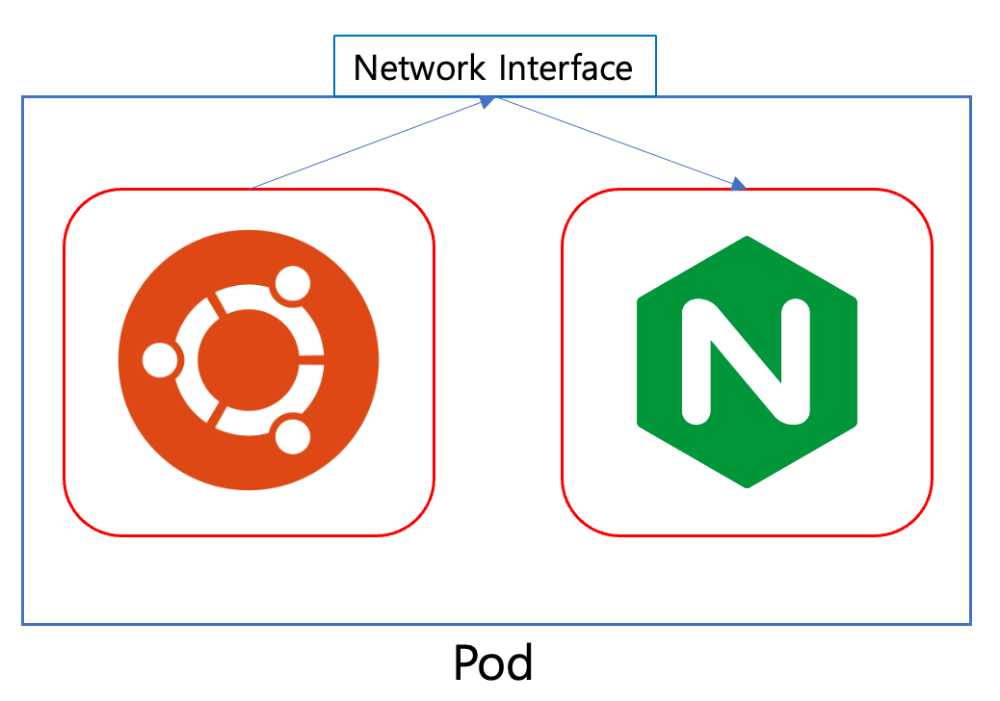

Pod
===
쿠버네티스에는 수많은 리소스와 컴포넌트가 존재한다. 그 중 컨테이너 애플리케이션을 구동시키기 위해 꼭 알아야하는 오브젝트들이 존재한다.

- Pod 
- Replica Set
- Service
- Deployment

이 중 가장 기초가 되는 Pod부터 하나씩 살펴보자
## Pod

Pod는 **쿠버네티스 컨테이너 애플리케이션의 기본 단위**이다. Pod는 한개 이상의 컨테이너로 구성된 컨테이너의 집합이다. 하나의 **Pod에는 하나의 컨테이너가 존재할 수 도, 여러개의 컨테이너가 존재할 수 도 있다**.

### Pod 생성하기
Pod를 YAML파일을 이용해 직접 작성해본다. 소스코드 파일은 [이곳](./nginx-pod.yaml)에 있다.
```yaml
apiVersion: v1
kind: Pod
metadata:
  name: nginx-pod
spec:
  containers:
    - name: nginx-container
      image: nginx:latest
      ports:
        - containerPort: 80
          protocol: TCP

```
쿠버네티스 YAML 파일들은 일반적으로 `apiVersion`, `kind`,`metadata`, `spec` 네개의 필드로 구성이 된다. 각각의 필드가 의미하는것들을 살펴보자. 각각의 필드들에 정의하는 내용은 [Document](https://kubernetes.io/ko/docs/concepts/overview/working-with-objects/kubernetes-objects/#요구되는-필드)를 참고하자
- apiVersion : YAML파일에서 정의한 오브젝트 API Version을 의미한다. 오브젝트 종류에 따라 달라질 수 있다.
- kind : 리소스의 종류를 의미한다(오브젝트의 종류). 여기서 생성하는것은 Pod이므로, Kind를 Pod로 기재하였다. 앞에서 보았던 `kubectl api-resources`의 `KIND`필드에 나오는 값을 적어주면 된다.
- metadata : name, uid, namespace과 같이 컴포넌트를 구분지어줄 수 있는 데이터를 적어준다. metadata에 기재되는 것들은 ***오브젝트를 유일하게(unique)끔 구분해주는 역할**을 한다.
- spec : 리소스를 생성하기 위한 자세한 정보를 기재한다. 위의 예시에서는 Pod에서 실행될 컨테이너 정보를 나타내는 `container`필드 아래에 항목을 작성한 뒤 하위 항목인 `image`, 그리고 container의 포트를 의미하는 `port`등  컨테이너의 자세한 정보를 적어주었다.

YAML파일을 이제 실제 pod로 만들어 보자. `kubectl apply -f` 명령어를 통해서 쿠버네티스에 오브젝트를 생성할 수 있다.
```
kubectl apply -f nginx-pod.yaml
```
```
# Result

pod/nginx-pod created
```
잘 생성이 되었는지 확인해보자. `kubectl get` 명령어를 사용하면 특정 오브젝트 목록을 확인할 수 있다.
```
kubectl get (object name)
```
위에서 생성한것은 `Pod`오브젝트이므로, `pods`를 통해 확인해 본다.
```
kubectl get pods
```
```
# Result

NAME           READY   STATUS    RESTARTS      AGE
nginx-pod      1/1     Running   0             2m7s
```
위에서 생성한 Nginx Pod는 웹서버 역할을 하는 Pod이다.그리고 `containerPort`를 통해 포트도 개방해 주었다. 하지만, 이 Pod는 외부와 접속할 수 있는 상태가 아니다. 이유는 **쿠버네티스에서 외부 혹은 내부에서 Pod에 접근하기 위해서는 `Service`라는 오브젝트를 생성해야하지만**, 여기서는 순수히 `Pod`만 생성했기 때문이다.

위에서 생성한 Nginx 웹서버에 접속하기 위해서는 내부 IP로 접근해야한다. Pod의 IP를 얻기위해서는 `kubectl describe` 명령어를 통해 리소스의 정보를 가져와야한다
```
kubectl describe (오브젝트 이름) (리소스 이름)
```
자 이제 위에서 생성한 Pod의 IP를 확인하고, 요청을 보내보자. 주의할 점은, **여기서 Pod의 IP는 결국 클러스터 내부에서의 IP**이다. 이 실습에서 사용하는것은 Minikube + Docker이며, **Minikube는 결론적으로 단일 클러스터**이다. 그렇기 때문에, **요청을 보내기 위해서는 Minikube Container 내부에서 요청**을 보내야한다.
```
kubectl describe pods nginx-pod
```
```
# Result

Name:             nginx-pod
Namespace:        default
Priority:         0
Service Account:  default
Node:             minikube/192.168.49.2
Start Time:       Wed, 05 Apr 2023 01:58:56 +0900
Labels:           <none>
Annotations:      <none>
Status:           Running
IP:               10.244.0.24
IPs:
  IP:  10.244.0.24
Containers:
  nginx-container:
    Container ID:   docker://dd7fe1c5529c58cdb34e234882ec8e659fdd575d7af10d0b8556c8b04baa621f
    Image:          nginx:latest
    Image ID:       docker-pullable://nginx@sha256:2ab30d6ac53580a6db8b657abf0f68d75360ff5cc1670a85acb5bd85ba1b19c0

...
```
위의 결과를 통해서 방금 만든 Pod의 클러스터 내부 IP는 10.244.0.24 인것을 확인하였다. 이제 Minikube Container에 `curl`을 사용하여 내부 IP에 요청을 보내보자
```
docker exec -it minikube curl 10.244.0.24
```
```
# Result

<!DOCTYPE html>
<html>
<head>
<title>Welcome to nginx!</title>
<style>
html { color-scheme: light dark; }
body { width: 35em; margin: 0 auto;
font-family: Tahoma, Verdana, Arial, sans-serif; }
</style>
</head>
<body>
<h1>Welcome to nginx!</h1>

...
```

### Pod 제어하기

Docker에서 `docker exec` 명령어를 통해 컨테이너에서 명령을 실행할 수 있었다. 쿠버네티스에서도 `kubectl exec` 이라는 명령어를 통해 Pod에 명령을 실행할 수 있다. 
```
kubectl exec (실행모드) (Pod name) -- (Command)
```
실행 모드들도 Docker와 모두 동일하다. 우선 Pod의 bash 쉘에 접속해 보겠다. Docker에서 했던 `docker exec` 명령어를 회상하며 명령어를 작성해 본다.
```
// kubectl exec [POD] [COMMAND] is DEPRECATED and will be removed in a future version. Use kubectl exec [POD] -- [COMMAND] instead.

kubectl exec -it nginx-pod -- bash
```
Docker에서 `docker logs` 명령어를 통해 컨테이너 로그를 확인할 수 있었다. 쿠버네티스에서도 동일하게 `kubectl logs` 명령어를 통해 Pod의 로그를 확인할 수 있다.
```
kubectl logs (Pod name)
```
nginx pod의 로그를 살펴보자
```
kubectl logs nginx-pod
```
```
# Result

/docker-entrypoint.sh: /docker-entrypoint.d/ is not empty, will attempt to perform configuration
/docker-entrypoint.sh: Looking for shell scripts in /docker-entrypoint.d/
/docker-entrypoint.sh: Launching /docker-entrypoint.d/10-listen-on-ipv6-by-default.sh
10-listen-on-ipv6-by-default.sh: info: Getting the checksum of /etc/nginx/conf.d/default.conf
10-listen-on-ipv6-by-default.sh: info: Enabled listen on IPv6 in /etc/nginx/conf.d/default.conf
/docker-entrypoint.sh: Launching /docker-entrypoint.d/20-envsubst-on-templates.sh
...
```
오브젝트 삭제를 위해서는 `kubectl delete -f` 명령어와 YAML파일 지정을 통해 삭제할 수 있다. 사용방법은 아래와 같다
```
kubectl delete -f (YAML file name)
```
위에서 생성했던 nginx Pod를 삭제해 본다.
```
kubectl delete -f nginx-pod.yaml
```
해당 Pod가 잘 삭제되었는지 확인해본다.
```
kubectl get pods
```
## Pod vs Docker Container
얼핏 보면 Docker Container와 다를께 없어보인다. 하지만 왜 `Pod`라는 개념을 사용하는 것일까? 여러 이유가 있지만 가장 큰 이유중 하나는하나 **여러 리눅스 네임스페이스 를 공유하는 컨테이너들을 추상화된 집합으로 관리**하기 위함이다.

>>리눅스 네임스페이스란 별개의 독립된 공간을 격리된 환경에서 운영하는 가상화 기술을 의미한다. 조금의 비유로 아파트의 각 호실별로 서로 다른 세대인것을 생각하면된다.(네임스페이스 관련 실습은 [Docker 1주차](../docker-1-What-is-docker%3F/)를 참고하자)

Pod에는 여러개의 컨테이너가 들어갈 수 있다고 하였다. 위에서 Pod의 목록을 가져왔을때 아래와 같이 출력되었다.
```
NAME           READY   STATUS    RESTARTS      AGE
nginx-pod      1/1     Running   0             2m7s
```
`READY 1/1`이라는 문구는 Pod에는 1개의 컨테이너가 존재하며, 해당 컨테이너를 사용할 수 있는 상태라는 것이다. Pod에 하나의 컨테이너만 존재할 수 있다면, 굳이 `1/1`과 같이 표기할 이유가 없다. 위에서도 말했듯이 Pod에는 1개 혹은 그 이상의 컨테이너가 들어갈 수 있다. 위에서 작성한 nginx pod에 하나의 컨테이너를 추가해보자. (파일은 [이곳](./multiple-pod.yaml)에 있다. YAML에서 `-`를 쓰는것은, 여러개의 항목을 지정함을 의미한다.)

```yaml
apiVersion: v1
kind: Pod
metadata:
  name: multi-containers
spec:
  containers:
    - name: nginx-container
      image: nginx:latest
      ports:
        - containerPort: 80
          protocol: TCP
    - name: ubuntu
      image: hoplin/ubuntu-curl
      command: ["tail"]
      args: ["-f", "/dev/null"]
```
이제 Pod를 생성해보자. 처음에는 Image를 Pulling하기에 다소 시간이 소요될 수 있다.
```
kubectl apply -f multiple-pod.yaml
```
```
# Result

NAME               READY   STATUS    RESTARTS      AGE
multi-containers   2/2     Running   0             114s
my-nginx-pod       1/1     Running   5 (17m ago)   23d
```
이제 각각의 컨테이너에 접속해 본다. [공식 문서](https://kubernetes.io/docs/reference/generated/kubectl/kubectl-commands#exec)에 따르면 `-c` 옵션을 통해서 특정 컨테이너를 지정할 수 있다고 나와있다. ubuntu 컨테이너에 `kubectl exec` 명령을 통해 `bash`에 접속해본다.
```
kubectl exec -it pod/multi-containers -c ubuntu -- bash
```
접속한 상태에서 `127.0.0.1:80`에 `curl`을 통해 요청을 보내본다.
```
curl 127.0.0.1:80
```
```
# Result 

<!DOCTYPE html>
<html>
<head>
<title>Welcome to nginx!</title>
<style>
html { color-scheme: light dark; }
body { width: 35em; margin: 0 auto;
font-family: Tahoma, Verdana, Arial, sans-serif; }
</style>
```
위 결과에서 이상한 점은, ubuntu 컨테이너에서 웹서버 80번 포트에 요청을 보내니, nginx로 부터 응답이 왔다는 점이다. 이 이유는 **Pod 내의 컨테이너들은 동일한 Linux Namespace를 공유**하기 때문이다. 그렇기에 네트워크 인터페이스 또한 서로 공유하게 되는것이다.



그렇다고 **Pod 내에서 컨테이너를 여러개 생성하는것은 바람직하지** 않다. Pod는 **하나의 애플리케이션**이기 때문이다. 위 예시에서는 `Nginx`라는 애플리케이션이 이미 하나의 Pod에 들어가 있기때문에 또다른 컨테이너가 들어가는것은 바람직하지 않다.

여러개의 컨테이너가 필요한 경우는 **Sidecar Container**가 필요할 때이다. 예를 들어 설정파일을 갱신해주는 리로더, 혹은 로그 수집을 해주는 애플리케이션의 경우에는 부가적인 역할을 하는 **Sidecar Container**로서 사용할 수 있다.