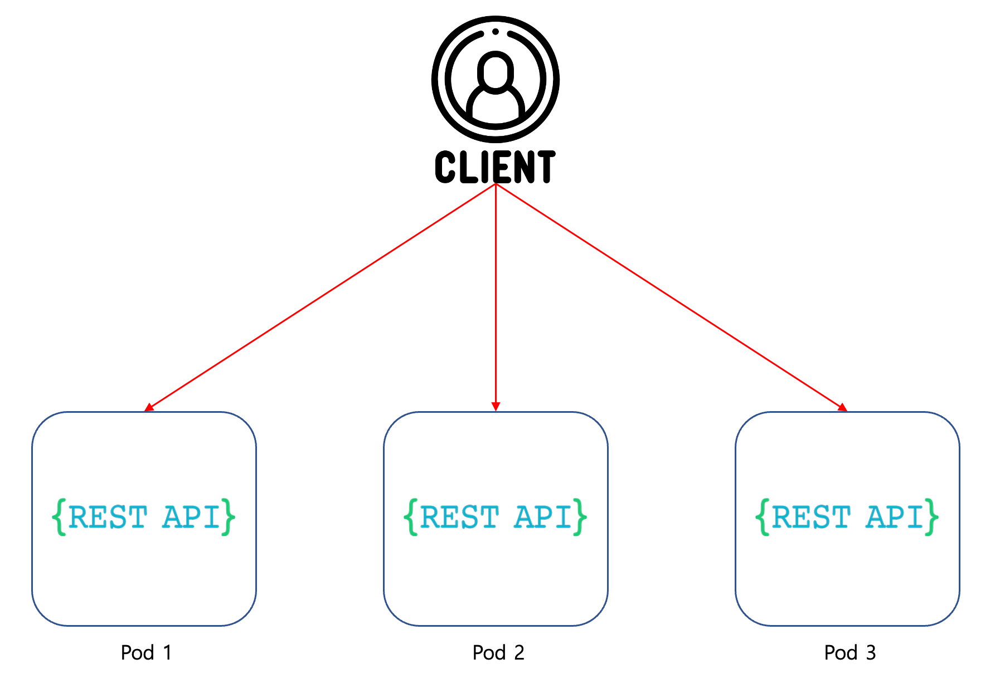
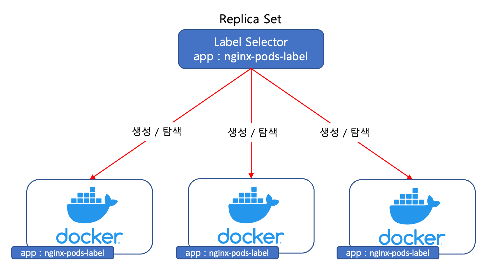
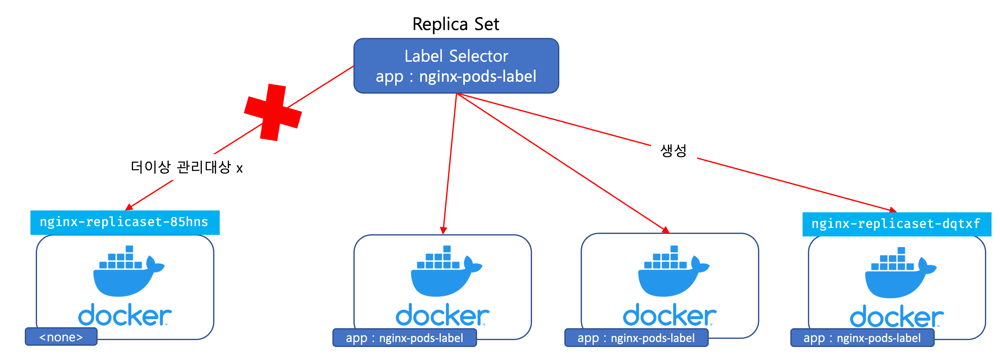

Replica Set
===
컨테이너 애플리케이션을 구동시키는 두번째 오브젝트 `Replica Set`에 대해 알아보자. 그 전에 영어로 `Replica`라는 단어의 뜻을 먼저 알고가자. `Replica`란 `복제하다`라는 사전적 의미가 있다. 단지 이 의미로는 `Replica Set`이 하는일을 정확히 추론하기 어렵다. '복제하다' 라는 의미를 기억하고 Replica Set에 대해 살펴보자.

## Replica Set?
앞에서 `Pod`라는 오브젝트에 대해 다루었다. `Pod`는 **컨테이너 애플리케이션 하나의 단위**로 해석할 수 있었다. 

Micro Service 구조에서, Pod는 하나로 생성하지 않고, 여러개의 동일한 컨테이너 애플리케이션을 생성한 뒤, 사용자의 요청에 대해 분배를 한다.(일종의 Load Balancing)



하지만 Pod를 여러개 띄운다면 아래와 같이 Pod 하나당, 필드를 일일히 재정의 해주어야한다([without-replica.yaml](./without-replica.yaml)). YAML에서 `---`는 구분자이다.

```yaml
apiVersion: v1
kind: Pod
metadata:
  name: nginx-pod-a
spec:
  containers:
    - name: nginx-container
      image: nginx:latest
      ports:
        - containerPort: 80
          protocol: TCP

---
apiVersion: v1
kind: Pod
metadata:
  name: nginx-pod-b
spec:
  containers:
    - name: nginx-container
      image: nginx:latest
      ports:
        - containerPort: 80
          protocol: TCP

---

...
```
이러한 방식은 번거로운것도 번거롭지만, Pod의 성질에 의해서 좋은 방법이 아니다.

앞에서 잠시 언급했듯이, `Pod`는 휘발성이라는 성질을 가지고 있다. 만약 특정 사유로 인해 Pod가 삭제되거나, 멈추거나, 장애가 발생하게 되면, 해당 Pod는 관리자가 직접 삭제, 생성을 해주지 않는 이상 복구 되지 않는다. 이러한 이유에서 쿠버네티스에서는 **Pod만 단독적으로 정의해 사용하는 경우가 없다**.

Replica Set은 이 한계점을 극복하게 해주며, 일반적으로 Replica Set 오브젝트와 함께 Pod를 사용한다. Replica Set의 역할은 아래와 같다.

1. YAML파일에 지정된 수만큼, Pod개수가 실행상태로 되어있게끔 관리한다
2. 클러스터 환경 내에서, 특정 노드의 장애로 인해 Pod를 사용할 수 없다면, 다른 노드에서 Pod를 다시 생성한다

Replica Set을 사용하면, 쿠버네티스가 Pod의 개수를 항상 유지하기 때문에 직접적으로 Pod를 관리할 일은 없다. 

## Replica Set 분석하기
Replica Set을 우선 정의해 본다. YAML의 필드가 모르는것이 있더라도 우선 작성해보자.([nginx-replicaset.yaml](./nginx-replicaset.yaml))

```yaml
apiVersion: apps/v1
kind: ReplicaSet
metadata:
  name: nginx-replicaset
spec:
  replicas: 3
  selector:
    matchLabels:
      app: nginx-pods-label
  template:
    metadata:
      name: nginx-pod
      labels:
        app: nginx-pods-label
    spec:
      containers:
        - name: nginx
          image: nginx:latest
          ports:
            - containerPort: 80

```

앞에서 Pod를 정의할때와 비슷해 보이지만, 다른것을 확인할 수 있다. 각 필드가 의미하는 것들을 짚어보자.

### apiVersion
Pod에서는 apiVersion을 `v1`이라고 적어주었지만, 여기서는 `apps/v1`이라고 적어준것을 볼 수 있다. 쿠버네티스 1.16 버전부터 Replica Set의 apiVersion이 `apps/v1`으로 변경되었다. YAML파일을 작성할때 오브젝트의 apiVersion을 확인하려면 `kubectl api-resources`를 통해 확인할 수 있다. 쿠버네티스는 버전이 변경될때마다, apiVersion값이 변하는 경우도 종종 있으니 주의하자.
```
kubectl api-resources
```
```
# Result

NAME                              SHORTNAMES   APIVERSION                             NAMESPACED   KIND

...

replicasets                       rs           apps/v1                                true         ReplicaSet

...
```

### kind
kind는 `kubectl api-resources`의 결과와 같이 ReplicaSet으로 기재한다.

### metadata
metadata는 Pod와 동일한 의미를 가진다.

### spec
spec부분이 Pod와 많이 다른것을 알 수 있다. 

#### spec.replicas

우선 `replicas`라는 필드는 총 몇개의 Pod를 유지할 것인지를 적어주는 부분이다. 위 예시에서는 총 3개의 Pod를 유지하겠다 라는 의미이다.

#### spec.selector

`selector`필드는 `레이블 셀렉터`이다. Replica Set은, `spec.selector.matchLabel`에 정의된 레이블을 통해서 관리할 Pod를 생성하고, 찾는다. 



**레이블 셀렉터를 통해 Replica Set과 Pod는 Loosely Coupled(시스템 구성요소가 약하게 연관되어, 한 구성 요소의 변경이, 다른 요소의 변경에 적은 영향을 주는것을 의미) 관계를 유지**하고 있다.

>> 레이블은, 오브젝트에 첨부되는 Key-Value 쌍이다. 오브젝트에 대한 식별을 할때 사용되어 User입장에서는 중요하나, 쿠버네티스 시스템에서는 의미없는 값이다. 그렇기에 위의 예시에서도 Key값을 app이 아닌, 자신만의 convention에 맞춰 바꿔줄 수 있다. 레이블을 통해 오브젝트의 하위 집합을 선택하고, 구성하는데 사용할 수 있다. `selector`와 같은 레이블 셀렉터를 통해 레이블을 기반으로, 오브젝트를 식별할 수 있다. 자세한것은 [공식문서](https://kubernetes.io/ko/docs/concepts/overview/working-with-objects/labels/)를 참고하자

#### spec.template

`spec.template`는 레이블을 붙이도록 되어있는 `Pod Template`이다. 

>> Pod Template은 Pod를 생성하기 위한 명세서이다. Workload Resource(컨테이너를 동작시키고 관리하기 위한 오브젝트. Replica Set, Deployment, Daemon Set등이 이에 해당)의 각 컨트롤러는 Pod Template을 활용해, 실제 Pod를 생성한다. 이 글에서는 우선 Pod Template이 무엇인지 정도만 짚고 넘어간다.

`spec.selector`에서 지정한 레이블은 `spec.template.metadata.labels`의 값과 일치해야한다.

```
...

  selector:
    matchLabels:
      app: nginx-pods-label
  template:
    metadata:
      name: nginx-pod
      labels:
        app: nginx-pods-label
...
```
>> Replica Set의 Pod Template 정책 필드인 `spec.template.spec.restartPolicy`(Pod에 대한 재시작 정책)는 기본값이 `Always`이다.

이외, metadata, spec 필드는 일반적인 Pod를 정의하는것과 동일하다. Replica Set과 같은 **Workload Resource(컨테이너를 동작시키고 관리하기 위한 오브젝트. Replica Set, Deployment, Daemon Set등이 이에 해당)** 들은, Pod Template을 가지고 Pod를 생성하므로, apiVersion, kind를 별도로 정의해줄 필요가 없다.

## Replica Set 생성하기

Replica Set을 생성해 보자. Pod를 생성할 때와 동일하게 `kubectl apply`를 통해 생성한다. 파일은 [nginx-replicaset.yaml](./nginx-replicaset.yaml)을 사용한다.
```
kubectl apply -f nginx-replicaset.yaml
```
```
# Result

replicaset.apps/nginx-replicaset created
```
한번 Pod 리스트를 출력해보자.
```
kubectl get pods
```
```
# Result

NAME                     READY   STATUS              RESTARTS        AGE
nginx-replicaset-2q2qh   0/1     ContainerCreating   0               3s
nginx-replicaset-47fj8   0/1     ContainerCreating   0               3s
nginx-replicaset-ldspx   0/1     ContainerCreating   0               3s
```
3개의 Pod가 생성된것을 알 수 있다. Pod의 이름은 아래와 같은 포맷으로 생성되는것을 알 수 있다. uid는 그냥 고유성을 부여하기 위한 임의의 문자열이라고 이해하면 된다.
```
(Replicaset Name)-(uid)
```
이번에는 Pod가 아닌 Replica Set 정보를 출력해보자.(replicasets는 rs라는 shorten name을 가지고 있다. Shorten Name은 `kubectl api-resources`를 통해 볼 수 있다.)
```
kubectl get rs
```
```
# Result

NAME               DESIRED   CURRENT   READY   AGE
nginx-replicaset   3         3         3       2m42s
```
만약에 Replica Set의 replicas의 값을 4로 변경해 4개의 Pod가 유지되게끔 하고 싶다고 가정하자. 이런 경우, 기존 Replica Set을 중단할 필요가 없다. 쿠버네티스는 이미 생성한 리소스의 속성을 변경할 수 있으며, 변경하는 방법의 대표적인 방법으로는 아래와 같은 것들이 있다.

- kubectl apply
- kubectl edit
- kubectl patch (이 자료에서는 다루지 않음)

우선 여기서는 `kubectl apply`를 사용하여 변경해본다. `nginx-replicaset.yaml`에서 `replicas`의 값을 4로 바꾼 후 Replica Set을 생성할때와 동일하게 `kubectl apply`명령어를 사용한다. 그 후 Replica Set 정보를 출력해보자.
```
...

spec:
  replicas: 4

...
```
```
kubectl apply -f nginx-replicaset.yaml 
```
```
# Result

replicaset.apps/nginx-replicaset configured
```
Replica Set을 생성할 때와의 차이점이라면, created가 아닌 configured라는 키워드로 출력되는것을 볼 수 있다.
```
kubectl get rs 
```
```
# Result

NAME               DESIRED   CURRENT   READY   AGE
nginx-replicaset   4         4         4       19m
```
변경한대로 Replica Set의 수가 4로 잘 적용된것을 알 수 있다. Pod의 목록도 출력해보자.
```
kubectl get pods
```
```
# Result

NAME                     READY   STATUS    RESTARTS        AGE
nginx-replicaset-85hns   1/1     Running   0               74s
nginx-replicaset-94zr8   1/1     Running   0               74s
nginx-replicaset-n8qgc   1/1     Running   0               74s
nginx-replicaset-rpg59   1/1     Running   0               74s
```
`kubectl get pods` 명령어를 사용할 때 `--show-labels`옵션을 함께 사용하면, Pod의 라벨도 함께 출력할 수 있다.

```
kubectl get pods --show-labels
```
```
# Result

NAME                     READY   STATUS    RESTARTS        AGE     LABELS
nginx-replicaset-7rx7k   1/1     Running   0               24m     app=nginx-pods-label
nginx-replicaset-85hns   1/1     Running   0               29m     app=nginx-pods-label
nginx-replicaset-n8qgc   1/1     Running   0               29m     app=nginx-pods-label
nginx-replicaset-rpg59   1/1     Running   0               29m     app=nginx-pods-label
```

## Replica Set 동작 관찰하기

### Pod가 삭제된다면?
위에서 언급했듯이, Replica Set은 지정된 개수만큼 Pod가 유지된다. 그렇다면, 정말 유지되는지 확인해보자. 위에서 Replica Set에 의해 생성된 Pod들 중 `nginx-replicaset-94zr8`(예시와 다를 수 있기 때문에, 각자 Pod를 따로 선택)를 삭제해 보겠다.
```
kubectl delete pods nginx-replicaset-94zr8
```
```
# Result

pod "nginx-replicaset-94zr8" deleted
```
그 후 다시 Pod목록을 출력해본다
```
kubectl get pods
```
```
# Result

NAME                     READY   STATUS    RESTARTS        AGE
nginx-replicaset-7rx7k   1/1     Running   0               32s
nginx-replicaset-85hns   1/1     Running   0               5m11s
nginx-replicaset-n8qgc   1/1     Running   0               5m11s
nginx-replicaset-rpg59   1/1     Running   0               5m11s
```
위 결과에서 알 수 있듯이 `nginx-replicaset-7rx7k`라는 Pod가 새로 생성된것을 알 수 있다. 이와 같이 Replica Set은 지정한 수만큼의 Pod를 유지해준다.

### Pod의 레이블을 제거하면?
이번에는 Pod에서 Label을 제거하면 어떻게 되는지 관찰해 본다. 실행중인 리소스에 대해 변경을 주기위해 `kubectl edit`이라는 명령을 사용한다.`nginx-replicaset-85hns` Pod의 Label을 제거해본다. `kubectl edit` 명령어를 사용하면, 리소스의 속성을 변경할 수 있는 편집기가 열린다(vim기반)
```
kubectl edit pods nginx-replicaset-85hns
```
```
# Edit

# Please edit the object below. Lines beginning with a '#' will be ignored,
# and an empty file will abort the edit. If an error occurs while saving this file will be
# reopened with the relevant failures.
#
apiVersion: v1
kind: Pod
metadata:
  creationTimestamp: "2023-04-05T20:25:31Z"
  generateName: nginx-replicaset-

  // label 부분 삭제 //

  name: nginx-replicaset-85hns
...
```
```
# Result

pod/nginx-replicaset-85hns edited
```
Pod의 목록을 출력해본다.
```
kubectl get pods
```
```
# Result

NAME                     READY   STATUS    RESTARTS        AGE
nginx-replicaset-7rx7k   1/1     Running   0               29m
nginx-replicaset-85hns   1/1     Running   0               34m
nginx-replicaset-dqtxf   1/1     Running   0               37s
nginx-replicaset-n8qgc   1/1     Running   0               34m
nginx-replicaset-rpg59   1/1     Running   0               34m
```
`nginx-replicaset-85hns` Pod는 아직 살아있는것을 볼 수 있다. 그리고 `nginx-replicaset-dqtxf`라는 Pod가 새로 생성된것을 알 수 있다. 조금 더 자세히 보기 위해서 Pod들의 라벨을 출력해본다.
```
kubectl get pods --show-labels
```
```
# Result

NAME                     READY   STATUS    RESTARTS        AGE     LABELS
nginx-replicaset-7rx7k   1/1     Running   0               33m     app=nginx-pods-label
nginx-replicaset-85hns   1/1     Running   0               37m     <none>
nginx-replicaset-dqtxf   1/1     Running   0               3m54s   app=nginx-pods-label
nginx-replicaset-n8qgc   1/1     Running   0               37m     app=nginx-pods-label
nginx-replicaset-rpg59   1/1     Running   0               37m     app=nginx-pods-label
```
`nginx-replicaset-85hns` Pod는 Label이 `<none>`으로 되어있고 새로 생성된 `nginx-replicaset-dqtxf`라는 Pod에는 `app=nginx-pods-label`라는 Label이 달려있는것을 알 수 있다. 이는 **Label이 제거된 `nginx-replicaset-85hns` Pod는 더이상 Replica Set의 관리 대상이 아니기 때문**이다(Loosely Coupled성질). 

`nginx-replicaset-85hns` Pod는 일반 Pod 생성한 상태와 다름이 없어지게 된다.



## Replica Set 삭제하기

실습을 완료하였으니, Replica Set을 삭제해 보자. `kubectl delete`를 사용하면 되며, 일일히 지울 필요없이 Replica Set 단위로 지울 수 있다. 앞 강의에서는 `-f`옵션을 통해 파일을 지정하여 삭제했지만, 이번에는 오브젝트 이름과, 리소스 이름을 지정하여 지우는 방법에 대해 알아보자
```
kubectl delete (Object Name or Short Name) (Resource Name)
```
이제 실습할때 생성한 Replica Set을 제거해본다.
```
kubectl delete rs nginx-replicaset
```
```
# Result

replicaset.apps "nginx-replicaset" deleted
```
그리고 Label을 제거하여 일반 Pod와 동일해진 `nginx-replicaset-85hns` Pod도 삭제해준다
```
kubectl delete pods nginx-replicaset-85hns
```
```
# Result

pod "nginx-replicaset-85hns" deleted
```
## 정리

**Replica Set은** 'Pod의 생성'이 목적이 아닌, **'일정 개수의 Pod 유지'가 목적**이라는 점에 집중해야한다. 맨 처음 보았던, 'Replica'라는 영단어의 뜻이 '복제하다'이듯이, Pod의 개수를 일정 개수만큼 '복제'하여 유지해 주는 것이다. 