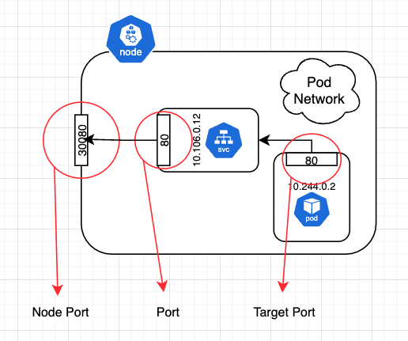
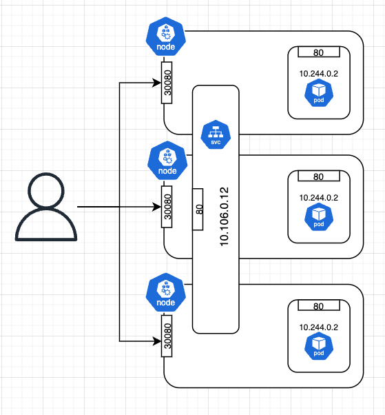

# Services

Service를 통해서 쿠버네티스 내 여러 애플리케이션들이 앱 외/내부간의 통신을 가능하도록 한다. 여기에는 다른 앱간의 통신이 될 수 있고, 실제 사용자들의 요청이될 수 있다.

## Service 종류

1. Node Port: 내부 포트를 노드(호스트 머신)의 포트에 액세스할 수 있게끔 한다.
2. Cluster IP: Cluster 내부의 가상 IP로서 Pod끼리 Cluster내부에서 통신이 가능하게끔 한다.
3. Load Balancer: Cloud Provider(GCP, AWS..etc)등에서 제공되는 Load Balancer를 Provisioning하기 위한 목적이다.

## Node Port를 활용해서 사용자가 클러스터 내 앱에 접근하기 까지



위 사진은 Node Port를 활용해서 사용자가 클러스터 내 애플리케이션에 접근하기 까지의 과정이다. 아래 각각의 용어들은 `Service` 관점에서 작성되는 용어라는것을 기억하자.

- Target Port

애플리케이션에서 개방하고 있는 Port를 `target port` 라고 부른다. 서비스가 요청을 전달하게 되는 포트이다.

- Port

외부 요청이 전달될 Service의 Port이다.

- Node Port

외부에서 요청할때 명시할 Port이다. 기본적으로 Node Port는 정해진 범위 (30000-32767)가 있다. 하지만 필요에 따라 수정할 수 있다.

## Declarative Service

이제 Service를 YAML로 정의해본다.(연결 대상 Deployments는 5장에 있는 manifest이다.)

```yaml
apiVersion: v1
kind: Service
metadata:
  name: myapp-service
spec:
  type: NodePort
  ports:
    - port: 80
      targetPort: 80
      nodePort: 30080
  selector:
    app: myapp
    type: frontend
```

여기서 중요한것은 `selector`이다. 앞에서 다른 리소스를 볼때도 그랬지만, 리소스간 연결할때 (Service - Pod, Deployments - Pod, Replicasets - Pod) 항상 label selector를 통한 Loosely Couple형태를 띄우는점이 중요하게 짚고 넘어가야하는점이다.

## Service는 모든 노드에 동일하게 적용된다.



노드가 1개 이상인 경우에도 Service는 생성되면 모든 노드에 동일하게 적용된다. 즉 각각의 노드들 모두 `30080`이라는 포트를 통해 들어가도 동일한 Service로 요청이 전달되게 되는것이다.
