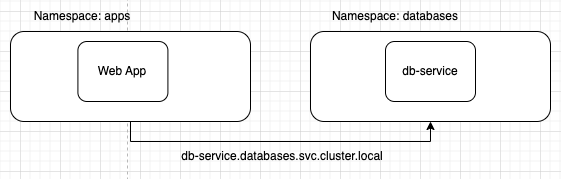

# Namespaces

- [공식문서](https://kubernetes.io/ko/docs/concepts/overview/working-with-objects/namespaces/)

지금까지 생성했던 모든 쿠버네티스 컴포넌트들은 `default` namespace에 생성되고 있었다. `default` namespace는 쿠버네티스 클러스터가 생성되었을때 기본으로 생성되는 namepsace이다.

쿠버네티스를 기본으로 실행했을때도 namespace가 존재한다.

- kube-system: 쿠버네티스 시스템과 관련된 컴포넌트들
- kube-public: 모든 사용자가 사용할 수 있는 리소스 생성

또한 실제 기업 운영환경에서도 namespace는 항상 나눈다. 이렇게 namespace를 나누는 이유는 각 운영환경 목적별로 삭제하거나 리소스를 변경하는것을 방지하기 위함일수도 있고, 혹은 리소스를 각 namespace별로 다르게 할당하기 위함일 수 도 있다.

## 다른 namespace에 있는 service 접근하기

필요에 따라 다른 namepsace에 생성된 pod에 접근해야하는 경우가 있다고 가정하자.



이런 경우에는 아래 포맷에 맞춰서 접근을 해줘야한다.(클러스터 내부에서)

```
(service name).(namespace).svc.cluster.local
```

이 중 **`cluster.local` 은 쿠버네티스 기본 도메인 이름**이다. 그리고 그 앞의 **`svc`는 서비스를 위한 하위 도메인**이다.

## Namespace 생성하기

리소스를 특정 namespace에 생성하기 전에는 꼭 namespace가 먼저 생성되어야 한다. Namespace는 선언형, 정의형 두가지 형태 모두 생성이 가능하다.

```yaml
apiVersion: v1
kind: Namespace
metadata:
  name: test-ns
```

```
kubectl create namespace (namespace name)
```

## 특정 namepsace에 리소스 생성 및 조회하기

특정 namespace에 리소스를 생성할때는 Declariative방식의 경우(YAML)에는 `metadata`에 `namespace`를 명시해주면 된다.

```yaml
apiVersion: apps/v1
kind: Deployment
metadata:
  namespace: test-ns
  name: myapp-deployment
  labels:
    app: myapp
    type: frontend
```

반대로 Imperative방식의 경우에는 `--namespace` 혹은 `-n` 플래그를 활용해서 namespace를 명시해주면된다.

```
kubectl run my-pod --image=nginx -n my-namespace
```

이 방식은 특정 namespace에 있는 리소스를 조회할때도 동일한 플래그로 namespace를 명시해주면 된다.

```
╰─ kubectl get pods --namespace=test-ns
NAME                               READY   STATUS    RESTARTS   AGE
myapp-deployment-dc6cd6cdf-2nbgh   1/1     Running   0          2m32s
myapp-deployment-dc6cd6cdf-fmjk8   1/1     Running   0          2m32s
myapp-deployment-dc6cd6cdf-hf42h   1/1     Running   0          2m32s
myapp-deployment-dc6cd6cdf-td6rl   1/1     Running   0          2m32s
myapp-deployment-dc6cd6cdf-zg8sr   1/1     Running   0          2m32s
myapp-deployment-dc6cd6cdf-zl6cf   1/1     Running   0          2m32s
```
