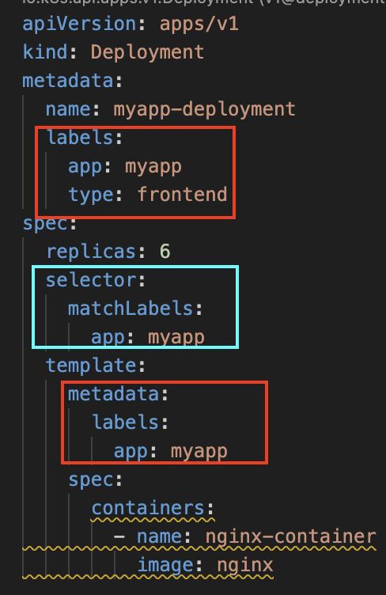

# Manual Scheduling, Label and Selector

# Manual Scheduling

쿠버네티스는 기본 스케줄러가 내장 되어있다. 그렇기 때문에, 직접 관리해주지 않아도 자동으로 노드에 배치된다.만약 클러스터에 스케줄러가 없다면, Pod는 Pending State로 머물러 있는다.
`Pod`를 정의할때 `nodeName`이라는 필드가 존재한다. 해당 Pod가 스케줄링될 Node의 이름을 정의하는데 주로 사람이 직접 명시하지 않고 쿠버네티스에 의해서 정의된다.

```yaml
apiVersion: v1
kind: Pod
metadata:
  name: nginx
  labels:
    tier: infrastructure
    app: nginx
spec:
  containers:
    - name: nginx
      image: nginx
  nodeName: master-node
```

`nodeName`은 Pod 생성시에만 정의할 수 있다는 점을 기억해야한다. 한번 실행 이후에는 수정이 불가능하다.

방금 본 `nodeName`을 명시해서 직접 스케줄링 하는 방법 이외에는 Binding을 활용하는 방식이 있다. 단 YAML형식이 아닌, JSON형식으로 변경한 후 POST로 binding API에 전송한다.

```yaml
apiVersion: v1
kind: Binding
metadata:
  name: nginx-binding
target:
  apiVersion: v1
  kind: Node
  name: master-node
```

- [Binding 관련](https://www.pulumi.com/registry/packages/kubernetes/api-docs/core/v1/binding/)

## Labels and Selector

Labels, Selector는 객체들을 그룹으로 묶는 표준적인 방법이다. 등급, 색깔 등 다양한 기준에 맞춰서 그룹화하기 매우 좋다. 쿠버네티스에서도 클러스터 내 수많은 Pod들간의 연결을 Labels와 Selector를 통해 연결한다. 가장 대표적으로 Replicaset이 자신과 동일한 label을 가진 Pod들을 관리하고, Replicaset이 만들어지기 이전의 Pod들도 관리가 되는것도 모두 Labels와 Selector를 이용한다.(Object간 Loosely Coupled가 가능해짐)

- Label: 분류에 집중(빨간 사각형)
- Selector: 필터링에 집중(밝은 파랑 사각형)



쿠버네티스에서 각 Object에 Label을 원하는 만큼 붙여도 괜찮다. 또한 `kubectl`을 통해 object를 가져올때 `selector`를 통해 가져올 수 도 있다.

```
╰─ kubectl get pods --selector app=myapp
NAME                               READY   STATUS              RESTARTS   AGE
myapp-deployment-dc6cd6cdf-7jxrm   0/1     ContainerCreating   0          37s
myapp-deployment-dc6cd6cdf-c5hth   0/1     ContainerCreating   0          37s
myapp-deployment-dc6cd6cdf-hfcrf   0/1     ContainerCreating   0          37s
myapp-deployment-dc6cd6cdf-qrmjq   0/1     ContainerCreating   0          37s
myapp-deployment-dc6cd6cdf-xs65r   0/1     ContainerCreating   0          37s
myapp-deployment-dc6cd6cdf-z8gj4   0/1     ContainerCreating   0          37s

╰─ kubectl get deployments --selector app=myapp
NAME               READY   UP-TO-DATE   AVAILABLE   AGE
myapp-deployment   6/6     6            6           59s
```

`namespace`의 object를 `--namespace` 플래그를 붙여 조회하는것과 동일하게 `--selector` flag와 `(key)=(value)`를 제공하여 불러올 수 있다.
